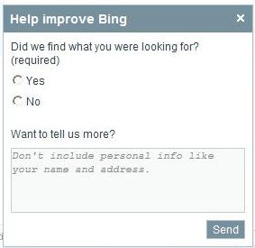
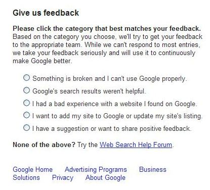

How much does feedback from searchers impact the search results that we see at Bing or Google? How do those search engines process and respond to that feedback?

The links that Google and Bing present for searchers to provide feedback on search results are listed at the bottoms of the search results pages for each. If there was a link instead after each search result where someone could provide feedback, how much of an impact would that change have, and would the search engines be able to handle the feedback that they receive?

A patent granted to Microsoft this week describes how the search engine may automate processes for “dissatisfaction reports” that are manually submitted by searchers, and how the search engine may file its own disatisfaction reports in some instances. While some of the feedback that search engines receive may include web spam reports, they may also receive feedback that something is “broken” with the search engines, or that a URL that should be showing for a specific query isn’t, or that the results just weren’t helpful.

**Providing Feedback at Bing and Google**

The link to provide feedback at Bing is located in the footer on search result pages using the anchor text “tell us what you think”.

If you click upon that link, a box popups up where you can tell Bing whether or not you found what you were looking for along with a box where you can provide more information (without providing personally identifiable information).

Provide feedback, either positive or negative and click on the “send” button, and Bing will thank you for helping to make Bing better.

Google’s link is displayed under the pagination of results at the bottom of the search results pages with the text “Give us feedback.”

If you click upon that link, you are brought to a new page where you have a choice of different items you can report upon, as seen in the image below:

One of the things that I like about this page is that they also include a link to the Google [Web Search Help Forum](http://productforums.google.com/forum/#!forum/websearch), so that you can also ask for help in addition to reporting something. You don’t always get a response from someone who works at Google when you choose that route, but often the responses you receive are helpful.

When you do provide feedback at Bing or Google, you usually won’t receive a response from anyone at either of the search engines, and we really don’t have any idea what happens with that feedback after that. The Microsoft patent gives us a little more insight into some of the processes that may take place.

The patent is:

[Automatic diagnosis of search relevance failures](http://patft.uspto.gov/netacgi/nph-Parser?Sect1=PTO2&Sect2=HITOFF&u=%2Fnetahtml%2FPTO%2Fsearch-adv.htm&r=1&p=1&f=G&l=50&d=PTXT&S1=8,041,710.PN.&OS=pn/8,041,710&RS=PN/8,041,710)
Invented by Li-wei He, Wenzhao Tan, Jinliang Fan, Yi-Min Wang, and Xiaoxin Yin
Assigned to Microsoft Corporation
US Patent 8,041,710
Granted October 18, 2011
Filed: November 13, 2008

Abstract

> Search relevance failures are diagnosed automatically. Users presented with unsatisfactory search results can report their dissatisfaction through various mechanisms.
>
> Dissatisfaction reports can trigger automatic investigation into the root cause of such dissatisfaction. Based on the identified root cause, a search engine can be modified to resolve the issue creating dissatisfaction thereby improving search engine quality.

Why is a searcher dissatisfied with search results? Here are some of the reasons listed in the patent:

- The searcher knows of a good or relevant URL that isn’t returned in their search
- URLs returned in results are irrelevant, dead, or duplicative
- A site listed is malicious (contains spyware, viruses, etc.)
- A site listed is from the wrong market

The Bing search engine may also submit its own feedback to this automated feedback system. It might do this by identifying pages that show up in search results that get little or no clicks for particular queries, and when they are clicked upon have visitors spending very little time on those pages before returning for a new search.

**Benefits of an automated search diagnostic system**

We’re told in the patent that this automated search diagnostic system can provide many benefits over conventional manual approaches to diagnostics, such as:

1. Automation is more efficient because it can eliminate unnecessary waste of manual effort to perform repetitive diagnostic tasks.
2. Accuracy is improved by eliminating guesswork that can lead to erroneous root cause categorization.
3. Manual responses to feedback can result in inconsistency when different people take actions in response to the feedback.
4. The system is more comprehensive since it can analyze the feedback received and help to prioritize responses and provide metrics to measure overall organizational performance.
5. An automated system can be useful in revealing patterns that may suggest best fixes.

The automated system might classify the feedback received into a number of different categories and point to possible corrective actions.

It’s possible that while the people who end up reviewing feedback received may make some changes to search results on a case-by-case basis, there’s probably an emphasis upon identifying chances to make corrections and improvements that impact as many sites as possible.

The patent provides an example of one kind of investigation into feedback received in the case of someone reporting that a relevant or good URL isn’t being displayed in search results. The root cause might be investigated. It’s possible in that instance that:

- The page in question hasn’t been crawled by the search engine (why not?)
- The page wasn’t indexed correctly (Is there a reason why it wasn’t?)
- The page didn’t make it into the candidate document set for a particular query (Does it contain all of the words in the query)

A dissatisfaction reporting system might be set up to have different levels of reports, so that for instance someone at the search engine might be able to provide highly detailed and explicit reports, while feedback from searchers might be more limited.

The patent also tells us that other approaches might also be used to enable search engines to receive feedback about sites listed in search results.

For instance, Google now provides users with the ability to both +1 pages that they see in search results and block sites they also see in search results. While those actions don’t give user the ability to provide the kind of detail that their feedback forms do, they are signals that Google is paying attention to. See, for instance the Office Google Webmaster Central blog post, [High-quality sites algorithm goes global, incorporates user feedback](https://webmasters.googleblog.com/2011/04/high-quality-sites-algorithm-goes.html):

> In some high-confidence situations, we are beginning to incorporate data about the [sites that users block](https://googleblog.blogspot.com/2011/03/hide-sites-to-find-more-of-what-you.html) into our algorithms.

The patent provides much more detail on how this automated feedback system might work, and is recommended if you’re interested in how a search engine might use feedback to reshape its search results or find ways to improve the results it receives based upon reports from its users.

**Conclusion**

I recently wrote about a Yahoo patent that described different ways that a search engine might measure [Search Success](https://www.seobythesea.com/2011/09/how-a-search-engine-may-measure-the-quality-of-its-search-results/), and one of the methods that was discussed as having a great amount of value was in viewing reports from searchers about their experiences while searching.

One complaint that I sometimes see or hear from people in comments here or elsewhere is that people who provide feedback to search engines by reporting problems in search results such as spam or irrelevant results is that they don’t see changes made or get responses from their reports.

I have no idea how much feedback the search engines receive, but imagine that a very small number of people actually do provide feedback in response to a very small number of searches. Given the volume of searches at Google or Bing or Yahoo, that can still mean that they are receiving a lot of feedback.

Finding ways to intelligently cluster that input and prioritize corrective actions makes sense. Trying to find ways to provide algorithmic solutions also makes sense in that the more problems that can be solved with a single change, the better.

How much of a role does this kind of feedback have in changing the search results that we do see?

A very recent [interview by Eric Enge with Google Research Head Peter Norvig](https://blogs.perficient.com/2011/10/17/search-algorithms-with-google-director-of-research-peter-norvig/) included some discussion of the algorithmic changes that take place at Google on a regular basis:

> We test tens of thousands of hypotheses each year, and make maybe one or two actual changes to the search algorithm per day. That’s a lot of ideas, and a lot of changes.
>
> It means the Google you’re using this year is improved quite a bit from the Google of last year, and the Google you’re using now is radically different from anything you used ten years ago.

I couldn’t help but wonder though, what if Bing or Google added a “feedback” button after every search result, and provided searchers with the kind of detailed reporting interface that we see above from Google. And what if the search engines had a response system that could effectively manage those responses?

How much would that impact the search results that we receive?
