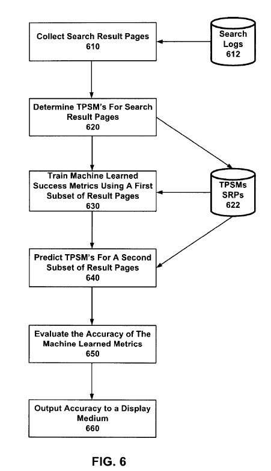

## How Do Search Engines Measure Search Results Quality?

When you try to gauge how effective your website is, you may decide upon certain performance metrics to measure its impact. Those may differ based upon the objectives of your pages, but could include things like how many:

- Orders you receive for products you might offer
- Phone calls you receive inquiring about your services
- People signup for newsletters
- Subscribers to your RSS
- Clickers on ads on your pages
- Linkers to your pages
- Social sharers of articles or blog posts that you’ve published
- Bounce rates like on pages that have calls to action intended to have people click upon other links on those pages
- Folks tend to stay upon your pages

You could look at and measure (and take action upon) a range of things to determine the effectiveness of your site.

A search engine is no different in that the people who run it want to know how effective their site is. A patent granted to Yahoo today explores how the search engine might evaluate page ranking in search results for different queries and looks at a range of possible measurements that it might use. While this patent is from Yahoo, expect that Google and Bing are doing some similar things. And while Bing is providing search data for Yahoo, that doesn’t mean that Yahoo’s results might become presented and formatted differently than Bing’s results and include additional or different content as well. As a matter of fact, Yahoo recently [updated](https://www.searchenginewatch.com/2009/08/25/yahoo-updates-search-results-pages/) its search results pages.

One of the problems or issues you might encounter when attempting to see how well your site works determines how well the performance metrics you’ve chosen to measure might work. A problem that plagues large sites is that they are so large that it can get difficult to determine which metrics work best. For example, Yahoo’s approach uses a machine learning approach to determining the effectiveness of different “search success” metrics when measuring search results quality.

The search results quality patent is:

[System and method for development of search success metrics](http://patft.uspto.gov/netacgi/nph-Parser?Sect1=PTO2&Sect2=HITOFF&u=%2Fnetahtml%2FPTO%2Fsearch-adv.htm&r=1&p=1&f=G&l=50&d=PTXT&S1=8,024,336.PN.&OS=pn/8,024,336&RS=PN/8,024,336)
Invented by Lawrence Wai
Assigned to Yahoo!
US Patent 8,024,336
Granted September 20, 2011
Filed: June 9, 2009

Abstract

> A system and method for the development of search success metrics. A plurality of search engine result pages are collected, and a target page success metric is determined for each page. A plurality of machine-learned page success metrics is trained using a first subset of the search engine result pages and each result page’s respective target page success metric, wherein each of the machine-learned page success metrics is trained to predict the target page success metric for each of the first subsets of search engine result pages. A predicted target page success metric is predicted for each of a second subset of the search engine result pages using each machine-learned page success metric. The accuracy of each machine-learned page success metric in predicting the target page success metric associated with each of the second subsets of search engine result pages is then evaluated.

One of the things I like to do when looking at a patent like this is to see if I can learn a little more about the people behind the patent. A look at inventor Laurence Wai’s LinkedIn profile shows that he is now the senior manager in charge of analytics at Groupon. The LinkedIn profile describes some of the work he did while at Yahoo and a little about his involvement in transitioning Bing results to fit into Yahoo pages. He is also co-author of a paper titled [Web Search Result Summarization: Title Selection Algorithms and User Satisfaction](http://www.kanungo.com/pubs/cikm09-web-summarization.pdf) (pdf), which includes as authors a couple of other Yahoo researchers as well as a Microsoft search engineer. The paper introduces the topic of “search success,” which is the focus of this patent.

The patent presents many different approaches with search results quality to measure search success, including “presentation, ranking, diversity, query reformulation, SRP enhancements, and advertising.”

The focus behind this patent is to take a measurement that might have been shown in the past to become highly reliable in measuring the effectiveness of search results or pages, but which might get either too costly or time-consuming to measure upon an ongoing basis and develop ways to predict how well a particular page might fulfill that metric. For example, if dwell time or the amount of time someone spends upon a page is a useful measurement for determining how well that page meets a searcher’s needs, are there other search engine metrics that a machine learning system can use to predict dwell time for a page?

The patent uses the phrase “search success” to measure the overall ability to measure how effective the search engine might get in displaying useful search results to searchers. It also refers to “page success metrics” for different types or families of measurements that might reliably become used to evaluate the success of search results. These different classes of “page success metrics” could get ranked based upon how reliable they might become, and the patent presents a general rule about them:

> It is also generally true that the higher a class is ranked, the greater the cost of obtaining the metric.

The hardest and most valuable metric, direct feedback from a searcher on the value of results, is considered within the realm of [unobtainium](https://en.wikipedia.org/wiki/Unobtainium) by the author of the patent, who tells us that there is presently no known techniques in existence for “directly evaluating the user’s perceptions of search page results.”

Providing a searcher with the ability to report whether or not a set of search results were useful is close, and it’s regarded as helpful. However, the limitations of self-reporting can bias it.

Next on the list in a “hierarchy” of metrics are target page success metrics, such as click-through rates on search results. For instance, the search engine might look through its query logs and see whether pages were clicked in search results for specific queries and which pages were clicked.

These types of clicks might get tempered with editorial judgments, such as whether or not the search results were in response to navigational or non-navigational queries and whether a particular page might have been placed at the tops of the search results because the query was perceived as navigational. For example, if I type [espn] into a search box, the chances are that I want to visit the ESPN website rather than search for information. However, if people search for ESPN and tend to look at pages other than the ESPN website, it might cause the search engine to question the value of showing ESPN first in a set of search results.

In addition to clicks on results, another metric used to evaluate search results quality is dwell time. Rather than looking at the amount of time spent upon a page, this dwell time would compare the timestamps associated with different actions on a search result page.

The patent also refers to the use of a [Discounted Cumulative Gain](https://en.wikipedia.org/wiki/Discounted_cumulative_gain) approach to determining the search results quality. The search engine might look to see if more highly relevant results appear more highly within search results. An interesting paper jointly written by researchers from Yahoo and Google explored some of the problems with that approach in 2009. I wrote about it in the post [Evaluating the Relevancy of Search Results Based upon Position](https://www.seobythesea.com/2009/09/evaluating-the-relevancy-of-search-results-based-upon-position/).

**Search Results Quality Conclusion**

If you’ve spent some time thinking about how a search engine might evaluate search engine performance metrics to determine search results quality, you may want to spend some time with the patent to learn more about some of the approaches explored.

Google’s Panda updates are similar. They focus upon identifying a series of search engine metrics that can help identify relevant and higher quality results that might gain more clicks in search results and more successful searches. Like the process described in this Yahoo patent, one of the issues that Google needs to contend with is determining how well the different metrics they’ve decided on using in Panda might predict click-throughs, dwell time, and other search success measures.

Last Updated July 4, 2019
