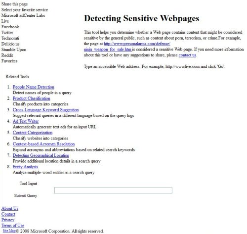
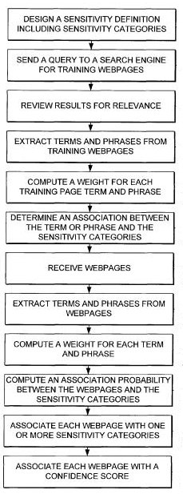

Given the Panda Updates from Google, I’ve spent a fair amount of time looking at how search engines might use automated programs to classify webpages, and how they use those classifications. If you’re a web publisher, it’s the kind of thing that you might be interested in as well. If you display ads, what does Google think of where and how you present them? How does your choice of colors, font styles and sizes, number of columns, size of headings and footers, the inclusion of about pages and privacy policies, and other features on your site influence how Google might perceive and classify and score your pages?

One example of a problem where the classification of pages might be helpful to a search engine is described in the book about Google by [Steven Levy](https://stevenlevy.com/), *In The Plex*. The author tells us about some Google Adsense gaffs that show challenges in automating the matching of advertisements with pages to display those ads upon. One particularly offensive match was a Google ad for plastic bags showing on a news page about a grisly murder where the victim’s body was disposed of in plastic trash bags. Tickets for air travel might be placed on a page about plane crashes. A coupon offering a free dinner for 2 at a particular chain restaurant appeared on the same page as an article about several people who dined at a restaurant in that chain and had suffered from food poisoning. The author notes:

> Google Engineers started working on ways to mitigate this problem, but it would never be eliminated. It was just too hard for an algorithm trained to discover matches between articles and ads to exercise human good taste.

I don’t believe that I’ve seen a patent or paper from Google directly on this subject. However, I did write a post a few years back, [How Google Rejects Annoying Advertisements and Pages](https://www.seobythesea.com/2007/06/how-google-rejects-annoying-advertisements-and-pages/), that described many of the things that Google might be looking for when using an automated process to review ads.

The patent I wrote about in that post, [Detecting and rejecting annoying documents](http://patft.uspto.gov/netacgi/nph-Parser?Sect1=PTO2&Sect2=HITOFF&p=1&u=%2Fnetahtml%2FPTO%2Fsearch-adv.htm&r=1&f=G&l=50&d=PALL&S1=07971137&OS=PN/07971137&RS=PN/07971137), was granted last week. It looks at many features that might be related to both advertisements and landing pages that influence whether or not an advertisement might be accepted. But it doesn’t discuss whether or not some ads might be considered inappropriate for some web pages that they might be displayed upon.

Microsoft was granted a patent this week on a process they came up with to try to avoid showing inappropriate advertisements on Web pages. However, it’s possible that they’ve replaced the process they detail in the patent with something new. In early 2007, you could visit Microsoft AdCenter Lab and see a tool for “Detecting Sensitive Web Pages” amongst the experimental products the search engine offered.

I’m not sure how useful the tool itself might have been for site owners, but I did find a blog post on Web metrics Guru that shows what the results from the tool looked like on [Microsoft AdCenter Labs New and Improved Beta Tools – Sensitive Page Detection](http://web.archive.org/web/20160525182927/http://www.webmetricsguru.com:80/archives/2007/01/microsoft-adcenter-labs-new-an-2/).

The tool’s goal was to look at the content of one or more pages of a site to predict a “sensitivity” level associated with that content, and determine whether it fits within certain sensitivity categories. The patent behind the tool is:

[Sensitive webpage content detection](http://patft.uspto.gov/netacgi/nph-Parser?Sect1=PTO2&Sect2=HITOFF&u=%2Fnetahtml%2FPTO%2Fsearch-adv.htm&r=1&p=1&f=G&l=50&d=PTXT&S1=7,974,994.PN.&OS=pn/7,974,994&RS=PN/7,974,994)
Invented by Ying Li, Teresa Mah, Jie Tong, Xin Jin, Saleel Sathe, and Jingyi Xu
Assignee: Microsoft Corporation (Redmond, WA)
US Patent 7,974,994
Granted July 5, 2011
Filed May 14, 2007

Abstract

> Computer-readable media, systems, and methods for sensitive webpage content detection are described. A multi-class classifier is developed in embodiments, and one or more web pages with web page content are received. In various embodiments, the one or more web pages are analyzed with the multi-class classifier. In various embodiments, a sensitivity level is predicted that is associated with the webpage content of the one or more web pages. In various other embodiments, the multi-class classifier includes one or more sensitivity categories.

The database behind a system like this might store specific information about web pages and advertisements, such as:

- Sensitivity categories,
- Sensitivity subcategories,
- Multi-class classifier information,
- Webpage information,
- Association information involving webpages and sensitivity categories and subcategories,
- Advertisement information,
- Parental control information,
- Forum information,
- Blog information

In addition to determining whether an ad might be inappropriate for a specific page, this system might be used to target certain pages for time-sensitive advertisements specifically. For example, when the content of a page involves a recent natural disaster, advertisements, and public service announcements involving relief efforts might be more easily shown on those pages.

**Sensitive and Non-Sensitive Categories and Subcategories**

The patent includes several examples of categories that might be assigned to pages and provide examples of “sensitive” and “non-sensitive” examples of each, involving sex, weapons, accidents, crime, terrorism, and war. Here is their breakdown from the larger accidents category:

> ACCIDENTS: Accidents pages include news articles, analysis, or commentary on events resulting in fatalities.
>  Accidents – sensitive: Natural disasters Vehicle crashes Household accidents
>  Accidents – non-sensitive: Minor injuries Non-fatal, major injuries Sports injuries Natural disaster preparedness Injury prevention and precautions Injury treatment

**Sensitive Web Pages Categorization Process**

The categorization of web pages might be done by collecting many training pages and classifying those, to use to classify other pages in an automated manner. For example, a query involving crime prevention might be submitted to a search engine, and the top 500 web pages returned might be reviewed by humans to find the pages relevant to crime prevention. Those pages may then be placed within a training set of pages for a “crime – nonsensitive” category. Other pages then might be identified as being in that category by comparison with those training pages.

This machine-learning system might look for similar phrases and terms in other pages, as well as how frequently those terms appear, whether the phrase appears near the top of a page or less prominently lower upon the page if the terms show upon in an alternative font such as a larger font, or bold, or italic, or underlined.

Certain rules may be applied based upon associations found with the human reviewed pages and other pages seen only by the machine learning system. For example, if the word “sex” appears upon a page more than 3 times, and the word “nude” appears more than twice, that may indicate a certain probability that the page belongs to a “sex–sensitive subcategory” (I better not use the word “sex” or “nude” again on this page. Oops.)

Some rules may be applied differently if the pages being classified are news articles, blog posts, online forums, or pages operated by a specific business.

**Conclusion**

This patent paints a fairly broad overview of how web pages might be classified into sensitive and non-sensitive categories, based upon a human review of a sample number of web pages followed up by an automated approach for additional pages that looks at features associated with the use of specific terms found on the manually reviewed pages. The chances are that Google may be doing something similar for ads that they display upon pages as well.

As for Google and its Panda updates, the type of document classification system in the Microsoft patent aims to determine when it might be appropriate to show certain advertisements on certain pages rather than reviewing pages to try to determine the “quality” of those pages. The chances are that the type of many features used in a document classification to determine the quality of pages contains a much larger set of features. Still, the chances are that many of the ideas behind the approach are similar, including the use of human reviewers to identify several “high” quality pages manually.

What kind of features might Google be looking at on your pages to determine what level of quality it might have?

The answer to that question might best be served by looking at the questions that Google Fellow Amit Singhal raised in the Google Webmaster Central blog post [More guidance on building high-quality sites](https://webmasters.googleblog.com/2011/05/more-guidance-on-building-high-quality.html). In addition to looking at how your site might fit those questions, it may not hurt to find “high quality” sites that rank well for similar or related queries as the pages on your site and see how those sites address the issues raised in those questions.
