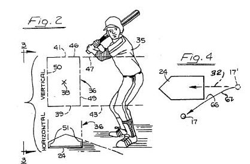
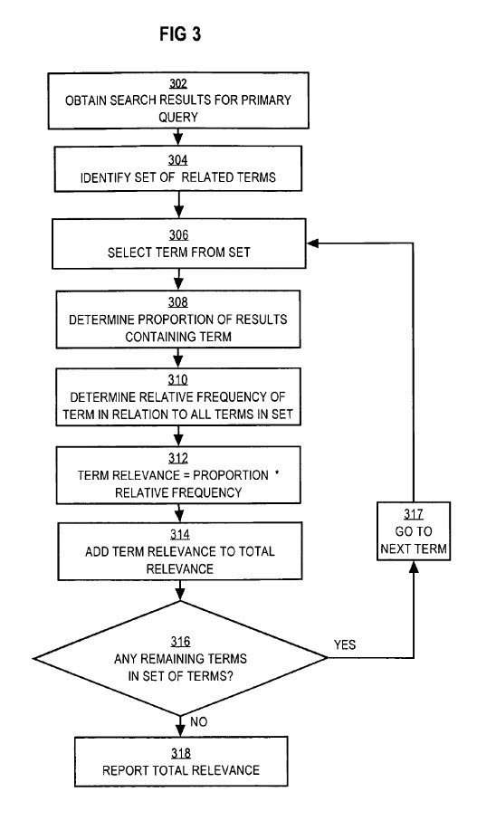
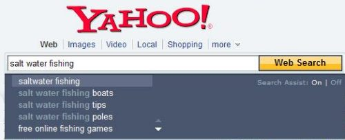

It’s interesting to see how a search engine might calculate the relevance of search results and find related queries.

A recently granted Yahoo patent investigates an approach that might help it identify how relevant the results it displays to searchers might actually be and how likely those results show various results when a searcher uses a query term that might cover a range of topics.

Before presenting their automated approach for checking relevance and variety, the patent tells us about some limitations in using manual reviews or clicks data to determine how relevant results might be.

**Human Reviewers**

One option for checking on the relevancy of search results would be to manually screen results for each query. That might be pretty time-consuming, involve the possibility of human error, and doesn’t seem like it would even begin to cover all of the queries that are conducted on the web.

I did see an ad on Craig’s List a few weeks ago from Lionbridge Technologies, Inc., asking for part-timers to act as Internet Judges. A little sleuthing on the Web revealed Google might have used Lionbridge in the past to hire people to rank the relevancy of search results, though Craig’s List posting didn’t identify the ultimate employer. From the job description from the ad:

> Position Description
>
> Relevance measurement is the foundation of all search engines. Without it, no one can tell whether a change has made the system better or worse. As an Internet Judge, you will be a key participant in helping determine the relevance of search engines. We are looking for Internet Judges who would work from home; review and rate websites based on an objective set of guidelines. Candidates must be avid internet enthusiasts. If you love browsing the web and can follow a specific set of guidelines to rate websites, then we want to hear from you.

Search engines do use manual reviewers. So does baseball. They never make mistakes, now do they?

**Tracking Clicks**

In a recent post, I described a patent filing from Yahoo, where they presented a method of ranking images based upon a method of [predicting clickthroughs](https://www.seobythesea.com/2009/07/ordering-images-and-other-multimedia-in-search-results-by-predicting-clickthroughs/) of images at different positions in search results.

The assumption behind that approach was that images that appeared to be relevant for a query would be clicked upon and that a prediction rate for images at certain positions in the search results could be used to identify images that overperformed based upon where they appeared in the results and move those up, and to find images which underperformed based upon their position and move them down in the results. With image search results showing a thumbnail of an image, that might work well for images.

Would tracking the number of times web search results get clicked upon when they appeared in search results reveal that those results are relevant for the query terms they rank for? That they might be related queries?

A problem with that approach is that searchers only see a page title, abstract (or snippet), and URL for web pages, and those may not accurately reflect the content that appears upon the pages they represent. That limitation means that clicks upon search results for web pages may not be a good indication of how relevant those results are for a particular query.

The image above is from a patent for an Automated [Baseball Umpiring System](http://patft.uspto.gov/netacgi/nph-Parser?Sect1=PTO2&Sect2=HITOFF&u=%2Fnetahtml%2FPTO%2Fsearch-adv.htm&r=1&p=1&f=G&l=50&d=PTXT&S1=6,634,967.PN.&OS=pn/6,634,967&RS=PN/6,634,967). While it may do a good job of calling balls and strikes, it probably isn’t going to be helpful with other tasks, such as determining whether a pitch hit a hitter or if a runner is safe or out on a close play at the plate.

**An Algorithm to Determine the Relevancy and Variety of Search Results**

Yahoo’s patented process uses recent searches to see if search results match up well with people’s searches on the search engine.

[Automatic relevance and variety checking for web and vertical search engines](http://patft.uspto.gov/netacgi/nph-Parser?Sect1=PTO2&Sect2=HITOFF&u=%2Fnetahtml%2FPTO%2Fsearch-adv.htm&r=1&p=1&f=G&l=50&d=PTXT&S1=7,558,787.PN.&OS=pn/7,558,787&RS=PN/7,558,787)
Invented by Jignashu G. Parikh
Assigned to Yahoo
US Patent 7,558,787
Granted July 7, 2009
Filed July 5, 2006

Abstract

> Techniques for automatically checking the relevance and variety of search results are provided.
>
> A query is submitted to a search engine, which uses a search algorithm to obtain search results based on the query. A set of the top n related terms for the query is identified. For each related term in the set of terms, its relative frequency about all terms is determined. If the term does not occur in any of the results, then a loss in variety proportional to the relative term frequency for the term has occurred.
>
> Otherwise, the relevance of the search results is calculated by comparing the proportion of results containing the term with the relative term frequency for a term. This process is repeated for all terms in the set of related terms to produce a total variety and relevance.

When someone searches at a search engine, they enter a query term into the search box and hit enter.

The search engine results are returned, which ranks those results according to search algorithms. The actual algorithms used to rank those results usually include elements that measure both the relevance and the importance of pages matching the query searched for.

This patent filing describes a testing interface that search algorithm and search engine developers can use to test for related queries.

As I noted at the start of this post, it’s interesting to see how a search engine might attempt to determine how relevant search results might be.

**Using Related Terms**

This process of determining relevancy and variety in search results starts by identifying terms in related queries.

Someone searches for [Amazon], and the search engine retrieves results related to the query and displays results to the searcher.

The results that appear may be relevant to the online store at “Amazon.com” or to the “Amazon River.”

There’s no way to actually determine automatically whether the searcher wants information about one or the other or something even different.

But, the search engine might look at query logs and session-based search data, and other data sets to determine sub-concepts for a query.

Those sub-concepts might be the kind that you see offered at query suggestions by a search engine. See my previous post, [How Search Engines May Decide Upon and Optimize Query Suggestion](https://www.seobythesea.com/2009/07/how-search-engines-may-decide-upon-and-optimize-query-suggestions/) for some ideas on how a search engine might identify and optimize query suggestions for a specific query.

The same kind of data that Yahoo might use to offer “Also Try” type queries or Yahoo predictive search suggestions might also be used to identify sets of related terms for a searcher’s query.

A search engine also tracks when queries are submitted to a search engine, which may help identify time-sensitive queries.

Related terms may be collected from search engine query log data from the last week rather than the last year to ensure that the information is timely.

So, if an earthquake took place a couple of months ago, the query logs around that time might have included many searches for [Amazon earthquake]

A month or so later, there might be a lot fewer searches for that term, and [amazon earthquake] might not be considered a related query like it would be recently after the time of the event.

A search through recent query logs might show how many times queries that included or co-occurred” with “Amazon” appeared in that data. So related queries such as “amazon books,” “amazon river,” and “amazon rainforest” might be determined to be related queries if they show up frequently enough in the query logs that are examined.

The search engine may also look at search sessions from searchers in the query logs to see how often other queries appear in the same search sessions as queries for or that contain “Amazon.”

A search session might be defined as multiple searches from a searcher within a specific amount of time, such as an hour or a day.

**Relative Term Frequency and Checking for Relevancy**

Once a search engine has come up with a set of related terms for a query, it might calculate the relative frequency of each of those related terms compared to the original searcher’s query in the query logs examined to identify related queries. Here’s an example of how that calculation might work from the patent filing.

> For example, referring to table 216, the F.sub.term of the term “books” is 25, meaning that “books” co-occurred with “Amazon” 25 times within the selected portion of Query Log 210, represented by table 212. Further, the F.sub.total is 50, corresponding to the total number of co-occurrences for all terms within the set of table 216.
>
> Therefore, a determination can be made that the F.sub.relative of the term “books” is 25/50 or 50%. Table 216 further contains the relative term frequencies of all the other terms within the set of related terms. Specifically, the term frequency of “rainforest” is 12/50, or 24%, “river” is 8/50, or 16%, and “fish” is 5/50, or 10%.
>
> The relative term frequency of each related term in the set is used to determine the relevance and variety of search results for a primary query, as further described herein.

Those ratios might be used in looking at the search results for the original search query.

If you look at the titles and snippets (or the actual content) of the top ten results in a search for [amazon], do half of those results contain the word “books” like the query logs examined do? Do a quarter of them contain the word rainforest? Is there a mention of the word “river” in one or two of them? Is there at least once with the word “fish” in it?

If the ratios between the query logs and the search results match up well, it might indicate that the relevance of those results is pretty good. It may also indicate that the variety of results is good as well.

The patent does warn that some search results may be very relevant but may also completely lack variety if a searcher’s query contains many sub-topics or related terms involving different topics.

**Conclusion**

I thought it was interesting that this patent describes finding related queries that are very similar to the method described in a Microsoft patent application in my last post.

The idea that the frequency of appearance of words from related queries could gauge the relevancy and variety of results for a searcher’s query is also worth thinking about.

If half the people using [amazon] in their searches include the word “books” in those searches, should half the search results in a search for [amazon] contains the word “books?” If 20 percent of searchers looking for [amazon] include the word “rainforest’ in those searches, should two of the top ten search results be results about the Amazon rainforest?

Presently, the top ten search results at Yahoo for [amazon] contain two results for the .com version of the bookstore, followed by two results for the .ca version of the bookstore, then the Wikipedia page for amazon.com, an entry about the Amazon river, a couple of pages about Amazon’s web services, a result for the co. uk Amazon store, and a final result for Amazon seller services, which lets people sell their products through Amazon.

Do these results reflect recent searches in Yahoo’s query logs that include the word “Amazon” or show up in the same search sessions as a search for [Amazon]?

Should the relevancy of search results be based upon the frequency of related terms in recent query logs? Is that a good measure of how relevant those results might be?

I’ve written an earlier post about this patent when it was published as [a patent application](https://www.seobythesea.com/2008/01/yahoo-on-testing-relevance-and-variety-in-search-results/) in January of 2008. I didn’t realize that until I was most of the way done with this post, but I think that the two posts actually complement each other, so I decided to go ahead and publish this post.

I think the two posts do a good job of emphasizing the importance of trying to understand what a search engine might see as “related queries” for a specific query and how those might not only influence which search suggestions might be shown in a set of search results but also how relevant a search engine might believe those search results to be based upon those related queries.
