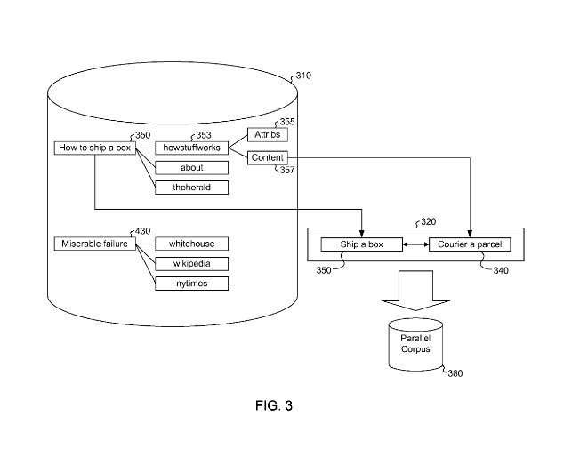

## Google Tells Us About Ways to Rewrite Search Queries using synonyms

Search for the word “automobile” at Google, and the search engine might rewrite your search to include results for the word “car” as well since it is a synonym of the word automobile. Accidentally misspell the word “automobile,” and Google might automatically correct your spelling error and search for “automobile.”

Follow that up with a search for the word “driving.” Google could expand your query by using a process called stemming from looking at the root of the word (drive-) and adding common endings to it to come up with and include in the search. Those would be such words as “driving,” and “driver.”

This kind of query expansion becomes aimed at providing searchers with better search results. But, this method of expanding queries might not happen yet (though it sometimes appears to be for spelling corrections at least), and it might not happen in all searches.

Typical approaches to rewrite search queries include:

- Stemming of words
- Correction of spelling errors
- Augmentating search queries by doing things such as using search engine synonyms of words that occur in the original query

A couple of white papers from Google and a newly published patent application explore some of the ways that Google might use machine translation to find synonyms for words to expand the search terms that you might use.

There are a few different ways to rewrite search queries using synonyms that can get done.

1) Synonyms for a word might become found in a thesaurus where those synonyms have gotten identified by experts or a lexical ontology (an organized vocabulary of words).

2) Synonyms might get identified from other search queries that are syntactically similar (an ordering of and relationship between words in phrases similar) to the original query.

One challenge to those methods is when a word has multiple potential synonyms with widely varying meanings. For example, in the query “How to ship a box,” the word “ship” could have synonyms such as “boat” and “send.”

If that query is rewritten based upon the boat meaning, it might provide very irrelevant search results to a searcher, who probably doesn’t expect to see search results related to fishing trawlers.

The Google patent application involves methods that are also explored in papers from Google; [Translating Queries into Snippets for Improved Query Expansion](https://www.aclweb.org/anthology/C08-1093/) (pdf), and Statistical Machine Translation for Query Expansion in Answer Retrieval (pdf).

The patent application lists a couple of inventors who were also authors of those papers:

[Machine Translation for Query Expansion](http://appft1.uspto.gov/netacgi/nph-Parser?Sect1=PTO2&Sect2=HITOFF&u=%2Fnetahtml%2FPTO%2Fsearch-adv.html&r=1&p=1&f=G&l=50&d=PG01&S1=20080319962.PGNR.&OS=DN/20080319962&RS=DN/20080319962)
Invented by Stefan Riezler, Alexander L. Vasserman
Assigned to Google
US Patent Application 20080319962
Published December 25, 2008
Filed: March 17, 2008

Abstract

> Methods, systems, and apparatus, including computer program products, expand search queries. One method, For example, one includes receiving a search query, selecting a synonym of a term in the search query based on a context of occurrence of the term in the received search query, the synonym having gotten derived from statistical machine translation of the term, and expanding the received search query with the synonym and using the expanded search query to search a collection of documents.
>
> Alternatively, another method includes receiving a request to search a corpus of documents, the request specifying a search query, using statistical machine translation to translate the specified search query into an expanded search query, the specified search query and the expanded search query being in the same natural language, and in response to the request, using the expanded search query to search a collection of documents.

## Using Statistical Machine Translation (SMT) to rewrite search queries

The patent application goes into a good amount of detail on how Google might use statistical machine translation to translate a sequence of words from one language to another or learn how words in different languages become related. So if you want a detailed version of how statistical machine translation works, it’s worth looking at the patent filing for their description.

The Google Research Blog, in a post from 2006 titled [Statistical machine translation live](https://ai.googleblog.com/2006/04/statistical-machine-translation-live.html), provides a much simpler explanation:

> Several research systems, including ours, take a different approach: we feed the computer with billions of words of text, monolingual text in the target language, and aligned text consisting of examples of human translations between the languages. We then apply statistical learning techniques to build a translation model.

So, how does SMT help rewrite search queries?

The word “ship” in a particular context can get translated into another language the same way that “transport” can be. In that context, the word “ship” is synonymous with the word “transport.” So, our example above of a query such as “how to ship a box” might have the same translation as “how to transport a box.”

The search might be rewritten to include both queries – “how to ship a box” as well as “how to transport a box.”

A machine translation system may also collect information about words in the same language to learn how those words might get related.

## Approaches for Training a Statistical Machine Translation Model

The first step is collecting a training set of words, possibly from many different sources, such as the following:

1) Looking at Question-Answer Pairs to rewrite search queries

Imagine looking at as many frequently asked questions pages as possible and comparing how the same questions got answered differently (or similarly). Taking questions and answer pairs and using them as a training body for statistical machine learning might be helpful.

2) Looking at Query and Snippet Pairs to rewrite search queries

Look at the search results for a query in a search engine and the snippets of those results. Perhaps look even closer at the results that have gotten selected and viewed more frequently and/or longer by people who searched using those query terms (possibly indicating that those snippets are more relevant for the query term searched with).

Those query and snippet pairs might also get used as a training body for statistical machine learning. From the documents themselves, from anchor text in links pointing to those documents, and other information about words appearing in those results. Such as whether they got used in the page title or if they are part of a string of text that is relevant to the query used may also get considered.

3) Look at phrase and paraphrase pairs to rewrite search queries

Like our examples above of “how to ship a box” and “how to transport a box,” these phrases can get translated into the same term in another language, and that term might be reasonably translated back into either phrase.

Phrases and paraphrases might also get supplied manually by language experts. A body of synonyms and similar phrases might be collected from that approach.

A query such as “how to become a mason” might yield a translated and rewritten search query of “how to be a bricklayer” using this approach.

## Using Context Maps with Synonyms to Rewrite Search Queries

Synonyms might get found during a search, or they might get prepared beforehand and used with a context map that pays attention to words that might appear to the left and right of one of the words in a query phrase. The context map might become prepared before a search is ever conducted.

For example, with the query “how to tie a bow,” the left and right context of the word `tie` in that query is “how to” and “a bow.”

In the context map, the word tie may get associated with two synonyms, `equal` and `knot.` The word “knot” could get chosen as a synonym for “tie” since it also fits in well within the context found in the context map of “how-to” and “a bow.” The question is rewritten to something like [how to (tie or knot) a bow].

## Conclusion

When a misspelling gets entered into Google as part of a search query, the search engine will sometimes show a message at the top of the results. This is what they refer to as a prompt. The search engine may ask if you meant the correct spelling. Google will also show a mix of results for the misspelled version and the corrected version, expanding the query. And sometimes, Google will show results from the corrected version of the word.

We don’t know for certain if Google uses stemming for query expansion or using synonyms for query expansion. But these are authentic possibilities. So, for example, if you search for a query that includes the word “automobile” and the word “car” produces very relevant results, it is reasonable to rewrite search queries like that.

You may be interested in how a search engine might rewrite queries used in a search and how they might decide upon what words to use in that query expansion. It’s worth spending some time going through this patent application to learn how that rewriting might get done.

Added: January 1, 2009 –

Google does tell us that they use stemming on their [Web Search Help](https://support.google.com/websearch/answer/134479?hl=en&rd=2) page:

> Word variations (stemming)
>
> Google now uses stemming technology. Thus, when appropriate, it will search not only for your search terms but also for words like some or all those terms. If you search for pet lemur dietary needs, Google will also search for pet lemur diet needs and other related variations of your terms. Any variants of your terms that get searched for will could get highlighted in the snippet of text accompanying each result.

I’ve written a few posts about synonyms in search. Here are some of those:

- 2/19/2006 – [Multi-Stage Query Processing at Google](https://www.seobythesea.com/2006/02/google-looks-at-multi-stage-query-processing/)
- 5/25/2007 – [Refining Queries Using a Local Category Synonym](https://www.seobythesea.com/2007/05/refining-queries-using-category-synonyms-for-local-and-other-searches/)
- 12/29/2008 – [How a Search Engine Might Use Synonyms to Rewrite Search Queries](https://www.seobythesea.com/2008/12/how-a-search-engine-might-find-synonyms-to-use-to-expand-search-queries/)
- 1/23/2009 – [Google to Expand Language Search and Shrink Our World?](https://www.seobythesea.com/2009/01/search-engines-to-expand-language-search-and-shrink-our-world/)
- 6/29/2009 – [Semantic Relations from Query Logs](https://www.seobythesea.com/2009/06/query-logs-and-the-slang-of-the-web/)
- 12/22/2009 – [Google Search Synonyms Can Get Found in Queries](https://www.seobythesea.com/2009/12/how-google-may-expand-searches-using-synonyms-for-words-in-queries/)
- 1/19/2010 – [Google Synonyms Update](https://www.seobythesea.com/2010/01/google-synonyms-update/)
- 1/27/2010 – [Paid Search Results and Query Expansion using Synonyms and Related Concepts](https://www.seobythesea.com/2010/01/paid-search-results-and-query-exansion-using-synonyms-and-related-concepts/)
- 2/16/2011 – [More Ways Search Engine Synonyms Might Rewrite Queries](https://www.seobythesea.com/2011/02/more-ways-a-search-engine-might-identify-synonyms-to-expand-queries-with/)
- 8/12/2013 – [How Google May Substitute Query Terms with Co-Occurrence](https://www.seobythesea.com/2013/08/google-substitute-query-terms-co-occurrence/)
- 9/27/2013 – [The Google Hummingbird Patent?](https://www.seobythesea.com/2013/09/google-hummingbird-patent/)
- 12/8/2013 – [How Google May Rewrite Queries](https://www.seobythesea.com/2013/12/rewrite-search-terms/)
- 9/9/2013 – [How Google May Reform Queries Based on Co-Occurrence in Query Sessions](https://www.seobythesea.com/2013/09/google-reform-queries-based-co-occurrence-query-sessions/)
- 10/15/2013 – [Google’s Hummingbird Algorithm Ten Years Ago](https://www.seobythesea.com/2013/10/googles-hummingbird-algorithm-ten-years-ago/)
- 12/21/2015 = [How Google Might Make Better Synonym Substitutions Using Knowledge Base Categories](https://www.seobythesea.com/2015/12/how-google-might-make-better-synonym-substitutions-using-knowledge-base-categories/)

Last Updated July 4, 2019.
