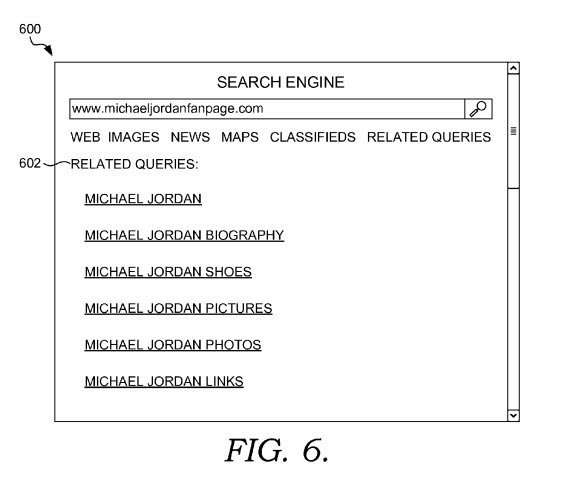

If you look at a typical page that shows up after you perform a search at one of the major commercial search engines, you’ll see that those search result pages don’t differ too much from each other.

Some sets of search results do include news, images, maps, and other results that go beyond just a list of web pages that may contain the keywords used in a search.

But, how interested would you be in entering the address of a web page and seeing related search queries for that page, or related people or places or other pages?

**Inversion Searches Showing Related Search Queries**

This kind of search, referred to as an “inversion search,” by some Microsoft inventors, is the topic of a new patent application from the Washington-based search provider.

Information about related queries from this inversion search, combined with data about how people might click through those queries and spend time on pages visited through an inversion search, might be used by the search engine to improve search results and rerank those results.

The patent filing also describes how web page owners could elect to show related queries about their pages, upon their pages, along with advertisements and share revenue from those advertisements with Microsoft.

The patent application is:

[Related Search Queries for a Webpage and their Applications](http://appft1.uspto.gov/netacgi/nph-Parser?Sect1=PTO2&Sect2=HITOFF&u=%2Fnetahtml%2FPTO%2Fsearch-adv.html&r=1&p=1&f=G&l=50&d=PG01&S1=20080235187.PGNR.&OS=dn/20080235187&RS=DN/20080235187)
Invented by Krishna Chaitanya Gade, Srinath Reddy, Nicholas Eric Craswell, Amit Prakash, and Hugh Evan Williams
Assigned to Microsoft
US Patent Application 20080235187
Published September 25, 2008
Filed: March 23, 2007

Abstract

> An inversion of the basic format of searching is provided herein. Instead of receiving a search query and providing web page results, a search engine receives a web page identifier as search input from an end-user, determines related search queries for the associated web page, and provides the related search queries to the end-user issuing the search.
>
> Related search queries for web pages may also be used to refine search engines performing the basic form of searching by facilitating the determination of web pages to index and the ranking of web pages as search results to user queries. Additionally, related search queries may be used in advertising revenue generation and sharing.

The search engine might collect information about related search queries by extracting keywords from the content of a target web page and generating related search queries based on the extracted keywords.

Query terms might also be taken from historical search information taken from search engine query logs, including the targeted web page, or from the search engine’s cache file, or from previous inversion searches for the page.

Those related search queries might be presented based on rankings determined from the relevance of the related search queries to the web page and the popularity of the related search queries based upon the user’s historical search information.

Keywords might be extracted from web pages by looking at anchor text, page titles, and text appearing in the page’s content. Words found might be stemmed, to find the roots of the words and vary based upon those roots.

Stop words, that appear frequently and aren’t important to the page’s content may be removed. Words that don’t appear too frequently upon a page (below a certain threshold) may also be not be returned as a related keyword phrase.

Term frequency and inverse document frequency (TF/IDF) techniques may also be used to try to score words and phrases against each other on a page, to find the terms with the highest scores, and to identify them as keywords.

When a search engine ranks web pages, it may try to match the query terms with words “occur in several parts of web pages, such as the anchor text, title, body, and URL string.” The weights for those different parts may be “tuned manually” or through “machine learning techniques.”

The patent filing tells us that these rankings could be adjusted by looking at both related search queries and extracted keywords, and the user interactions with those related queries.

> A high frequency of users selecting a particularly related search query for a web page may be viewed as empirical evidence that the web page should be considered highly relevant for the selected related search query.
>
> Accordingly, web pages may be given higher weighting for search queries matching related search queries having a high frequency of user selection as evidenced by historical inversion search information.

**Conclusion**

There may be a few different ways that an inversion search might show up in search results, such as a checkbox or some other way that searchers could select to perform a “related” search, or the use of a special search operator that would be used like this – related:www.example.com, or if a searcher entered a URL for a page into the search box, the search engine might automatically display related search queries.

Inversion search could be a pretty informative tool for searchers, giving them the chance to explore concepts found on pages, and search results for those concepts or related keyword phrases.

I can envision site owners who might occupy the same or similar markets spending a lot of time exploring related keyword phrases for pages on competitors’ sites. How much of an impact might inversion search have on the development of new content for their sites?
