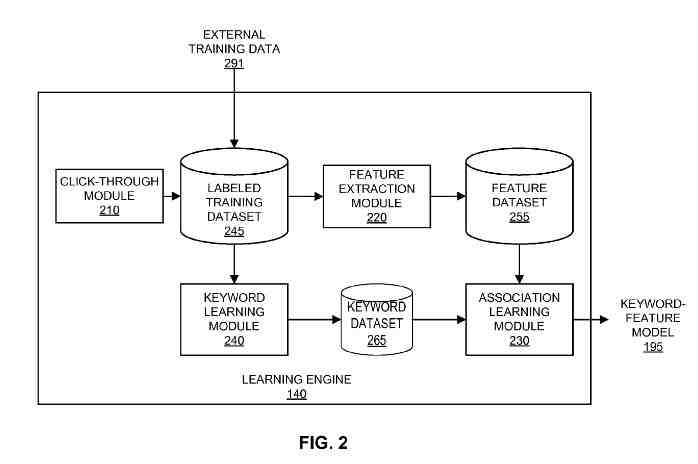

## How Does Google Rank Videos?

The chances are that when you search for a video on Google or YouTube, Google may rank videos based upon text about the video rather than the content of the video itself. The search algorithm might look at the title of the video and a description and tags entered by the person who uploaded the video as well. Annotations may also play a role in determining what terms and phrases the video may be relevant for as well.

For example, the video below announces Google’s new food recipe search option and provides a detailed description of the new feature. But none of the text accompanying the video mentions that the person providing details about Google’s added functionality is one of Google’s executive chefs, Scott Giambastianai. If you search for [Google executive chef], you wouldn’t see this video appear in YouTube’s search results, and you probably should.

Other factors may play a role in how Google may rank videos in search results, including how many views and comments and likes the video has received, how often it was added to a playlist, and more.

## Other Factors Involved in How Google May Rank Videos

There are some problems with relying upon just the textual content that is associated with a video. One is that description probably doesn’t do a perfect job of describing a long video that might contain many scenes and a variety of content. Another is that on a site containing many videos, the number of results received in response to a query may be on the large side.

The search engine might show a screenshot from the first frame, center frame, or last frame of the video to help people decide which video might best meet their query. But that thumbnail might not be very representative of the video’s actual content.

Those ignore the actual content of the video itself when Google may rank videos. What if a search engine could use the video’s existing audio and visual content of the video to decide what search terms it might be relevant for, and use that information to rank videos?

## Keyword Association Scores When Google May Rank Videos

It might be easier to get an idea of what the video is about if the search engine created an index from videos that would store keyword association scores between frames of many videos and keywords associated with those frames.

Those frames might be associated with keywords based upon what’s contained within images or audio on each video. Google may also choose to use images from those frames as thumbnails show in search results instead of just selecting the videos’ first, middle, or last structure of the videos.

A patent application published by Google this past week describes how the search engine might improve the indexing of videos by identifying and indexing both images and audio clips associated with specific keywords in videos. The improved way to rank videos in a patent filing is:

[Relevance-Based Image Selection](http://appft.uspto.gov/netacgi/nph-Parser?Sect1=PTO2&Sect2=HITOFF&u=%2Fnetahtml%2FPTO%2Fsearch-adv.html&r=1&p=1&f=G&l=50&d=PG01&S1=20110047163.PGNR.&OS=dn/20110047163&RS=DN/20110047163)
Invented by Gal Chechik and Samy Bengio
Assigned to Google
US Patent Application 20110047163
Published February 24, 2011
Filed: August 24, 2009

Abstract

> A system, computer-readable storage medium, and computer-implemented method present video search results responsive to a user keyword query. The video hosting system uses a machine learning process to learn a feature-keyword model associating media content features from a labeled training dataset with keywords descriptive of their content.
>
> The system uses the learned model to provide video search results relevant to a keyword query based on features found in the videos. Furthermore, the system determines and presents one or more thumbnail images representative of the video using the learned model.

A number of whitepapers from Google authors also provide some hints at the possible future of video indexing:

- [Large Scale Online Learning of Image Similarity through Ranking](http://www.robots.ox.ac.uk/~vgg/rg/papers/rankingsimilarity.pdf)
- Sound Ranking Using Auditory Sparse-Code Representations
- [Large Scale Content-Based Audio Retrieval from Text Queries](http://static.googleusercontent.com/media/research.google.com/en/us/pubs/archive/33429.pdf)
- [Large Scale Image Annotation: Learning to Rank with Joint Word-Image Embeddings](http://static.googleusercontent.com/media/research.google.com/en/us/pubs/archive/35780.pdf) (pdf)
- [Discriminative Tag Learning on YouTube Videos with Latent Sub-tags](https://research.google/pubs/pub36931/)

The system described in the patent relies upon a video annotation index to help searchers find videos or parts of videos that may be relevant to their queries.

A video with a clip or image of a dolphin swimming in the ocean might get labeled with keywords such as “dolphin,” “swimming,” “ocean,” and so on.

Many methods mentioned in the patent could get used to help rank videos for a particular query.

## Using Click Data To Rank Videos

Click-through data may help to determine whether a keyword is appropriate for a particular video. Suppose the same thumbnail image from a video gets chosen on searching for a specific query by many searchers. In that case, that may indicate a positive association between the query terms and the video.

A similarity search between images and audio from a video and a labeled training dataset, which contains stock images and audio clips that have metadata associated with them, can help to identify unlabeled images and audio from the video. An example of Google using similarity searches to rank videos can be found in the [Google Similar Images](https://googleblog.blogspot.com/2009/10/similar-images-graduates-from-google.html) search.

The patent filing and the whitepapers provide a much deeper look at the technology behind the similarity searches that could be used to associate images and audio from videos with labels that could be used to match up with keywords.

It’s possible that the metadata associated with a video, such as a title and description may continue to be used by the search engine, but additional data from the content of a video itself can improve the results of a video search considerably.

And it might make it easier to find Google’s executive chef on YouTube when he’s featured in a Google Video.
