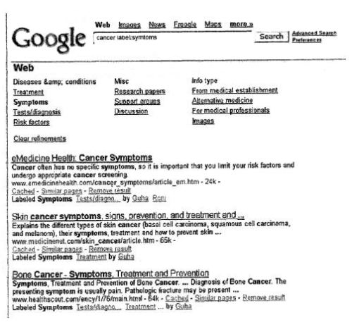

## Relevant Annotations

One of the words that often appears when someone describes how search engines work is relevance. A search engine attempts to show searchers web pages and other results that might be relevant to the words that they used when they perform a search. Yet, there are a number of different ways that you can define relevance.

For instance, Rutger’s professor Tefko Saracevic, who has been studying the concept of relevance for years, explores different thoughts and literature on the topic to describe a number of ways to define relevance in a 2006 paper on [Relevance: A Review of the Literature and a Framework for Thinking on the Notion in Information Science. Part II: Nature and Manifestations of Relevance*](https://www.researchgate.net/publication/220433462_Relevance_A_Review_of_the_Literature_and_a_Framework_for_Thinking_on_the_Notion_in_Information_Science_Part_II).

Relevance could be considered a way of finding documents that contain words someone might search for, or documents that are related to concepts involved in those query terms. Relevance could be determined by looking at a relationship between a searcher and the search terms they use while considering their past browsing and searching history, and possibly the searches of people who might socially be related to them, or who share some common interests with them.

Relevance could also be determined by a problem or task that a searcher is faced with when performing a search.

Search engines have been exploring some of these different concepts of relevance as well, and a recently granted patent from Google redefines the way that we might perform searches to help searchers find relevant pages when they are faced with informational needs or tasks that they want to fulfill.

Under the process described in the patent, in addition to using a query term in our search, we would also include a label that might match annotations made on pages that could be returned in search results.

For example, someone searching for information about digital cameras might want to see professional reviews about cameras. They might enter a query at Google that would look like this:

> digital cameras label:professional reviews

The search results that they would see would show the pages that are relevant for the query term “digital cameras,” and would weigh pages that are labeled “professional reviews” as more relevant to the search than pages that don’t have labels attached to them.

The image below from the patent shows pages in search results that have a “symptoms” label associated with them on a search for cancer that includes a “labels: symptoms” search operator:

**Annotations as Labels**

Personalized search often looks at past browsing and searching history to try to identify pages that might be “relevant” to a searcher’s intent by attempting to understand the interests of a searcher. But that information may not be very helpful when someone is attempting to find information relevant to a task at hand, that has nothing to do with pages they viewed in the past.

A search engine will also sometimes show query suggestions to a searcher based upon pages that other searchers ended up visiting when they entered the same or similar terms into a search box. But it’s possible that those searchers had very different intentions behind their searches.

If a searcher were to add more information about what they were looking for, such as the labels mentioned above, it might help a search engine find more relevant results based upon the situation behind a search.

But how does a search engine create those labels, and associate them with web pages?

A web site focusing specifically on health issues might include tags or categories for articles published on the site. For instance, articles about allergies might be tagged with terms such as “symptoms,” or “treatment,” or “medications.” A web site about digital cameras may also annotate specific pages with tags such as “expert review,” or “new product.”

The tags may be helpful on those sites, but you don’t see the annotations when you perform a search on a general search engine such as Google or Yahoo or Bing. Annotations might also be identified from comments made on a page, as well.

If a search engine were to capture information such as the tags on sites like those, it might be a start, but there are many pages that don’t have explicit annotations on them, and that might not be labeled, even though they would possibly be helpful to searchers.

A search engine might attempt to find other ways to understand how annotations might apply to specific pages, such as looking at the information found within patterns on the URLs of pages. For instance, a web site about digital cameras might have a directory named reviews, such as “www.digitalcameraexample.com/review/.” An assumption might be made that the documents contained in that directory contain reviews of digital cameras, and a label or “professional reviews” might be applied to pages within that directory.

Another directory on that site might be “news,” as in “www.digitalcameraexample.com/news/.” Pages within that directory wouldn’t have a “professional reviews” label attached to them, but an “industry news” label might be instead.

The Google patent is:

[Filtering search results using annotations](http://patft.uspto.gov/netacgi/nph-Parser?Sect1=PTO2&Sect2=HITOFF&u=%2Fnetahtml%2FPTO%2Fsearch-adv.htm&r=1&p=1&f=G&l=50&d=PTXT&S1=7,668,812.PN.&OS=pn/7,668,812&RS=PN/7,668,812)
Invented by Patrick F. Riley and Ramanathan Guha
Assigned to Google
US Patent 7,668,812
Granted February 23, 2010
Filed May 9, 2006

Abstract

> A search engine system accepts queries that include query terms and labels applicable to certain documents. A domain filter is constructed that is used to filter search results to certain domains, where the domains are determined based on the labels included in the query. The filtered search results are processed to ensure that certain portions of the results are from domains included in the filter. The results are further processed to include the query labels with certain ones of the results.

**Conclusion**

The idea of being able to add “labels” to query terms is interesting, but I wonder how many searchers would add labels to their searches.

Google does allow you to use other special search operators when you search. For example, if you want to find pages on a topic that are only from educational sites, you can perform a search like the followning:

> red dwarf stars site:.edu

There is a lot of value in being able to go to Google and perform a search like:

> chicken pox label:symptoms

I would like to see a “label” search operator added as an option.

I do believe that being able to use labels like these would make it easier to find pages that are relevant for a particular situation.

I could see the possibility that people might intentionally apply tags to some pages that aren’t appropriate, or place pages within directories that aren’t good matches for the words found within the URLs, and the patent filing doesn’t go into detail on how those possibly irrelevant “annotations” might be identified, but I would assume that there would be some way to filter those results out.

Note that Google does provide [a way to include labels](https://developers.google.com/custom-search/docs/refinements) in Google Custom Search already.
