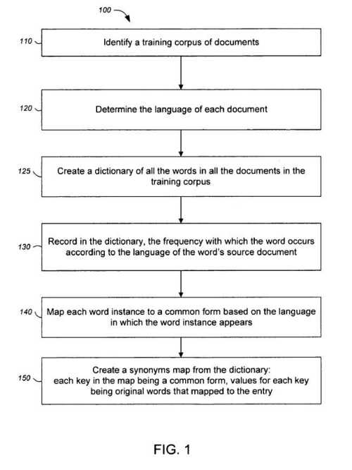

Choosing the right character set for your web page might mean that it is easier for a search engine to understand what language your page is in, though there are also [other ways](https://www.seroundtable.com/archives/015791.html) that it might be able to determine that.

But what about when someone types in a query?

– How does a search engine know the language of a query?

– How does it handle queries in different languages made on devices that might not be capable of creating some special characters outside of the Latin alphabet?

Also, do web pages that use a certain character set (something that webmasters can choose in their HTML for a page) stand a better chance of having the language that they use be identified more easily by a search engine?

## Google Patent Applications on the language of a Query

Google published four patent applications recently that delve into the subject of the language of a query, on the “handling of language uncertainty in processing search queries and searches over the web, where the queries and documents can be expressed in any one of many different languages.”

A search engine is called upon to index and search documents written in various languages and several documents that are expressed in multiple languages.

## Keyboards without Non-Latin Characters

Another challenge is that some devices used to create content and display web pages can have difficulties in producing some of the characters used in different languages.

People searching on a handheld or a keyboard may use characters that are close substitutes for the ones that they would want to use, such as an unaccented character.

A search engine could process content that it has indexed, to remove accents and convert special characters into a standard set of characters, but this would result in losing information from the search index and making it impossible to retrieve content when a searcher does use their natural language in a query when their search does use non-Latin characters.

**The Language of a Query Patent Filings**

The patent applications were published on December 13, 2007, and were originally filed on April 19, 2006.

- [Query language determination using query terms and interface language](http://appft1.uspto.gov/netacgi/nph-Parser?Sect1=PTO2&Sect2=HITOFF&u=%2Fnetahtml%2FPTO%2Fsearch-adv.html&r=1&p=1&f=G&l=50&d=PG01&S1=20070288450.PGNR.&OS=dn/20070288450&RS=DN/20070288450) (20070288450)
   Invented by Ruchira S. Datta and Fabio Lopiano
- [Augmenting queries with synonyms from synonyms map](http://appft1.uspto.gov/netacgi/nph-Parser?Sect1=PTO2&Sect2=HITOFF&u=%2Fnetahtml%2FPTO%2Fsearch-adv.html&r=1&p=1&f=G&l=50&d=PG01&S1=20070288449.PGNR.&OS=dn/20070288449&RS=DN/20070288449) (20070288448)
   Invented by Ruchira S. Datta
- [Augmenting queries with synonyms selected using language statistics](http://appft1.uspto.gov/netacgi/nph-Parser?Sect1=PTO2&Sect2=HITOFF&u=%2Fnetahtml%2FPTO%2Fsearch-adv.html&r=1&p=1&f=G&l=50&d=PG01&S1=20070288448.PGNR.&OS=dn/20070288448&RS=DN/20070288448) (20070288449)
   Invented by Ruchira S. Datta and Fabio Lopiano
- [Simplifying query terms with transliteration](http://appft1.uspto.gov/netacgi/nph-Parser?Sect1=PTO2&Sect2=HITOFF&u=%2Fnetahtml%2FPTO%2Fsearch-adv.html&r=1&p=1&f=G&l=50&d=PG01&S1=20070288230.PGNR.&OS=dn/20070288230&RS=DN/20070288230) (20070288230)
   Invented by Ruchira S. Datta

## Search Engines Learning the language of a Query and Documents

Under the approach in these patents, a training model is created to use to identify the language used in documents to be searched. The training model focuses upon a specific body of documents when training, and those can be a mix of different types of documents, such as:

- HTML
- PDF
- Text documents,
- Word processing documents,
- Usenet articles, or;
- Any other kinds of documents having text content, including metadata content.

These documents should ideally represent what might be found on the Web and might be the Web itself or a snapshot or extract from the Web.

That body of documents should include all languages represented on the Web, with enough documents from each language, so that they might contain a significant enough portion of the words found within all documents of the language on the Web.

**The Role of Character Encoding**

A system like this might work best if each of the training documents and each document to be searched would be encoded in a known and consistent character encoding, such as an 8-bit Uniform Transformation Format ([UTF-8](http://www.utf-8.com/)). Of course, that isn’t what you’ll find on the Web, where you will see many pages not even including a character set defined or another character set completely. Here’s what the code looks like in the HTML for a page using UTF-8:

<meta HTTP-equiv=”Content-Type” content=”text/html; charset=utf-8″>

If a page doesn’t use UTF-8, and this language determination process does, then documents using some other encoding might be converted into UTF-8. That conversion might result in some funny-looking characters ending up in results.

**Language Detection on Pages, Using Probabilities**

The document language detection process uses statistical learning theories and classification models.

The most likely class or classes for a page of text may be based on the text from the page and possibly by looking at the URL of the page.

This could be done by breaking the text down into words, and computing the probabilities of those words appearing upon the page together in different languages, to predict the most likely language for that text.

So, on a page where the word “Hello” occurs frequently, and in the training model, it appears most frequently in English and then German pages, there’s a probability that the page may be in English and then in German.

Looking at certain characters can be helpful, too. If certain characters don’t appear very frequently, if at all, in some languages, then pages that have words in them with those characters might be less likely to be in those languages.

## The Use of Character Mapping

One of the keys to this process is creating character maps that may be more unique to one language than to others. Thus, a common form of a word in a specific language may contain accented characters, for instance.

The language of query patent applications goes into a great deal of detail on how these character mappings can be used in a few different ways.

One is to help identify languages for some queries.

Another is to identify when certain queries might be simplified versions of a word when a searcher can’t use certain characters. The device they are using, such as a smartphone, is incapable of using those characters. There are many examples of how this might work, given in patent applications.

**Conclusion**

If you work with websites written in non-Latin characters, you may find these patent applications worth digging into in much more depth.

Another patent application, mentioned in these patent filing but unpublished at this point, *Query Language Identification* looks like it might go into even more depth on the topic.

Some of the languages and conversion maps created for those languages discussed in the patent filings include:

Catalan, Croatian, Czech, Danish, Dutch, English, Esperanto, Estonian, French, German, Greek, Hungarian, Icelandic, Italian, Latvian, Lithuanian, Macedonian, Polish, Portuguese, Romanian, Russian, Serbian, Slovakian, Slovenian, Spanish, Swedish or Finnish, Turkish, and Ukrainian.

**Other Resources**

I looked for a number of documents that explore query language, and came up with the following:

- Search Engine Land: [Google Launches ‘Cross-Language Information Retrieval (CLIR)’](https://searchengineland.com/google-launches-cross-language-information-retrieval-clir-11296)
- The Official Google Blog: [Search without boundaries](https://googleblog.blogspot.com/2007/05/search-without-boundaries.html)
- How do search engines handle non-English queries? – A case study (2003)
- [Lost in Cyberspace: How do Search Engines Handle Arabic Queries](https://wenku.baidu.com/view/4214312b915f804d2b16c1df.html)
- How Do Search Engines Handle Chinese Queries? (2005)
- [Building Minority Language Corpora by Learning to Generate Web Search Queries](http://www.cs.cmu.edu/afs/cs/project/theo-4/text-learning/www/corpusbuilder/papers/CMU-CALD-01-100.pdf) (pdf)
