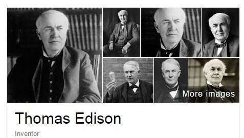
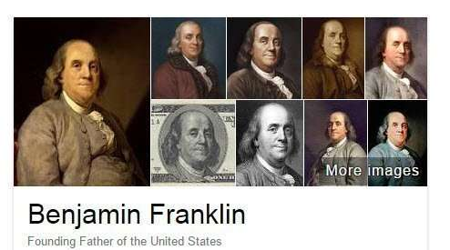
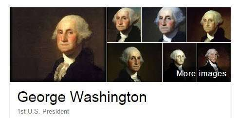
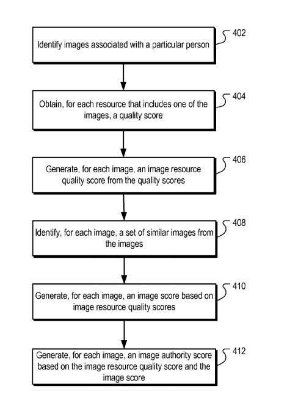
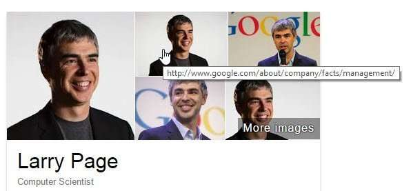
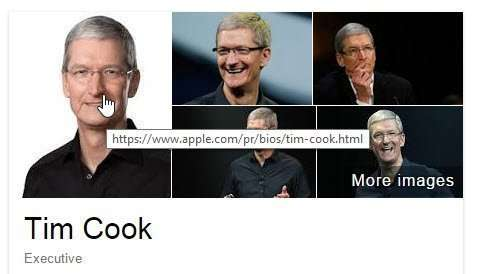

## How Google May Decide Upon knowledge Graph Images

Google has been showing Knowledge panels in response to queries when Google recognizes an entity within a query. Google has collected enough information about that entity for it to display a knowledge panel about the entity. I’ve written about these knowledge panels before in [How Google Decides What To Know In Knowledge Graph Results](https://www.seobythesea.com/2013/05/google-knowledge-graph-results/), and in [Google’s Knowledge Cards](https://www.seobythesea.com/2015/03/googles-knowledge-cards/).

I mentioned knowledge graph images in those, but not how entity images represent those entities those panels are about, especially when the entities are people.

A patent granted to Google earlier this month describes how entity images might get selected as high authority images to represent people returned in knowledge panels in response to a query.

There may be other issues determining what image gets selected, but this patent lays out a nice framework for determining what entity images to show. When you’re talking about someone like Thomas Edison or Benjamin Franklin, or George Washington, there are potentially many images that could get shown for each of those; so how does Google decide what to show?

Keep in mind that when you do an image search for a person, such as Thomas Edison, the image returned from that query appears on a web page. The web page may become referred to as a “landing page.” This web page may have a quality score associated with it that could get used to rank the image from that page, that compares web pages where images have gotten located for that person, and compares them to each other.

Images themselves could also get scored based upon the quality of the image.

The combination of image scores and quality scores for web pages that contain entity images might get used to generate an image authority score.

The images may then become ranked based upon these image authority scores. The highest-ranked images may be the ones displayed to a searcher as knowledge graph images.

We have gotten told that quality scores for web pages may get determined independently of the content of those pages.

Click Logs and Query Logs may get used to identifying entity images, with images that have gotten clicked upon a lot in an image search for an entity possibly scoring higher than other images for that entity. The quality score for a page that an image gets found upon could get based in part upon the number and quality of links pointing to that page.

Images for a person may get selected in part using facial recognition software. Creating a score based upon a confidence level that the person displayed is like other person images. A “portrait score” may be part of that image score, making sure that the image shown contains matching features to other images that have gotten determined to be similar (eyes, a nose, a mouth, ears, and other features that may show a face).

## Advantages of the method in the Knowledge Graph Images Patent

1. Authoritative or high-quality images, may become identified based on many high-quality resources. Interestingly, the fact that there are similar images also from high-quality pages
2. A Comparison of image resource quality scores for similar images to image resource quality scores for dissimilar images provides a relative measure of image quality that can become used to select images with a high degree of authority about an entity relative to the authority of other images for the same entity
3. Images that have a relatively high authority for an entity are more likely to meet a user’s informational need than images with a relatively low authority for the entity
4. Images with high image scores for an entity are likely to be good choices (as in visually representative, clear, and distinguishable from other images related to that entity).

The knowledge graph images patent is:

[Scoring images related to entities](http://patft.uspto.gov/netacgi/nph-Parser?Sect1=PTO1&Sect2=HITOFF&d=PALL&p=1&u=%2Fnetahtml%2FPTO%2Fsrchnum.htm&r=1&f=G&l=50&s1=9,098,552.PN.&OS=PN/9,098,552&RS=PN/9,098,552)
Invented by: Adam Hartwig, Sylvain Gelly, Yuan Li, Taehee Lee
Assigned to: Google
US Patent 9,098,552
Granted August 4, 2015
Filed: February 5, 2013

Abstract

> Methods, systems, and apparatus for scoring images related to entities. In one aspect, a method includes:
>
> - Identifying images associated with a person, each image gets included in one or more resources
> - Obtaining, for each resource that includes one of the images, a quality score that represents a quality of the resource; for each of the images
> - Generating an image resource quality score from the quality scores of the resources that include the image
> - Identifying a set of similar images from the images, each similar image having a measure of similarity to the image that meets a similarity measure threshold
> - Generating an image score based on image resource quality scores of the resources that include the similar images relative to image resource quality scores of the resources that include each of the images
> - Generating an image authority score based on the image resource quality score and the image scores.

## Knowledge Graph Images Take Aways

The patent is more detailed than what I’ve written about here. There’s a discussion about similar images found on the Web, and how those can support decisions made about what images to show.

This approach may work best for people where there may be many images of them on the Web.

If you hover over the images shown for a person in a knowledge panel, those get linked to the pages where they come from. Suppose you want to investigate the sources of those pictures in more detail. Note that in the knowledge graph images below for Tim Cook and Larry Page, one of those persons’ images come from their company’s websites.

