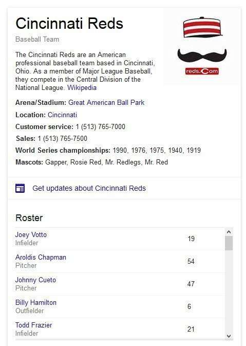
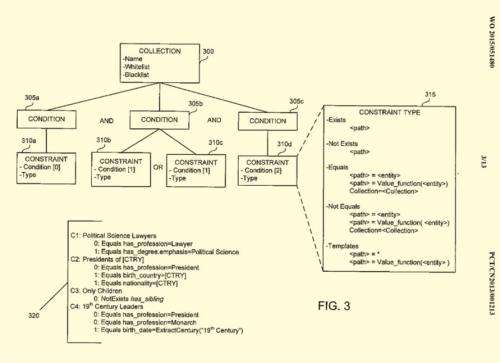
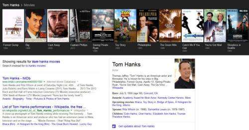

*Added 11:48 AM (pst) May 3, 2015*, H/t to [Natzir Turrado](https://twitter.com/natzir9), incoming news is that Google+ is introducing a new feature they are referring to as [Collections](http://news.thewindowsclub.com/google-plus-collections-77622/), and that announcement from [The Windows Club](https://www.thewindowsclub.com/) features the word “curation” prominently as do the two Google patent applications I write about in this post. Here’s how Susannah Lindsay in The Windows Club article uses the concept:

> Google Plus users will get an opportunity to curate pieces of content into their collection, with others holding the permission of viewing, sharing, and following those collections as they please.

*Added 12:15 Pm (pst)* More on the rumored Collections feature at Google+: [Google+ is Testing a New “Collections” Feature That Seems to be Part Pinterest, Part Blogging](https://www.droid-life.com/2015/04/23/google-plus-collections-pinterest/)

Last November, before Google and Twitter announced that they had a [new partnership](https://searchengineland.com/everything-need-know-google-twitter-partnership-216892) delivering a data stream of tweets to Google, to enable the search giant to include that real-time social media data into its search results, we read about some of the efforts that twitter was undertaking to try to get more visitors to its pages in the article, [Twitter: Renewed Focus On SEO Generated 10 Times More Visitors](https://searchengineland.com/twitter-seo-more-visitors-208160#.VGYPN1QHzWQ.twitter).

My friend Barbara Starr commented on the approach, referring to Twitter’s use of hashtags, and collections of entities to attract attention to their pages, and it appears that it was an effective approach. Barbara’s use of the word collections referring to entities has been echoed in the issuance of a couple of recent patent applications from Google that focus upon building collections for the benefit of searchers, and content curators, like Twitter.

[Automatic Definition of Entity Collections](https://patentscope.wipo.int/search/en/detail.jsf?docId=WO2015051480)
Pub. No.: WO/2015/051480
International Application No.: PCT/CN2013/001213
Publication Date: 16.04.2015
International Filing Date: 09.10.2013
Applicants: Google
Invented by Faen Zhang, Keith Golden, Amit Behal, Ben Hutchinson, Alexander Oliver Marks, Fei Wu, Yuan Gao

Abstract:

> A system for automatically generating entity collections comprises a data graph including entities connected by edges and instructions that cause the computer system to determine a set of entities from the data graph and to determine a set of constraints that has several constraints.
>
> A constraint in the set represents a path in the data graph shared by at least two of the entities in the set of entities. The instructions also cause the computer system to generate candidate collection definitions from combinations of the constraints, where each candidate collection definition identifies at least one constraint and no more than the number of constraints. The instructions also cause the computer system to determine an information gain for at least some of the candidate collection definitions and store at least one candidate collection definition that has an information gain that meets a threshold as a candidate collection.

[Determining Collection Membership in a Data Graph](https://patentscope.wipo.int/search/en/detail.jsf?docId=WO2015051481)
Applicants: Google
Invented by Faen Zhang, Keith Golden, Amit, Behal, Ben Hutchinson, Alexander Oliver Marks, Jason Macnak
Pub. No.WO/2015/051481
International Filing Date 09.10.2013

Abstract:

> An efficient system for evaluating collection membership in a large data graph. The system includes a data graph of nodes connected by edges and an index of constraints from collection definitions, a definition specifying at least one condition with at least one constraint, where a constraint has a constraint type and a constraint expression. Multiple conditions in the definition may be conjunctive.
>
> The system may also include instructions that, when executed by the at least one processor, cause the system to evaluate an edge for a node in the data graph against the index to determine conditions met by the edge and its associated neighborhood, repeat the evaluating for each edge associated with the node in the data graph, determine that conditions for a first collection are met, and generate an indication in the data graph that the node is a member of the first collection.

The first of these patents focus on finding collections of entities and creating collections. The second one describes how members may be added to a collection.

The knowledge panel below is for the Cincinnati Reds team, and includes a scrolling list of the players on the team, likely from a [table](https://en.wikipedia.org/wiki/Cincinnati_Reds#Current_roster) Google has found on the web:

_Scrolling roster shows a collection of entities for this sports team_

## Defining Entity Collections

The patent on defining Entity Collections tells us that it might do that in a few different ways.

(1) Assigning Constraints to entities

As Google discovers entities on the Web, it might collect information about those related to “constraints” in one of the following five formats; Exists, Not Exists, Equals, Not Equals, and a Template format. These constraints identify whether or not an entity is a member of a published or a candidate collection, and may be considered part of one of those.

***Published collections*** may be found in places like a wiki or a table on the Web. like a list of members of a sports team or US Presidents or World Leaders.

***Candidate Collections*** may be identified in popular web queries that might indicate a collection of entities, and the patent tells us that entities that are members of those collections may be identified in Semantic searches, as follows:

> …Determining the first set of entities may include selecting a category from a crowd-sourced document corpus and determining entities identified by the category.
>
> As another example, determining the first set of entities may include identifying a popular query from search records, converting the popular query to at least one semantic query, and executing the at least one semantic query against the data graph to obtain a query result, wherein the first set of entities is the query result from the data graph. Converting the popular query to the at least one semantic query may include converting the popular query to a plurality of semantic queries, running each of the plurality of semantic queries against the data graph, and determining a plurality of sets of entities, a set of the plurality of sets representing entities responsive to one of the semantic queries.

The first four types of constraints identify whether or not an entity is a member of a certain type of entity collection, and the “template” constraint identifies a template that might be associated with the entity that shows off membership in a certain type of collection.

## Take-Aways

The patent does describe how information about entities may exist in the web in the form of triples, how those are searchable and can be used to identify whether or not an entity is a member of a team or a political activist group or a world leader group, and how different collections may be ranked based upon things like how notable their members are.

Collections can include groups of entities such as Chinese Scientists, or Tom Hank’s Movies.

_A collection of Tom Hanks Movies shown off in a Google Carousel._

From reading the patents, you get a sense that Google has implemented some aspects of these patents but hasn’t put into place knowledge panels or carousels that might show off collections of groups of entities such as “World leaders, ” but yet might.
