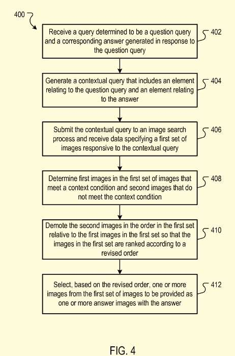
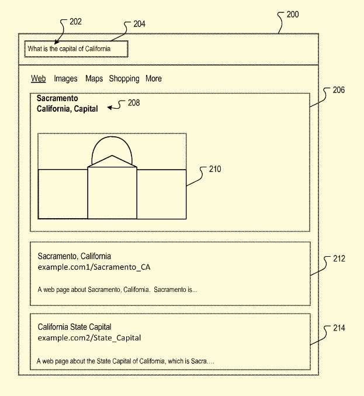
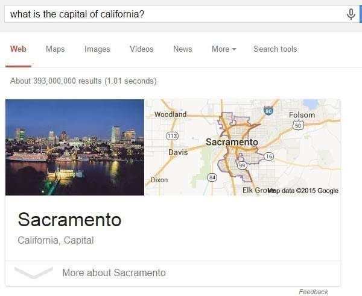

_From the query, ‘How to fix a clogged sink.’_

Last week, this patent application described a search system query processing for questions, looking for rich content results.

Queries may be responded to with various resources, such as image files, audio files, video files, and web pages. A search engine may identify resources in response to queries submitted by searchers and attempt to provide information in response “in a manner that is useful to the users.”

Searchers may look for an answer to a specific question rather than a listing of links to other pages and resources.

They may want to know what the weather is like at a particular location, or a current quote for a stock, or the capital of a state, etc.

When a query is shaped in the form of a question, a search engine may work to respond to that question format by responding to the form of an “answer,” such as a “one box” answer to the question.

Last month, I wrote the post [How Google May Trigger Answer Box Results For Queries](https://www.seobythesea.com/2015/06/how-google-may-trigger-answer-box-results-for-queries/), which provided a different description of how queries might be responded to with answer box results. It’s not surprising to have many patents that might look like responses to the same problem. However, this differs by providing rich content results in response to a query, such as an image or audio, or video.

There are several important steps related to the process in this patent, which include:

1) This patent works to receive a question query and return an answer responsive to the question query;
2) Using a contextual query that includes an element from the question query and an element from the answer; and submit that contextual query to a rich content search process and receiving rich content responsive to the contextual query, the rich content items ranked according to an order that is indicative of the relevance of each rich content item to a query for which the set was generated;
3) determining the first rich content item in the first set of rich content items that meet a context condition that is indicative of a rich content item providing contextual information of both elements of the question query and the answer query; and
4) preferentially selecting from the first content items relative to the second rich content items provided as one or more answer images.

## Advantages

This patent focuses upon providing rich content, such as an image, audio, or video, to answer a question. The rich content is chosen to convey to a piece of searcher information regarding both the content of the question and the answer – this aims to “ensure that rich information provided to the user for an answer is responsive to the question and consistent with the answer provided.”

The rich content results patent application is:

[Rich Content for Query Answers](https://patentscope.wipo.int/search/en/detail.jsf?docId=WO2015102869)
Pub. No.: WO/2015/102869
International Application No.: PCT/US2014/070359
Publication Date: 09.07.2015
International Filing Date: 15.12.2014
Assigned to: Google
Invented by: Gal Chechik, Eyal Segalis, Yaniv Leviathan, and Yoav Izur

Abstract:

> Methods and systems for providing rich content with an answer to a question query.
>
> A method includes receiving a query determined to be a question query and a corresponding answer generated in response to the question query, generating a contextual query that includes an element relating to the question query and an element relating to the answer; submitting the contextual query to a rich content search process and receiving data specifying a first set of rich content items responsive to the contextual query, determining first rich content item in the first set of rich content items that meet a context condition that is indicative of a rich content item providing contextual information of both elements of the question query and the answer query; and preferentially selecting from the first content items relative to the second rich content items to be provided as one or more answer rich content items.

## Question Queries versus Informational Queries

Searchers often look for “answers” rather than a range of links to web pages. An answer can be defined as a fact or relation responsive to a question. “Question queries” differ from an informational query in that the question query is looking for the answer. In contrast, an informational query requests a variety of different types of information about a subject. For example, a question query along the lines of “How high is Pikes Peak” is structured to request a fact – the height of Pikes Peak clearly. A search engine can determine that the query is in a structured format and may interpret it as a question query and return in response to the query, which is an answer to the question, as well as other results.

## Rich Content Question Responses

A rich content question processing system provides an answer for a question query using rich information specific to the question query. The search engine returns a question query and an answer generated in response to the question query. Both the question query and the answer will have one or more terms. This system then creates a contextual query that includes elements relating to the question query and the answer. For example, the contextual query can include at least one or more terms from the question query and one or more terms from the answer. Alternatively, the contextual query can specify entities identified by the question query and answer or related terms derived from the question query and answer.

That contextual query may be submitted to a rich content search process, such as an image search process or a search for videos and audio. Image-rich content is used as an example.

An image search process would specify the first set of images in response to the contextual query and then ranks those images in an order indicative of the relevance of each image to the question query. A first set would be provided to the rich content question processing system, determining the first images and second images in the first set. The first images are images meeting a context condition indicative of an image providing contextual information of both terms of the question and terms of the answer. The second image does not meet the context condition.

The first and second images may be chosen based in part on respective image sets for the question query and answer query and a comparison of those image sets to the image set for the contextual query. They might also be chosen based upon the image labels of each respective image.

Rich content in response to a question query might be chosen from many thousands of publisher websites.

The search engine crawls those publisher websites and indexes resources provided by the publisher websites, stored in a resource index.

Searcher requests are used to index and identify resources relevant to the queries in search results. For example, a search result for a resource may include “a web page title, a snippet of text extracted from the web page, and a resource locator for the resource, e.g., the URL of a web page.”

These search results are ranked based on a mix of Information Retrieval (“IR”) scores and an “Authority” Score (such as PageRank ) related to the resources. The results are returned in that order based upon those scores.

## Query Logs and Selection Logs

Queries submitted by searchers may be stored in query log files. The selection data for those queries and web pages referenced by those search results and selected by users could be stored in selection logs. This query log and selection information define search history data that includes data from previous search requests associated with unique user/device identifiers. In addition, those selection logs represent searcher actions taken in response to the search engine’s search results. This kind of information can include clicks on the search results. Both the query logs and selection logs can be used to map queries submitted by user devices to resources identified in search results and track actions taken by searchers when presented with the search results in response to the queries. Also, data may be associated with the identifiers from the search requests so that a search history for each identifier can be accessed. The search engine can then use these selection logs and query logs to track the respective sequences of queries submitted by the user devices. The actions are taken to respond to the queries and track how often the queries have been submitted.

When personally identifiable information is collected about searchers, those searchers may be given a chance to control whether programs or features are used to collect user information from them, such as information about:

- a user’s social network
- social actions or
- activities
- profession
- a user’s preferences, or
- a user’s current location.

This may be done to give them the option to protect the sharing and use of this information.

## Question Query Processing

The patent describes when a query is in the form of a question or an implicit question. An example of an implicit question might be the query “capital of California.”, short for “What is the capital of California?” A question may be more specific, as in the query “What is the capital of California?” The search engine may have a “query question processor” to decide whether a query is a query question and if it is to decide whether there is an answer that is responsive to the question.

This query question processor may use various algorithms to determine whether a query is a question and whether there is a particular answer responsive to the question.
These may involve language models, machine-learned processes, knowledge graphs, grammars, search results and resources referenced by the search results, or combinations of all those, to determine question queries and answers.

If a query is determined to be a question query, and there is a responsive answer, the query question processor may get the rich content processor involved, which acts to identify rich content to be shown with the answer. While that could be an image or set of images, it could also include video and audio data.

## Responding with Rich Content Results to Queries

A question such as “What is the capital of California” is answered by “Sacramento.” Ideal rich content results respond to both the question and the answer but show results that might include both, such as a text answer that identifies “Sacramento’ and maybe an image of the capitol building of California. A map image pinpointing Sacramento’s location in California might also be considered relevant as well.

_Note that the images are in response to a combination of the question and its answer._

The patent tells us that providing both the question and the answer to the rich content processor enables the question query response to be “represented” by both “question query terms {QQT} and answer terms {AT}, respectively.”

This is a contextual query that includes elements from the question and the answer. In addition, the contextual query can also “specify entities that are identified by the question query and answer, or related terms (synonyms, term expansions, etc.) derived from the terms of the question query and terms of the answer.”

It really can be as simple as having a question query of “Capital of California” and answer of “Sacramento,” and creating the context query of “Capital of California Sacramento.” The patent tells us that other ways to generating a context query can also be used and could involve removing stop words, substituting terms, and so on.

Rich content labels, such as tags, descriptors, and other text that may describe an image. It may also be used in ranking these images. For instance, a sports team logo located in Sacramento may not rank as highly as other images and may be demoted in rankings. The patent describes other instances of some rich content being demoted in rankings.

## Rich Content Results Take-aways

It’s good seeing some of the approaches and mechanisms that the search engine might use to provide rich content results to question answering queries. For example, seeing one involved in results that show off videos or images in response to a question-answering query is interesting. The idea of using a “contextual query” based upon both the question and the answer is also interesting.

Some posts I’ve written about patents involving question answering:

- 7/19/2007 – [Search Engines Crawling FAQs to Learn How to Answer Questions?](https://www.seobythesea.com/2007/07/search-engines-crawling-faqs-to-learn-how-to-answer-questions/)
- 9/21/2014 – [Google May Use Question Answering to Populate the Knowledge Graph](https://www.seobythesea.com/2014/09/missing-incorrect-data-knowledge-graph/)
- 10/12/2014 – [How Google May Use Entity References to Answer Questions](https://www.seobythesea.com/2014/10/google-fact-questions-entity-references-unstructured-data/)
- 12/30/2014 – [Featured Snippets – Taken from Authority Websites](https://www.seobythesea.com/2014/12/direct-answers-taken-authority-websites/)
- 12/31/2014 – [Featured Snippets – Using Query Intent Templates to Identify Answers](https://www.seobythesea.com/2014/12/direct-answers-using-query-intent-templates-identify-answers/)
- 2/11/2015 – [How Google was Corroborating Facts for Featured Snippets](https://www.seobythesea.com/2015/02/google-corroborating-facts-direct-answers/)
- 7/12/2015 – [How Google May Answer Questions in Queries with Rich Content Results](https://www.seobythesea.com/2015/07/how-google-may-answer-questions-in-queries-with-rich-content-results/)
- 9/9/2015 – [When Google Started Showing Featured Snippets](https://www.seobythesea.com/2015/09/when-google-started-answering-factual-queries/)
- 11/30/2016 – [Answering Featured Snippets Timely, Using Sentence Compression on News](https://www.seobythesea.com/2016/11/featured-snippets-sentence-compression/)
- 6/19/2017 – [Google Extracts Facts from the Web to Provide Fact Answers](https://www.seobythesea.com/2017/06/fact-answers/)
- 7/11/2019 – [How Google May Handle Question Answering when Facts are Missing](https://www.seobythesea.com/2019/07/how-google-may-handle-question-answering-when-facts-are-missing/)

Last Updated June 26, 2019.
