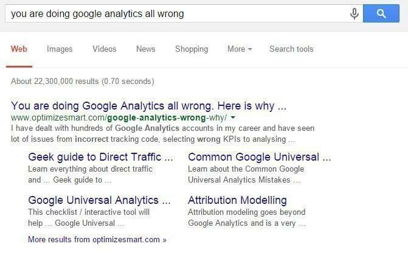
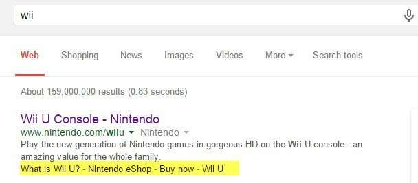
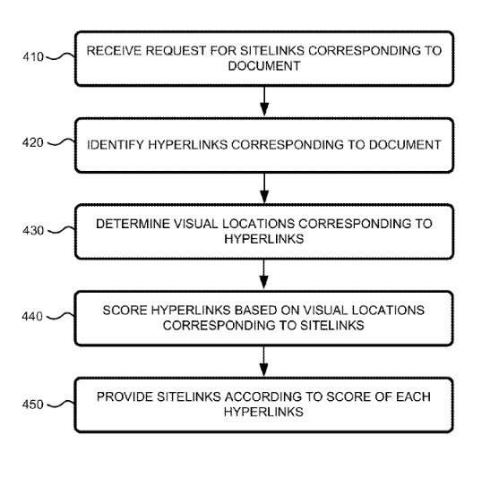
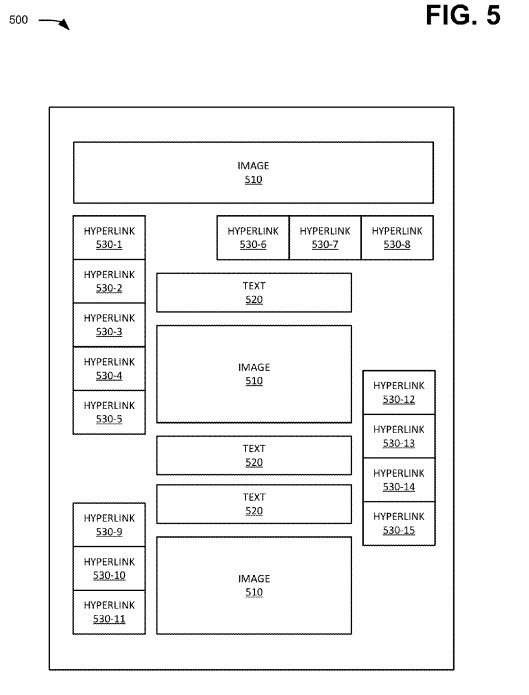

*Added 6-17-2015* – It’s not clear from the new patent filings, but from feedback, I received on Twitter from [Mathieu Janin](https://refeo.com/), at https://twitter.com/Matt_Refeo, it appears that Google may be showing sitelinks for pages that aren’t just the home pages of a site. As Mathieu tweeted to me:

_These sitelinks appear to be from an internal page on this site._

I performed this query again on the french version of Google, and it is showing sitelinks for an internal page on the site:

_Sitelinks appearing for an internal page on the site._

Himanshu Sharma also reported seeing sitelinks from interior pages in a tweet as well. (https://twitter.com/analyticsnerd):

_Sitelinks for a blog post, in Google search results._

Here’s what those sitelinks look like at Google:

_These sitelinks are showing up in an English Language result at Google_

I’ve tried many searches on Google.com to see if I could get sitelinks with descriptions on them like this on sites in English, but unlike Himanshu, I’m not having any success. However, I do get links below a result in a form that I’ve referred to here as [quicklinks](https://www.seobythesea.com/2010/03/how-a-search-engine-might-choose-text-for-quicklinks-or-site-links/) in the past. These do seem to be taken from prominently placed links on the linked pages. For example, here’s the search result for the Wii, which shows some quick links that appear upon the page linked to:

_The quicklinks for this search result shows off prominently placed links on the page listed in the results._

*Back to the original post…*

Search engines often provide extra links to display in search results for a site that are known as [Sitelinks](https://support.google.com/webmasters/answer/47334?hl=en). Google’s help page about sitelinks tells us that their purpose is to:

> … help users navigate your site. Our systems analyze the link structure of your site to find shortcuts that will save users time and allow them to find the information they’re looking for quickly.

I wrote about sitelinks at Google back in 2006, in the post [Google’s Listings of Internal Site Links for Top Search Results](https://www.seobythesea.com/2006/12/googles-listings-of-internal-site-links-for-top-search-results/), where I wrote about a patent application published that year that discussed how pages might be chosen to be presented as sitelinks. I noticed this week that Google was granted a new patent on sitelinks, and they followed that up by publishing a patent application about sitelinks under the same name. The 2006 patent seemed to focus more upon user behavior information associated with pages on a site to display those, and these newer patent filings have a slightly different approach. Their title discloses some significant differences, as they were both published under the name: “Sitelinks Based on Visual Location.”

_The Visual Sitelink Process_

I also noticed that the patent examiner listed the following three sources as “references” for the granted version of the patent:

- [All Links are Not Created Equal: 10 Illustrations on Search Engines’ Valuation of Links](https://moz.com/blog/20-illustrations-on-search-engines-valuation-of-links)
- [DOM](https://www.computerhope.com/jargon/d/dom.htm)
- [Google’s Reasonable Surfer: How the Value of a Link May Differ Based upon Link and Document Features and User Data](https://www.seobythesea.com/2010/05/googles-reasonable-surfer-how-the-value-of-a-link-may-differ-based-upon-link-and-document-features-and-user-data/)

Two of those articles describe how Google may choose some links on a page that may pass along more PageRank than other links. It appears that these new patent filings involving which links are chosen to be displayed in search results also use a similar approach to show off sitelinks. A score is given to sitelinks that appear upon pages that seem to be based on the visual location where that link appears upon that page.

The patent also tells us that some user-behavior signals still play a role by noting that:

> The method may also assign a score to each hyperlink of the plurality of hyperlinks based on a click-through rate corresponding to each hyperlink of the plurality of hyperlinks.

The visual location of a hyperlink is described in terms of a DOM (Document Object Model) for the site is listed (see the link above for “DOM” for a good description), and hypertext elements (different types of HTML markup)

The patent does mention the possibility that some links may appear in more than one location on a page, and links that do will have separate scores for each of those locations.

The patent application is:

[Sitelinks based on Visual Location](http://appft.uspto.gov/netacgi/nph-Parser?Sect1=PTO1&Sect2=HITOFF&d=PG01&p=1&u=%2Fnetahtml%2FPTO%2Fsrchnum.html&r=1&f=G&l=50&s1=%2220150161281%22.PGNR.&OS=DN/20150161281&RS=DN/20150161281)
Invented by: Minkoo SEO
Assignee: Google
US Patent Application 20150161281
Published June 11, 2015
Filed: June 11, 2012

Abstract

> A computing device may receive a request for sitelinks corresponding to a document and identify a plurality of hyperlinks corresponding to the document. Each hyperlink, of the plurality of hyperlinks, may include a hyperlink object within the document. The computing device may determine a visual location corresponding to each hyperlink of the plurality of hyperlinks corresponding to the document and assign a score to each hyperlink, of the plurality of hyperlinks, based on the visual location corresponding to the hyperlink. The computing device may provide a site link corresponding to a hyperlink of the plurality of hyperlinks based on the score assigned to the hyperlink.

The Granted patent is:

[Sitelinks based on visual location](http://patft.uspto.gov/netacgi/nph-Parser?Sect1=PTO1&Sect2=HITOFF&d=PALL&p=1&u=%2Fnetahtml%2FPTO%2Fsrchnum.htm&r=1&f=G&l=50&s1=9,053,177.PN.&OS=PN/9,053,177&RS=PN/9,053,177)
Invented by Minkoo Seo
Assigned to Google Inc. (Mountain View, CA)
US Patent 9,053,177
Granted June 9, 2015
Filed: June 11, 2012

Abstract

> A computing device may receive a request for sitelinks corresponding to a document and identify a plurality of hyperlinks corresponding to the document. Each hyperlink, of the plurality of hyperlinks, may include a hyperlink object within the document. The computing device may determine a visual location corresponding to each hyperlink of the plurality of hyperlinks corresponding to the document and assign a score to each hyperlink, of the plurality of hyperlinks, based on the visual location corresponding to the hyperlink. The computing device may provide a site link corresponding to a hyperlink of the plurality of hyperlinks based on the score assigned to the hyperlink.

The purpose behind these patent filings is summed up well in this paragraph:

> Since sitelinks may be included in a search engine result, scoring sitelinks according to visual locations and providing the sitelinks according to the score of each site link may enable the search engine result to not only include a hyperlink to a document but also to include sitelinks corresponding to the most visually and/or functionally significant hyperlinks within the document. Accordingly, as described herein, a system and/or method may be used to enhance search engine results corresponding to a document with one or more sitelinks to improve a user’s search experience.

So, it seems that Google is trying to identify significant hyperlinks on a page that might show sitelinks for.

The patent discusses a “sitelinks management system” that might be used to create sitelinks for pages. It mentions that to capture some links, Optical Character Recognition (OCR) might be used, and tags associated with links might be looked for. However, I have noticed some sites that don’t show sitelinks when you search for the site’s name, and links within the main navigation are images and pictures of text instead of actual textual-based links. In those instances, it didn’t appear that Google was using OCR to learn where those links led. That may change, but some self-help might be called to add text that GoogleBot can read to identify that link better.

The patent also discusses a “hypertext Markup System” that tracks groups of links that appear on pages, such as a top main navigation set. A set that appears in a footer on a page may contain some duplicated links from that top grouping of links. These groups of links may also be scored, and that score may play a role in determining how “visually, or functionally significant” a link may be.

## Sitelinks Take-Aways

Whether or not a site might have sitelinks appearing for it upon a search may depend upon whether or not Google can determine which links on the home page might be the most visually or functionally significant those links may be. Google may also score those links based upon a click-through rate associated with them, as well.

This is the first Search Engineer I’ve seen with the Surname “SEO,” which suggests that he might not have a Google Update named after Him.

I looked at the claims sections of the granted patent and the patent application (published after the granted patent was granted). There are three claims from the granted patent marked as “canceled” in the pending patent application. When those appear in the granted patent, they refer to sitelinks showing up in response to a query and having at least one site link for that result. It’s difficult to say how Google was interpreting those particular claims. There didn’t seem to be a lot upon them in the description section of the patent filings.

The sitelinks that do appear in response to a query may vary, as can be seen in the results below, in response to a query for the domain “seobythesea” and a query for the name of the site, “SEO by the Sea.”

_One set of sitelinks appear in search results for the domain name seobythesea_

_Another set of sitelinks appear in results for the site name SEO by the Sea._

Note that some sitelinks are for previously published blog posts, some are for categories, and some are for pages linked to navigation on the site. Do you have Sitelinks that appear for your domain name and Site Title, and if they don’t, do you have an idea of how to make changes so that those might start showing up?
