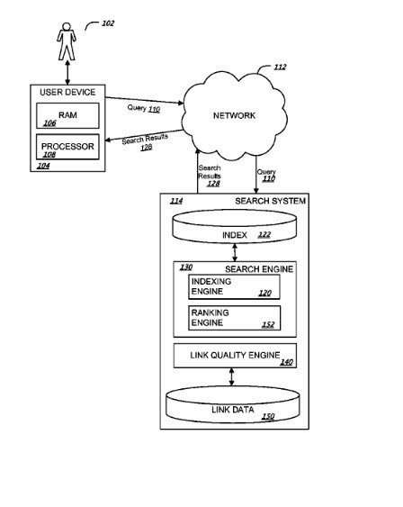
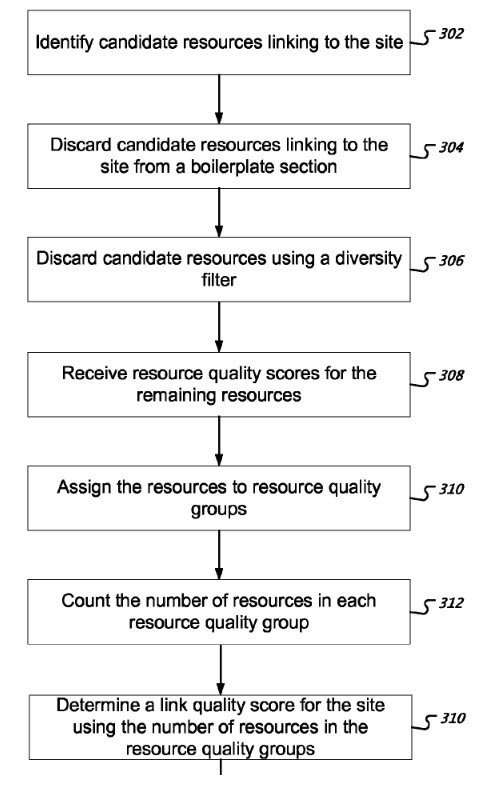

_A mural in Carlsbad, Ca._

On Tuesday, June 23, 2015. Barbara Starr and I gave a two-person Presentation to the SEO San Diego Meetup, SEM San Diego Meetup, and Lotico Semantic Web San Diego Meetup Groups. The Presentation was [Ranking in Google Since The Advent of The Knowledge Graph](https://www.meetup.com/san-diego-seo/events/222788666/).

Barbara and I have been looking at a lot of patents while preparing for the presentation. One patent mentioned adding “Buy Now” buttons to paid search listings in SERPs. But, of course, this would happen only if the sites that were to show buy now buttons have high-quality scores associated with them.

Barbara pointed out another patent to me that focuses on low-quality scores. It describes how a site might lose traffic if ranking scores for links pointed to it are below a certain threshold. That would make them low-quality sites.

## Is The Link Quality Score for a Site Below a Threshold?

This patent provides a quality score to resources that link to a site, counting the number of resources in each group. First, it determines a link quality score for the site using the resources in each resource quality group. It can then determine that the link quality score is below a threshold link quality score. It could then classify the site as a low-quality site because the link quality score is below the threshold link quality score. A low-quality site score classification can mean a decrease in the ranking score for that search result by an amount based on the link quality score. This follows a formula listed in the patent.

_Note the Link Quality Engine in the patent diagram_

The patent points out things that might lead to a lower quality score based upon links pointing to your site. These can include links to your site from boilerplate content and links from redundant material from sites pointed to your site. Enough links like these and that might result in a “low-quality site” label for your site.

It’s difficult to tell if a patent like this one has come into effect. But, some articles like the following make you wonder if Google has brought the details described within this patent, and similar ones, into effect. The article is, [Phantom 2 – Analyzing The Google Update That Started On April 29, 2015](https://www.gsqi.com/marketing-blog/phantom2-google-update-april-may-2015/)

## Linked to from Boilerplate Content

Many sites have content on them that could be considered boilerplate content. This includes footer content and sidebar content that doesn’t add much value to pages on a site. Boilerplate content is often copied from one page to another. This can also include copyright notices, links to things like sitemaps, and others. When someone links to another site from boilerplate sections of pages, Google may view that as an indication of low quality for the sites being linked to.

## Diversity filtering (Linked to from Redundant Material)

The patent also discusses something it calls diversity filtering. Diversity Filtering is a process for discarding resources that provide essentially redundant information to the link quality engine. For example, if your site provides a resource that links to a specific site and does so on several pages, Google may only count one of those links. Google may discard the rest of them. Google may count those filtered links against the site being pointed to, again as a sign of low quality.

_How a quality score is calculated under the patent._

## Advantages of the Low Quality Sites Patent

Here are the advantages this patent tells us it brings.

1. A search system can determine a link quality score for a site using a distribution of resource quality scores of resources linking to the site.
2. The search system can classify the site as a low-quality site if the link quality score is below a threshold.
3. When providing search results, the search system can decrease the ranking score of a site classified as a low-quality site, resulting in higher quality sites provided to users instead of low-quality sites.

The patent is:

[Classifying sites as low quality sites](https://patents.google.com/patent/US9002832)
Publication number US9002832 B1
Publication date Apr 7, 2015
Filing date Jun 4, 2012
Priority date Jun 4, 2012
Inventors Rajan Patel, Zhihuan Qiu, Chung Tin Kwok
Original Assignee Google Inc.

Abstract

> Methods, systems, and apparatus, including computer programs encoded on a computer storage medium, enhance search results. In one aspect, a method includes receiving a resource quality score for each of a plurality of resources linking to a site/ Each of the resources is assigned to one of a plurality of resource quality groups, each resource quality group associated with a range of resource quality scores, each resource assigned to the resource quality group associated with the range encompassing the resource quality score for the resource.
>
> The number of resources in each resource quality group is counted. A link quality score is determined for the site using the resources in each resource quality group. If the link quality score is below a threshold link quality score, the site is classified as a low-quality site.

## Take Aways

This isn’t the only patent from Google focusing on reducing rankings to sites based upon a low-quality score for that site. The Panda and Penguin updates from Google both do that. I’ve also written about a few others that involve low-quality scores as well, such as:

[How Google May Calculate Site Quality Scores (from Navneet Panda)](https://www.seobythesea.com/2015/05/google-site-quality-scores/)
[Google’s Quality Score Patent: The Birth of Panda?](https://www.seobythesea.com/2011/06/googles-quality-score-patent-the-birth-of-panda/)

I wrote one at Moz on this topic, too:

[Unraveling Panda Patterns](https://moz.com/blog/unraveling-panda-patterns)

The argument that Google seems to make about decreasing rankings for sites that seem to be low quality is that doing so raises the rankings of higher-quality sites.

I’ve written a few posts about patents involving quality scores for organic SEO:

- 6/14/2011 – [Google’s Quality Score Patent: The Birth of Panda?](https://www.seobythesea.com/2011/06/googles-quality-score-patent-the-birth-of-panda/)
- 12/9/2012 = [How Google May Identify Navigational Queries and Resources](https://www.seobythesea.com/2012/12/navigational-queries-resources/)
- 5/15/2013 – [How Google May Rank Web Pages Based on Quality Ratings](https://www.seobythesea.com/2013/05/google-rank-sites-quality-ratings/)
- 5/12/2015 – [How Google May Calculate a Site Quality Score (from Navneet Panda)](https://www.seobythesea.com/2015/05/google-site-quality-scores/)
- 6/22/2015 – [How Google May Classify Sites as Low Quality Sites](https://www.seobythesea.com/2015/06/how-google-may-classify-sites-as-low-quality-sites/)
- 7/30/2018 – [Quality Scores for Queries: Structured Data, Synthetic Queries and Augmentation Queries](https://www.seobythesea.com/2018/07/quality-scores-for-queries/)
- 9/21/2017 – [Using Ngram Phrase Models to Generate Site Quality Scores](https://www.seobythesea.com/2017/09/site-quality-scores/)
- 6/10/2019 – [How Google May Rank Some Results based on Categorical Quality](https://www.seobythesea.com/2019/06/categorical-quality/)

Last Updated June 26, 2019.
