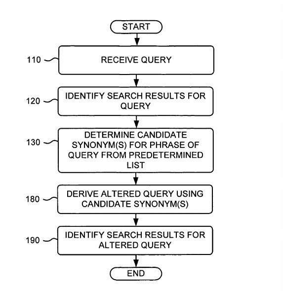
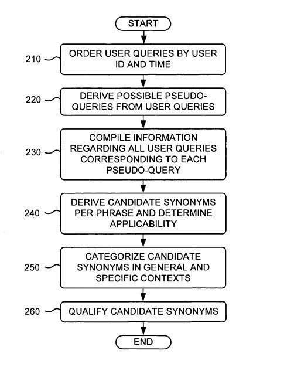
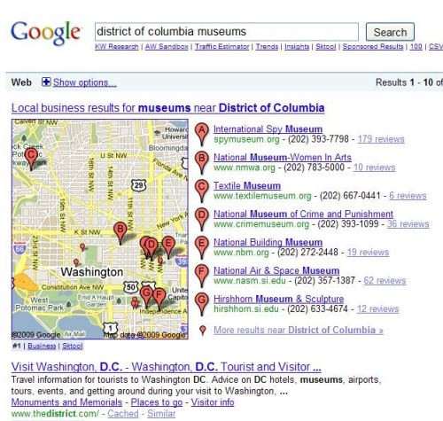

## How Often Do Search Synonyms Make A Difference in Searches at Google?

When someone searches the Web, one challenge they face is using the right words to find what they are looking for.

Search engines rank pages based on the prominence of terms from a query appearing on pages. If a searcher doesn’t use the right keywords, they may miss the information they might like to find. Search engines may decide to show pages that show search synonyms instead of the query terms searched with if those search synonyms show results for the meaning that the searcher intended to find.

As a searcher, if you see search results without the keywords you searched for but see words in your results similar in meaning to your query, Google may have returned those by using search synonyms to find the results you may see.

## Alternative Spellings of Locations as Search Synonyms

For example, a person looking for web hosting in the City of Ft. Wayne may type the query [Web hosting Fort Wayne] into a search engine. But, they may not see many pages about hosting in that location because the City is usually referred to as “Ft. Wayne” rather than “Fort Wayne.” I find myself often challenged by a similar problem when I look for information about Washington, D.C., or the District of Columbia, or DC. Alternative spellings of locations could be search synonyms because they mean the same place when used.

A patent granted to Google this week is about the search engine rewriting search terms searches with search synonyms to make it easier for searchers to locate the information they intended. In the Ft. Wayne example, this means Google would look for pages relevant for both [web hosting Fort Wayne] and [web hosting Ft. Wayne]. Search synonyms to find other words with the same meaning may help people find information that they first set out to find. For example, it would improve searches around Washington, DC by returning results for sites in DC or the District of Columbia instead of “Washington, DC.”

## Other Examples of Search Synonyms

The Fort Wayne search synonyms example is from the patent. The patent authors provide another example of a search query that someone looking for music for a video they are making might use in a search that they intended to find. Another example from the search synonyms patent is a query such as [free loops for the flash movie]. The chances are that most people offering music that they can use for free for videos will use the word “music” rather than “loops.” They may also use search synonyms for words such as “animation” rather than “movie.” When that searcher types [free loops for the flash movie] into Google’s search box, the search engine might not return pages that provide free music for flash animations because those pages don’t use the words “loop” or “movie,” or the words “loop” and “movie” get used on some pages that aren’t very prominent. The pages don’t rank very well in Google for those terms.

The inventors tell us of the search synonyms patent that as the number of terms in a query increases, this problem becomes more serious:

> Thus, documents that satisfy a user’s information need may use different words than the query terms chosen by the user to express the concept of interest. Since search engines typically rate documents based on how prominently the user’s query terms are in the documents, this means that a search engine may not return the most relevant documents in such situations (since the most relevant documents may not contain the user’s query terms prominently, or at all).
>
> This problem becomes progressively more serious as the number of terms in a query increases. For queries longer than three or four words, there is a strong likelihood that one of the words is not the best phrase to describe the user’s information need.

## Search Synonyms and Context

One of the simpler ways for a search engine to find search synonyms for terms that people use in queries to rewrite those queries would be to use a thesaurus or database of synonyms. The search engine could then look up the words in a query to identify possible search synonyms. There are some limitations to that approach. The most significant is that the meaning of a term often relies upon its context of usage.

> For example, “music” is not usually a good synonym for “loops,” but it is a good synonym in the context of the example query above. Further, this case is sufficiently special that “music” is not listed as a synonym for “loop” in standard thesauruses; many other examples of contextually dependent non-traditional synonyms can be easily identified.
>
> When a conventional synonym gets displayed for a term, it can be difficult to identify which particular synonyms to use in the particular context of the query.

## Search Synonyms For Words That Appear in Search Query Logs

The patent presents a process for finding search synonyms for words that appear in search query logs. It would then evaluate the quality of those synonyms within the context of a particular query and use those synonyms to rewrite queries and return relevant pages to searchers.

It starts by finding similar queries and performing tests upon those query terms and phrases while looking at information related to those queries.

For instance:

- The number or percentage of times both terms appeared in search queries within a certain amount of time.
- The number or percentage of times both terms appeared within a particular user search session.
- How much alike the search results are the original search query and for a search for a candidate synonym.

Once search synonyms are good replacements within a query, the search engine might offer a modified query using the search synonyms as search suggestions. The revised query might expand the scope of the search results presented to a searcher.

So, someone searching for [Web hosting Fort Wayne] might get a set of search results with a query suggestion at the top of the results with a link to results for [Web hosting Ft Wayne]. Or they might see a set of search results that includes pages that are good matches for both [Web hosting Fort Wayne] and [Web hosting Ft Wayne].

## The Search Synonyms Patent

The search synonyms patent is:

[Determining query term synonyms within query context](http://patft.uspto.gov/netacgi/nph-Parser?Sect1=PTO2&Sect2=HITOFF&u=%2Fnetahtml%2FPTO%2Fsearch-adv.htm&r=1&p=1&f=G&l=50&d=PTXT&S1=7,636,714.PN.&OS=pn/7,636,714&RS=PN/7,636,714)
Invented by John Lamping and Steven Baker
Assigned to Google
US Patent 7,636,714
Granted December 22, 2009
Filed: March 31, 2005

Abstract

> A method gets applied to search terms for determining synonyms or other replacement terms used in an information retrieval system. User queries are first sorted by user identity and session. Then, for each user query, a plurality of pseudo-queries gets determined. Finally, each pseudo-query gets made from a user query by replacing a phrase of the user query with a token.
>
> For each phrase, at least one candidate synonym gets determined. The candidate synonym is a term used within a user query in place of the phrase and the context of a pseudo-query. They may check the strength or quality of candidate synonyms. Validated search synonyms may be either suggested to the user or automatically added to user search strings.

## How the Google Search Synonyms Process Works

Someone enters a query at the search engine. A set of pages relevant to the query gets returned and ranked based upon their perceived relevance and importance.

The search engine then looks at the query terms and might attempt to identify possible search synonyms for words or phrases within that query. It may use a list made from analyzing the search engine’s query logs.

All queries received over a certain period might create that list. Because of it, potential or candidate search synonyms may then get found.

For example, the original query might have been [free loops for flash movie], and there might be previous queries within the log, such as [free music for flash movie], that may be worth reviewing.

Or, query fragments with wildcard tokens within them might be in [free * for flash movie].

Analysis of information from the query logs about the queries with the candidate search synonyms might.

For instance, how frequently has someone searching for [free loops for flash movie] within a short time then searched for [free music for flash movie] or [free loops for flash animation].

Other tests may also get run, such as the probability that both queries might have many top search results in common if someone searched for both. So, if in a search for [free loops for flash movie] and a search for [free loops for flash animation], there are a certain number of pages in the top 10 (or some other number) that are the same, then “movie” and “animation” are good synonyms within the context of that query.

## Search Synonyms Conclusion

The patent includes many examples of how search synonyms might be words that appear in queries. It is worth spending a good amount of time on if you’re interested in how a search engine like Google might expand search results for searchers to include those synonyms.

When I search for [District of Columbia museums], the top result after local results is a page that doesn’t include the word “Columbia.” However, if I look at the cached copy of the page at Google, I am told that “Columbia” does appear within anchor text in links to the page. That may be why it shows up as the top result for my query. But, plenty of pages are also good matches for the words I used to search with.

Is Google deciding that other words or phrases on that page are search synonyms for “District of Columbia,” such as “D.C.” Is Google modifying my search results to include that page?

While not conclusive evidence by any means, it is interesting that in the top search result (past the local results) for my query, the acronym “D.C.” gets bolded as one of my query terms. Google usually highlights query terms when they appear in search results using bold text to show searchers that the pages they are returning are relevant for the query used in a search.

There’s no mention in this patent that Google might highlight or display search synonyms in bold text in search results if they expand search results for a query. The highlighting process used by Google is separate, but, interestingly, the search engine bolded the synonym for District of Columbia.

What does this mean for you as a searcher or a site owner if Google uses this search synonyms process?

For searchers, it might mean that Google may add pages to your search results based upon words it perceives as search synonyms to words you used in your query. So, for example, search for something while including the words “District of Columbia” in your search, and you may see also see pages that use “Washington, D.C.” or “D.C.” instead of “District of Columbia.”

For site owners, it could mean that if you target specific keyword phrases on your pages for searchers, other sites that use synonyms for some of the words in your chosen keyword phrases may also show up in the same search results as your pages.

## how Google Handles Synonyms and Bold Search Results to Highlight Those Search Synonyms.

Added – January 19, 2010 – An Official Google Blog post was just published. It describes a recent change at Google on how Google handles synonyms and bold search results to highlight those search synonyms. The description sounds very much like the process above, using search synonyms determined in context.

See: [Helping computers understand language](https://googleblog.blogspot.com/2010/01/helping-computers-understand-language.html)

Note that the author of that Official Google Blog post, Steven Baker, is one of the inventors on this search synonyms patent.

Matt Cutts also follows up with [More info about synonyms at Google](https://www.mattcutts.com/blog/google-synonyms/)

Google also published a patent filing that looks at search synonyms in context. It also uses statistical language models to translate a query into another language and then back into the first language. It would do that to attempt to find more than one phrase or term that may include synonyms within the same context. That approach and the one that I described above could show in many ways. I describe it in the post: [How a Search Engine Might Find Synonyms to Use to Expand Search Queries](https://www.seobythesea.com/2008/12/how-a-search-engine-might-find-synonyms-to-use-to-expand-search-queries/).

I’ve written a few posts about search synonyms. Here are some of those:

- 2/19/2006 – [Multi-Stage Query Processing at Google](https://www.seobythesea.com/2006/02/google-looks-at-multi-stage-query-processing/)
- 5/25/2007 – [Refining Queries Using a Local Category Synonym](https://www.seobythesea.com/2007/05/refining-queries-using-category-synonyms-for-local-and-other-searches/)
- 12/29/2008 – [How a Search Engine Might Use Synonyms to Rewrite Search Queries](https://www.seobythesea.com/2008/12/how-a-search-engine-might-find-synonyms-to-use-to-expand-search-queries/)
- 1/23/2009 – [Google to Expand Language Search and Shrink Our World?](https://www.seobythesea.com/2009/01/search-engines-to-expand-language-search-and-shrink-our-world/)
- 6/29/2009 – [Semantic Relations from Query Logs](https://www.seobythesea.com/2009/06/query-logs-and-the-slang-of-the-web/)
- 12/22/2009 – [Google Search Synonyms Are in Queries](https://www.seobythesea.com/2009/12/how-google-may-expand-searches-using-synonyms-for-words-in-queries/)
- 1/19/2010 – [Google Synonyms Update](https://www.seobythesea.com/2010/01/google-synonyms-update/)
- 1/27/2010 – [Paid Search Results and Query Expansion using Synonyms and Related Concepts](https://www.seobythesea.com/2010/01/paid-search-results-and-query-exansion-using-synonyms-and-related-concepts/)
- 2/16/2011 – [More Ways Search Engine Synonyms Might Rewrite Queries](https://www.seobythesea.com/2011/02/more-ways-a-search-engine-might-identify-synonyms-to-expand-queries-with/)
- 8/12/2013 – [How Google May Substitute Query Terms with Co-Occurrence](https://www.seobythesea.com/2013/08/google-substitute-query-terms-co-occurrence/)
- 9/27/2013 – [The Google Hummingbird Patent?](https://www.seobythesea.com/2013/09/google-hummingbird-patent/)
- 12/8/2013 – [How Google May Rewrite Queries](https://www.seobythesea.com/2013/12/rewrite-search-terms/)
- 9/9/2013 – [How Google May Reform Queries Based on Co-Occurrence in Query Sessions](https://www.seobythesea.com/2013/09/google-reform-queries-based-co-occurrence-query-sessions/)
- 10/15/2013 – [Google’s Hummingbird Algorithm Ten Years Ago](https://www.seobythesea.com/2013/10/googles-hummingbird-algorithm-ten-years-ago/)
- 12/21/2015 = [How Google Might Make Better Synonym Substitutions Using Knowledge Base Categories](https://www.seobythesea.com/2015/12/how-google-might-make-better-synonym-substitutions-using-knowledge-base-categories/)

Updated July 15, 2019.
