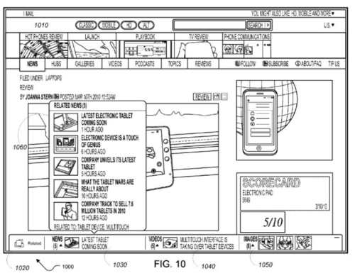

A Google patent granted this week describes how Google might try to understand main entities that appear on Web pages, and how that awareness might influence the search results that the search engine shows off in search results.

An entity is a specifically named person, place, or thing (including ideas and objects) that could be connected to other entities based upon relationships between them. Some pages may make certain Entities to be the main entities of a page, while others may include additional information about entities that are related in some manner to those first entities. When some entities appear on pages, they may be presented in an ambiguous manner that doesn’t make them the main topic for the page they appear upon.

Entities are said to exist in a graph that connects them to other entities based upon relationships between them. For instance, Google and Bing are both Search Engines, both internet domains, both employers of many search engineers, and have CEOs, Vice Presidents, Marketing staff, headquarters, data centers, Web indexes. There are a lot of related entities that might show up on Web pages about both.

This view of Entities being related to each other, and belonging to an “Entity Graph” is very similar to what the Microsoft Patent I wrote about recently in [How Bing May Expand Queries Based upon Finding Entities Within them](https://www.seobythesea.com/2015/04/how-bing-may-expand-queries-based-upon-finding-entities-within-them/). A number of the ideas behind how that patent works and this one are similar in that some knowledge about an entity might cause a search engine to display information about related entities.

This newly granted patent describes how Google may work to identify and understand main entities that appear upon pages, to be able to answer queries or questions about those pages.

The patent starts by trying to understand candidate entities for a page and understand an entity graph for that page and the relationships between those entities, and how those might fit and be best represented in response to a query made by the search engine that chooses that page to respond to the query.

## Scoring an identified main entity

This process may start by generating a score for the entities identified as to how central it is to a page or resource. That score may be based at least in part on the weights of outgoing edges of a node corresponding to the particular identified central entity in a second entity graph – in other words, looking at how strong the relationship is between them. This can be done by looking at a count of several times the identified central entity appears in a query log of queries to a search engine, or “upon a frequency of occurrence of the identified central entity from the first resource.”

Advantages described in the patent from this approach include:

- Entities representing main topics of a resource can be identified
- Entities representing more peripheral topics can be discarded
- Topical entities from a resource directed at one topic can be more clearly identified
- Entities mostly used in a different context than that of the resource (page, site) can be identified
- A combined entity may be created from identified entities so that their scope is limited to the topics related to the resource.

## Displaying Additional Entity Content

A user’s web browsing experience can be enhanced by providing additional content that is interesting and is relevant to resources that are being presented to the user. Because that additional content is generated using only main entities representing topics of the resources, the additional content’s relevance to the first resource and value to the user can be improved. For example, depending on the resource presented to the user, the additional content can include:

- related video content
- news content
- image content
- web pages
- price comparison
- map content
- business listing content
- so on

Because so much variety of types of content can be added, the patent tells us that, “the user’s web browsing experience can be improved, and can be adjusted based on their browsing history.”

The patent is:

[Identifying central entities](http://patft.uspto.gov/netacgi/nph-Parser?Sect1=PTO1&Sect2=HITOFF&d=PALL&p=1&u=%2Fnetahtml%2FPTO%2Fsrchnum.htm&r=1&f=G&l=50&s1=9,009,192.PN.&OS=PN/9,009,192&RS=PN/9,009,192)
Invented by Tomer Shmiel, Ziv Bar-Yossef, Alexander Sobol, Eran Ofek, Haran Pilpel, Eldad Barkai, Yossi Matias
Assigned to Google
US Patent 9,009,192
Granted April 14, 2015
Filed: June 3, 2011

Abstract

> Methods, systems, and apparatus, including computer programs encoded on a computer storage medium, for identifying central entities. In one aspect, a method includes obtaining candidate entities for a first resource;
>
> - Filtering a first entity graph whose nodes represent different entities found in a plurality of resources to remove nodes that do not correspond to a candidate entity, wherein pairs of nodes in the filtered first entity graph that are connected by an edge correspond to pairs of candidate entities that are associated with the same resource;
> - Generating a second entity graph for the first resource from the filtered first entity graph, wherein the second entity graph does not include nodes from the filtered first entity graph that are not connected to other nodes in the filtered first graph; and
> - Identifying candidate entities that are represented by nodes in the second entity graph as being main entities for the first resource.

## Take Aways

A knowledge of what entities important to a page can influence what other pages and results that a search engine might show when that page is a good response to a query and can include things like news stories, videos, images, and more. This is how a Knowledge Base can influence search results.

If I search for a popular TV series such as “Arrow” or “The Flash,” the search engine can likely look through a source such as their query log files and identify the people who are important figures acting in the show, important “Characters” from the show, important plot lines, and themes. It might use Knowledgebase information to help inform that knowledge even more. It can identify which entities associated with the shows are central figures, and which might be less important. It may gain a sense of topics that are similar between the shows, such as both having origins in the world of Comic Books, and are written about in many of the same sources.

If you switch that thinking over from TV shows to Business entities, like Microsoft or Google or Apple, again, you could look through a source such as Google’s query log files and knowledge base sources, such as Wikipedia and Freebase and others, and learn more about the entity graph associated with those businesses, and themes, and learn as a search engine, what additional content to display in search results when someone performs a relevant query.

_Related News for a story might be identified by looking at the central entity is it about._

An awareness of related entities on a topic that you care about when creating content about it on the Web can be helpful. It’s something that you should likely investigate.

I’ve written a few posts about named entities. These are some that I wanted to share:

- [Do You Have a Named Entity Strategy for Marketing Your Web Site?](https://www.seobythesea.com/2013/12/named-entity-strategy/)
- [How I Came to Love Entities and Start Doing Entity Optimization](https://www.seobythesea.com/2014/10/came-love-entities/)
- [How Google Uses Named Entity Disambiguation for Entities with the Same Names](https://www.seobythesea.com/2015/09/disambiguate-entities-in-queries-and-pages/)
- [How Named Entities Connected to Trending Topics can be used to Address Real Time Search Results](https://www.seobythesea.com/2015/03/how-named-entities-connected-to-trending-topics-can-be-used-to-address-real-time-search-results/)
- [Not Brands but Entities: The Influence of Named Entities on Google and Yahoo Search Results](https://www.seobythesea.com/2010/08/not-brands-but-entities-the-influence-of-named-entities-on-google-and-yahoo-search-results/)
- [How Knowledge Base Entities can be Used in Searches](https://www.seobythesea.com/2014/07/knowledge-base-entities-used-in-searches/)
- [Finding Entity Names in Google’s Knowledge Graph](https://www.seobythesea.com/2014/06/entity-names-in-google/)
- [Google Gets Smarter with Named Entities: Acquires MetaWeb](https://www.seobythesea.com/2010/07/google-gets-smarter-with-named-entities-acquires-metaweb/)
- [Entity Associations with Websites and Related Entities](https://www.seobythesea.com/2014/01/entity-associations-websites-related-entities/)
- [How Google Might Identify Entity Synonyms Using Anchor Text](https://www.seobythesea.com/2014/06/synonyms-for-entities/)
- [Extracting Facts for Entities from Sources such as Wikipedia Titles and Infoboxes](https://www.seobythesea.com/2014/08/extracting-facts-for-entities-from-sources/)
- [Extracting Semantic Classes and Corresponding Instances from Web Pages and Query Logs](https://www.seobythesea.com/2014/09/extracting-semantic-classes-instances-from-web-pages-query-logs/)
- [How Google May Identify Main Entities](https://www.seobythesea.com/2015/04/how-google-may-identify-central-entities-from-resources/)
- [How Google’s Knowledge Graph Updates Itself by Answering Questions](https://www.seobythesea.com/2018/10/how-googles-knowledge-graph-updates-itself-by-answering-questions/)

Last Updated June 26, 2019.
