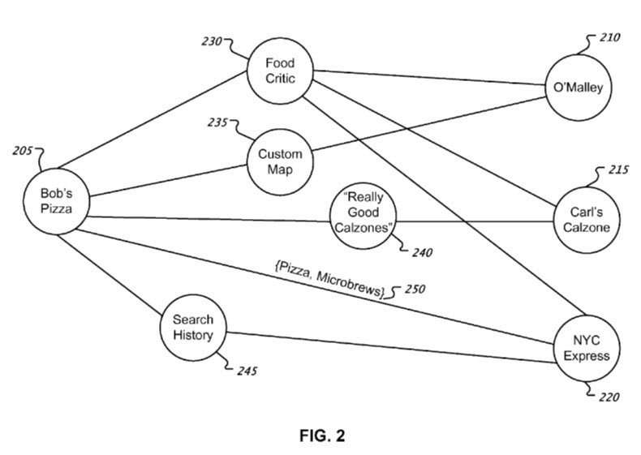
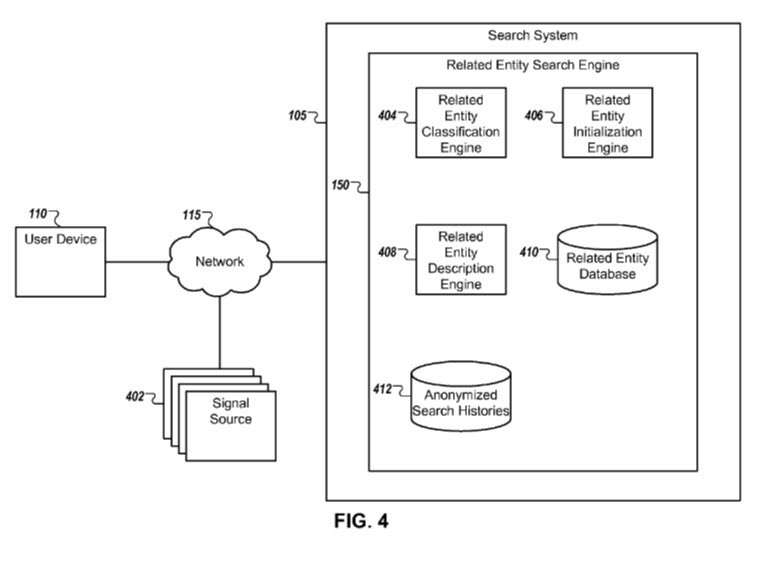
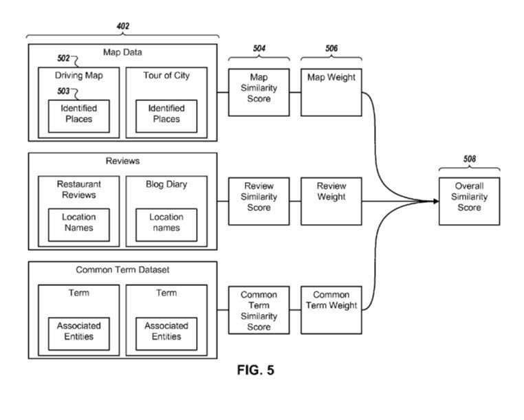

A patent granted to Google this week attempts to identify similarities between different types of entities when it finds information about them on the Web. It refers to these types of similarities as commonalities, as in things they may have in common. Google may use these similarities in many ways, such as supplementing search results containing related information based upon results that might be in the same category or possibly located in the same region.

The things identified as common may be for things that are moderately unique, but not completely rare.

The patent says “entities,” but it seems to be focusing upon different businesses that might share some similarities. For example, they refer to a food critic writing about restaurants a few times and tell us that the things such a critic might write about different restaurants might be used to find similarities between those places.

_This method describes finding commonalities between entities._

For example, that critic might tell us about two different restaurants that both serve the same types of food, such as specializing in certain types of seafood, or that may be located near each other.

The patent is:

[Identifying interesting commonalities between entities](http://patft.uspto.gov/netacgi/nph-Parser?Sect1=PTO1&Sect2=HITOFF&d=PALL&p=1&u=%2Fnetahtml%2FPTO%2Fsrchnum.htm&r=1&f=G&l=50&s1=9,116,982.PN.&OS=PN/9,116,982&RS=PN/9,116,982)
Invented by Tamara I. Stern, Gregory J. Donaker, Jason Lee, Bernhard A. M. Seefeld
Assigned to Google
US Patent 9,116,982
Granted August 25, 2015
Filed: March 14, 2013

Abstract

> Methods, systems, and apparatus, including computer programs encoded on a computer storage medium, for generating descriptions of relationships between entities.
>
> In one aspect, a method includes:
>
> - Identifying one or more related entities for a particular entity based at least in part on commonalities between the particular entity and the one or more related entities
> - sorting the commonalities according to a measure of the uniqueness of each of the commonalities, and
> - identifying a subset of the commonalities having a measure of uniqueness above a lower measure of uniqueness threshold.
>
> The identified subset of commonalities can include one or more commonalities. One or more commonalities can be selected from the subset of commonalities as indicative of a relationship to the particular entity, and a description of the relationship can be identified based on the selected one or more commonalities.

## Related Entities Take Aways

We are told in the patent that sources such as reviews of places might be looked at while also identifying similarities or commonalities from sources like a food critic’s articles or blog posts.

At present, I’m not seeing the kinds of recommendations fo “similar” places in search results, then again, this patent was just granted a few days ago. It’s possible that Google may have developed a process like the one described in this patent, but hasn’t released it to the public yet.

They tell us that the things they might look for similarities about specific entities might be scored on a “uniqueness” score, based upon how frequently those features might show up in a body of information that the entities (or businesses) might be located in. So, a uniqueness score for (entities) like restaurants may be restaurants could be based upon both offer a rare and unique dish such as Spanakopita, or that they share a map location, or that they share the use of some unusual language

The purpose of this patent seems to be to enable Google to offer searchers “similar” places when they perform a search for a particular type of business.
