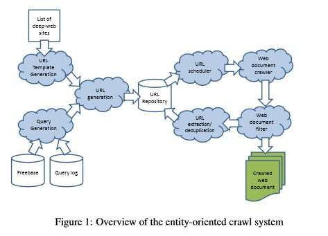

If you’ve been doing SEO for a while, one of the papers you may have read describes how Google was attempting to index content found on the Web that might be difficult for their crawlers to access, such as financial statements from the SEC. The search engine would have to access this information by filling out a form and guessing good queries because that was the only way to access the information – they couldn’t crawl it without querying it first. This paper describes efforts that Google undertook to access that information:

[Google’s Deep-Web Crawl](https://dl.acm.org/doi/10.14778/1454159.1454163)

From the abstract to the paper:

> The Deep Web, i.e., content hidden behind HTML forms, has long been acknowledged as a significant gap in search engine coverage. Since it represents a large portion of the structured data on the Web, accessing Deep-Web content has been a long-standing challenge for the database community. This paper describes a system for surfacing Deep-Web content, i.e., pre-computing submissions for each HTML form and adding the resulting HTML pages into a search engine index. The results of our surfacing have been incorporated into the Google search engine and today drive more than a thousand queries per second to Deep-Web content

A few years ago, I wrote a blog post that I titled “[Solving Different URLs with Similar Text (DUST)](https://www.seobythesea.com/2006/09/solving-different-urls-with-similar-text-dust/)” which described some of the difficulties that a search engine might have indexing some URLs.

A paper I came across this week sort of combines those topics and uses information from sources such as Freebase to better guess queries and crawl deep-web pages that focus upon products found on commerce pages that could be difficult to reach otherwise, that Google might have to fill out forms to access, and which it could use names of Entities found from sources such as Freebase (such as names of phones, like “iPhone”) to query and to find those deep web pages. The paper is:

[Crawling Deep Web Entity Pages](http://pages.cs.wisc.edu/~heyeye/paper/Entity-crawl.pdf) (pdf) The image below is from the paper and illustrates how the process describe within it works:

_A diagram of the entity crawl system described in the paper_

The abstract from the paper tells us:

> Deep-web crawl is concerned with the problem of surfacing hidden content behind search interfaces on the Web. While many deep-web sites maintain document-oriented textual content (e.g., Wikipedia, PubMed, Twitter, etc.), which has traditionally been the focus of the deep-web literature, we observe that a significant portion of deep-web sites, including almost all online shopping sites, curate structured entities as opposed to text documents. Although crawling such entity-oriented content is clearly useful for various purposes, existing crawling techniques optimized for document-oriented content are not best suited for entity-oriented sites. In this work, we describe a prototype system we have built specializing in crawling entity-oriented deep-web sites. We propose techniques tailored to tackle important subproblems, including query generation, empty page filtering, and URL deduplication in the specific context of entity-oriented deep-web sites. These techniques are experimentally evaluated and shown to be effective.

A Search at Freebase for [smartphones] provides a list of different entities described as competing entities at the Knowledge base:

_A Freebase list of smartphones._

The paper tells us that this type of information can help identify queries that can be used to crawl content from a product-based eCommerce site:

> Our first contribution is to show how query logs and knowledge bases (e.g., Freebase) can be leveraged to generate entity queries for crawling. We demonstrate that classical techniques for information retrieval and entity extraction can be used to robustly derive relevant entities for each site so that crawling bandwidth can be utilized efficiently and effectively

The paper also describes how it might filter content from these deep-crawled pages to avoid empty pages (pages without content focusing upon a specific entity) or pages that duplicate content under a different name.

## Take-Aways

If you’ve been looking for a connection between the SEO of web-page crawling and the use of Data from sources like Knowledge-bases, this paper describes such a connection – using data from a knowledge-base such as freebase to query the content of a deep web database, such as an eCommerce site where content doesn’t surface to be crawled unless it is queried first.

As I was looking through this paper, I was impressed by the papers cited within it, and I wanted to look them up. After looking at a few, I decided that I’m probably going to be spending some time reading through many of them, so I created links. A few of them require ACM Membership to read, but many are freely accessible on the Web. So you may find them interesting, too.

10. REFERENCES

[1] [HTML 4.01 Specification, W3C recommendations](http://www.w3.org/Addressing/URL/4_URI_Recommentations.html).
[2] Z. Bar-yossef, I. Keidar, and U. Schonfeld. Do not crawl in the dust: different URLs with similar text (pdf) In Proceedings of WWW, 2006.
[3] L. Barbosa and J. Freire. [Siphoning hidden-web data through keyword-based interfaces](https://vgc.poly.edu/~juliana/pub/freire-sbbd2004.pdf) (pdf) In Proceedings of SBBD, 2004.
[4] L. Barbosa and J. Freire. [Searching for hidden web databases](https://vgc.poly.edu/~juliana/pub/webdb2005.pdf) (pdf) In Proceedings of WebDB, 2005.
[5] L. Barbosa and J. Freire. An adaptive crawler for locating hidden-web entry points (pdf) In Proceedings of WWW, 2007.
[6] K. D. Bollacker, C. Evans, P. Paritosh, T. Sturge, and J. Taylor. Freebase: a collaboratively created graph database for structuring human knowledge (pdf) in SIGMOD, 2008.
[7] A. Z. Broder, S. C. Glassman, M. S. Manasse, and G. Zweig. [Syntactic clustering of the web](https://www.hpl.hp.com/techreports/Compaq-DEC/SRC-TN-1997-015.pdf) (pdf) In Proceedings of WWW, 1997.
[8] A. Dasgupta, R. Kumar, and A. Sasturkar. [De-duping URLs via rewrite rules](https://dl.acm.org/doi/10.1145/1401890.1401917#source) In Proceeding of the 14th ACM SIGKDD international conference on Knowledge discovery and data mining, Proceedings of KDD, 2008.
[9] J. Guo, G. Xu, X. Cheng, and H. Li. [Named entity recognition in query](https://www.cse.iitb.ac.in/~soumen/doc/www2013/QirWoo/GuoXCL2009nerq.pdf) In
Proceedings of SIGIR, Proceedings of SIGIR, 2009.
[10] B. He, M. Patel, Z. Zhang, and K. C.-C. Chang. [Accessing the deep web](https://dl.acm.org/doi/10.1145/1230819.1241670)
Commun. ACM, 50, 2007.
[11] M. A. Hearst. [UIs for faceted navigation recent advances and remaining open problems](http://flamenco.berkeley.edu/papers/hcir08.pdf) (pdf) In Proceedings of HCIR, 2008.
[12] A. Jain and M. Pennacchiotti. [Open entity extraction from web search query logs](http://www1.cs.columbia.edu/~alpa/Papers/coling10a.pdf) (pdf) In Proceedings of ICCL, 2010.
[13] H. S. Koppula, K. P. Leela, A. Agarwal, K. P. Chitrapura, S. Garg, and
A. Sasturkar. Learning URL patterns for webpage de-duplication (pdf) In Proceedings
of WSDM, 2010.
[14] J. Madhavan, S. R. Jeffery, S. Cohen, X. luna Dong, D. Ko, C. Yu, and
A. Halevy. [Web-scale data integration: You can only afford to pay as you go](http://web.mit.edu/tibbetts/Public/CIDR_2007_Proceedings/papers/cidr07p40.pdf) (pdf) In
Proceedings of CIDR, 2007.
[15] J. Madhavan, D. Ko, L. Kot, V. Ganapathy, A. Rasmussen, and A. Halevy.
[Google’s deep web crawl](https://dl.acm.org/doi/10.14778/1454159.1454163) (pdf) In Proceedings of VLDB, 2008.
[16] G. S. Manku, A. Jain, and A. D. Sarma. Detecting near-duplicates for web
crawling (pdf) In Proceedings of WWW, 2007.
[17] A. Ntoulas. Downloading textual hidden web content through keyword queries (pdf) In JCDL, 2005.
[18] M. Pa ̧sca. [Weakly-supervised discovery of named entities using web search queries](https://dl.acm.org/doi/10.1145/1321440.1321536) In Proceedings of CIKM, 2007.
[19] Y. Qiu and H.-P. Frei. [Concept based query expansion](https://dl.acm.org/doi/10.1145/160688.160713) (pdf) In
Proceedings of SIGIR, 1993.
[20] S. Raghavan and H. Garcia-Molina. [Crawling the hidden web](http://web.archive.org/web/20160325110929/http://ilpubs.stanford.edu:8090/725/1/2001-19.pdf) Technical report, Stanford, 2000.
[21] P.-N. Tan and V. Kumar.
[Introduction to Data Mining](https://www-users.cs.umn.edu/~kumar001/dmbook/index.php)
[22] Y. Wang, J. Lu, and J. Chen. Crawling deep web using a new set covering algorithm In Proceedings of ADMA, 2009.
[23] P. Wu, J.-R. Wen, H. Liu, and W.-Y. Ma. [Query selection techniques for efficient crawling of structured web sources](http://www.public.asu.edu/~huanliu/papers/icde06.pdf) (pdf) In Proceedings of ICDE, 2006
