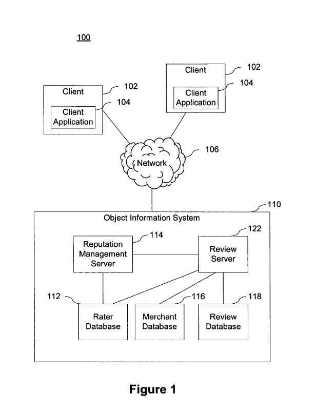

## New Google Patent on Reputation Mangement

Do reviews of businesses and products at Google influence how well those might show up in place searches or product searches? They may play a role, and a bigger question might be how much weight might Google give to each review that it sees. An answer, in part, to that may depend upon rater and reviewer reputations scores associated with the people leaving reviews.

People do go online to search for reviews and ratings for businesses and products, and the search engines are trying to provide that information when and where they think it might be useful.

Starred ratings are also showing in Google’s Web search with [Rich Snippets](https://webmasters.googleblog.com/2009/05/introducing-rich-snippets.html), and the presence of ratings may influence whether or not someone clicks through a snippet from Google’s search results.

A recent change to how Google shows search results in Web search may mean that if Google thinks you are performing a search where local search results are appropriate, then Google may show those local results as if they were organic search listings. Google refers to this change as [Place Search](https://googleblog.blogspot.com/2010/10/place-search-faster-easier-way-to-find.html), and it can have an impact upon the number of visitors a site may receive and possibly increase the number of contacts for a business listed in those results.

A patent from Google granted today, [Systems and methods for reputation management](http://patft.uspto.gov/netacgi/nph-Parser?Sect1=PTO2&Sect2=HITOFF&u=%2Fnetahtml%2FPTO%2Fsearch-adv.htm&r=1&p=1&f=G&l=50&d=PTXT&S1=7,827,052.PN.&OS=pn/7,827,052&RS=PN/7,827,052) (US Patent 7,827,052), takes a closer look at the people who provide reviews and ratings for businesses and products, and describes a way of creating reputation management scores for them modeled after Google’s PageRank algorithm.

The reputation management patent was originally filed in 2005. It’s possible that Google is using an updated version of the approach described in the patent, or adopted an entirely different approach. The patent, as it’s written, seems to apply primarily to reviews and ratings that people might make to Google, but could potentially be expanded to include reviews and ratings from other sites as well.

Google has looked more deeply at just ratings, and last year, I wrote about a Google patent filing that describes [How Google May Rate Raters](https://www.seobythesea.com/2009/06/how-google-may-rate-raters/), which seems to share a few ideas with this newly granted patent but looks at ratings provided on sites other than just Google.

Google has also looked more closely at the value of reviews, and I’ve written many posts on that topic as well, some of which echo the “reputation score” approach described in this patent. I mentioned this particular patent back in the days when it was still pending as an application in a post describing five related patent applications published simultaneously, [Google Reviews: Reputation + Quality + Snippets + Clustering](https://www.seobythesea.com/2007/04/google-reviews-reputation-quality-snippets-clustering/).

Some other earlier posts on reviews and ratings from SEO by the Sea include

- [Google’s New Review Search Option and Sentiment Analysis](https://www.seobythesea.com/2009/06/googles-new-review-search-option-and-sentiment-analysis/)
- [Opinion Summaries in Google Maps Reviews](https://www.seobythesea.com/2009/08/opinion-summaries-in-google-maps-reviews/)
- [Google Approach to Making Online Ratings Easier…](https://www.seobythesea.com/2009/10/google-approach-to-making-online-ratings-easier/)
- [Innovating Product Reviews at Google](https://www.seobythesea.com/2006/06/innovating-product-reviews-at-google/)

The abstract from today’s granted patent tells us about:

> A reputation management system, method, and computer-readable storage medium assigns reputation scores to various types of entities including, but not limited to people, products, advertisers and merchants.
>
> A reviewer reputations function is based on a directed graph including the reviewers and the reviews. The nodes in the graph represent the reviewers and the reviews and the links in the graph represent the ratings.
>
> The reputation function is iteratively solved until a convergence condition is met. Before convergence, when a stability condition is met, the reputation function is modified to remove portions of the function corresponding to nodes with negative reputations.
>
> Upon convergence, reputation values for at least the reviewers and reviews corresponding to nodes that have not been removed from the reputation function are generated.

## Some interesting tidbits from the reputation management patent

How might Google handle reputation management when it comes to things such as ratings and reviews? I’ve pulled out some interesting highlights from the patent.

- Some Reviewers or Raters can have negative reputations, and their reviews and ratings may not count in the final scores for the things, organizations, people, and other raters or reviewers being scored.
- When reviewers provide only negative reviews or ratings, their contributions may not count.
- In addition to creating a reputation score for reviewers and raters, this system includes reputation scores for reviews themselves.
- This system attempts to anticipate the possibility of people attempting to manipulate it. For instance, if someone’s reviews are highly rated, their reputation score may increase. But, the reputation score for that reviewer depends upon the reputation scores for the people rating his or her review. If their reputation scores aren’t very good, then their positive ratings won’t have much of an impact. Likewise, someone receiving poor ratings for their reviews wouldn’t have their reputation score being affected tremendously if those raters had low reputations.

The reputation management patent does go into considerable detail about how they may calculate reputation scores for reviewers, raters, and rateables – the people, places, and things being rated.

If you have a business that may show up in local search results or Google’s Place Search results, you may want to spend some time with Google’s patent filing on reputation management.

*Added November 3, 2010,* – Reviews and ratings on Google are shown in rich snippets for businesses that may be listed in Google Maps, as well as for some product sites who applied to be able to show Rich Snippets. A post at the Official Google Webmaster Blog posted yesterday, and updated today, [Rich Snippets for Shopping Sites](https://webmasters.googleblog.com/2010/11/rich-snippets-for-shopping-sites.html), describes how Google has expanded Rich Snippets for eCommerce sites.

It’s worth a read if you offer ratings and reviews on your eCommerce site.
