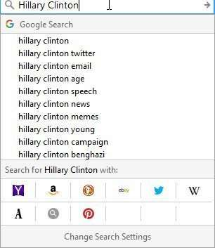
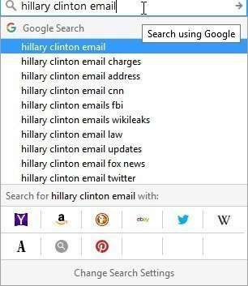
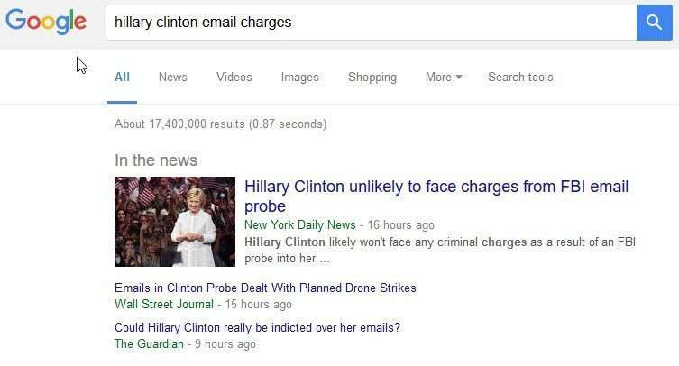
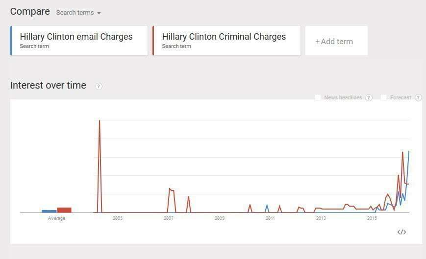
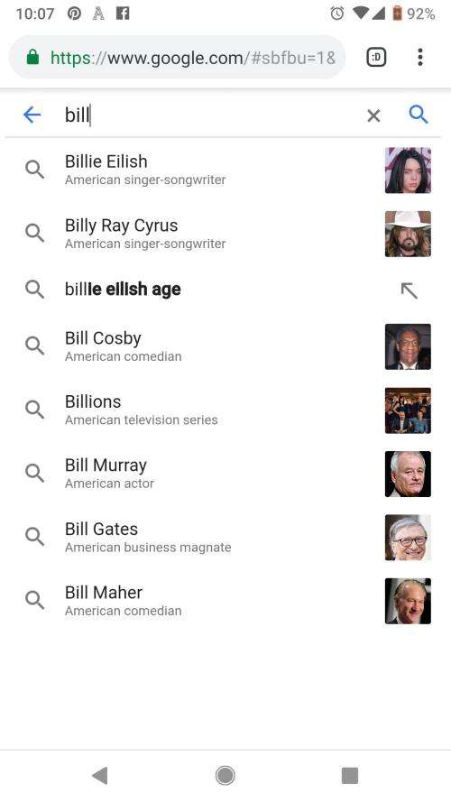

## Google Entity Search Suggestions Patent

> Search predictions come from:
>
> 1. The terms you’re typing.
>
> 2. What other people are searching for, including trending searches. Trending searches are popular stories in your area that change throughout the day. Trending searches aren’t related to your search history.
>
> 3. Relevant searches you’ve done in the past (if you’re signed in to your Google Account and have Web & App Activity turned on).
>
> Note: Search predictions aren’t the answer to your search, and they’re not statements by other people or Google about your search terms.
>
> ~ [Search on Google using autocomplete](https://support.google.com/websearch/answer/106230?hl=en)

A website named SourceFed produced a video that claimed that Google was intentionally manipulating search results to make Hillary Clinton look good because it wasn’t showing results tied to her name that SourceFed insisted Google should be showing.

SEO Consultant Rhea Drysdale [posted a response on Medium](https://medium.com/@rhea/hillary-clintons-search-results-manipulated-by-sourcefed-not-google-3dd9a5c68ca1#.d0e4w292y) that shot holes in their argument. Rhea started with:

> SourceFed believes Google is manipulating search results in favor of Hillary Clinton, because “Hillary Clinton cri-“ did not return “Hillary Clinton criminal charges” and “Hillary Clinton in-“ did not return “Hillary Clinton indictment”

I thought it was interesting that Google was just granted a new patent that describes one way they might be generating Entity Search Suggestions on May 31, and I thought it was worth looking at. I also thought it was interesting because it addressed how entity information might be used with autocomplete suggestions. The patent is:

[Associating an entity with a search query](http://patft.uspto.gov/netacgi/nph-Parser?Sect1=PTO1&Sect2=HITOFF&d=PALL&p=1&u=%2Fnetahtml%2FPTO%2Fsrchnum.htm&r=1&f=G&l=50&s1=9,355,140.PN.&OS=PN/9,355,140&RS=PN/9,355,140)
Inventors: Olivier Jean Andre Bousquet, Oskar Sandberg, Sylvain Gelly, Randolph Gregory Brown
Assignee: Google
US Patent 9,355,140
Granted: May 31, 2016
Filed: March 13, 2013

Abstract

> Methods and apparatus for associating an entity with at least one search query. Some implementations are directed to methods and apparatus to identify multiple queries associated with an entity and identify one or more of the queries as an entity search query that provides desired search results for the entity. Some implementations are directed to methods and apparatus for identifying a particular entity and, in response to identifying the particular entity, identifying an entity search query corresponding to the particular entity.

The process described in this patent provides search suggestions to searchers using a query to entity mapping intended to show off new aspects of entities and queries to provide improved search results to searchers. This is a fairly complicated process and is worth looking at to get a better sense of what is going on behind the curtains when Google does what it does so that we don’t make assumptions that might not be very good when it doesn’t do what we expect it to be doing.

When we search for Hillary Clinton in a Google Search Box, we see many query terms that Google presents as autosuggestions.

When we choose one of those, like the term “email,” we see some additional words added to that query term:

If we follow the suggestion [hillary Clinton email charges], we see a story that is about the possibility of criminal charges being filed against the candidate:

Google’s algorithm chose to map a query to the entity “Hillary Clinton” that used the terms “email charges” rather than “criminal charges,” as SourceFed was guessing should be how Google would map the topic of that query. Sourcefed didn’t map out the query the way Google did, but Google did have autosuggestions that covered that topic. If we compare Google trends information for both terms added to the entity “Hillary Clinton,” those terms seem to be close to each other in regards to how much interest searches appear to have shown for each of those queries:

## Entity Search Suggestions Take Aways

I was left wondering why this patent doesn’t discuss trends and if I would have to look for another that did (I chose to do that.)

The Entity Search Suggestions patent doesn’t mention the use of Google Trends to identify queries to map to entities. Still, we do know that [Google Trends have used the Machine Identification numbers](https://www.seobythesea.com/2016/01/image-search-trends-freebase-entity-numbers/) that would be assigned to entities at FreeBase.

This Entity Search Suggestions patent does tell us that properties associated with some entities may be identified at online encyclopedias such as Freebase, and entities may be assigned unique entity Identifiers.

This patent focuses on how it might help tell one entity from another using properties associated with different entities. It uses the Entity “Sting” as an example, since there are a well-known musician and a well known professional wrestler who both use that name, and they are different people:

> Also, in some implementations, the query suggestion system may identify one or more entities associated with a received query via the query to entity association database 125. Then, the query suggestion system may provide one or more query suggestions based on the identified entities. Each of the query suggestions is particularly formulated to focus on a particular entity.
>
> For example, Gordon Matthew Thomas Sumner and the wrestler Steve Borden may be associated with the query “sting” in the query to entity association database. In response to a received query “sting,” the query suggestion system 135 may identify the musician Gordon Matthew Thomas Sumner as the dominant entity from the query to entity association database and suggest an alternative query suggestion to the user, with the alternative query suggestion being particularly formulated for the musician Gordon Matthew Thomas Sumner (e.g., “sting musician”).

The query to Entity Search Suggestions described in this patent is based upon terms describing properties found in a knowledge base such as Freebase that can help tell that one is a musician and an athlete. Using an autosuggest based upon using properties to find query terms to map to the entity shows how query terms may be selected carefully.

Since the entity search suggestions patent focuses upon queries that might fit best with different entities, I looked at other patents that involved autocomplete to see what they said about using trend information. This one showed how trend information and personalized search histories could be used to generate suggestions using autocomplete:

[Providing customized autocomplete data](http://patft.uspto.gov/netacgi/nph-Parser?Sect1=PTO1&Sect2=HITOFF&d=PALL&p=1&u=%2Fnetahtml%2FPTO%2Fsrchnum.htm&r=1&f=G&l=50&s1=8,868,592.PN.&OS=PN/8,868,592&RS=PN/8,868,592)
Inventors: Nicholas B. Weininger and Radu C. Cornea
Assigned to: Google
US Patent 8,868,592
Granted: October 21, 2014
Filed: May 18, 2012

Abstract

> Methods, systems, and apparatus, including computer programs encoded on a computer storage medium, provide customized autocomplete suggestions. First profile data is obtained for a first user. Second profile data is obtained for second users that submitted search queries, where the second users are different from the first user. Based on the first profile data and the second profile data, similarity scores are determined. The similarity scores indicate a degree of similarity between the first user and at least one of the second users. A proper subset of the search queries is selected based on the similarity scores. An update for an autocomplete cache of a computing device associated with the first user is generated using the selected subset of search queries. The update is provided to the computing device associated with the first user.

This Entity Search Suggestions patent is telling us that autocomplete suggestions may be customized or personalized but could use trends in word usage when they offer suggestions:

> Autocomplete suggestions can be customized for the interests, attributes, and behavior of a particular user or a group of users. Using an autocomplete cache, personalized autocomplete suggestions can be generated when a network connection is unavailable. Using the autocomplete cache, personalized autocomplete suggestions can be presented in a manner that limits network latencies. The autocomplete cache can be updated to reflect current topics and trends in word usage, especially topics and trends among users with similarities to a particular user.

So, the “trend” information used in autocomplete for most people may not quite be the same that is shown in Google Trends but may be customized for
each searcher performing a search.

Regardless of which autocomplete process Google is following; Rather than charging Google with showing a bias, it may be best to see what Entity Search Suggestions Google provides and see what range of topics and concepts that those cover, instead of expecting certain words to show up, like in this instance were “email charges” was a suggestion and “criminal charges” wasn’t. Still, Google appeared to be covering very similar concepts with those suggestions.

Google wasn’t purposefully avoiding a topic; it was just using words it preferred to offer as a query suggestion.

Added – June 5, 2019. I just noticed that Google is showing images of entities in search results and remembered this patent. The patent tells us that:

> . For example, in some implementations, one or more images of an entity and/or related to an entity may be provided in an entity summary.

Google hadn’t been showing many images in dropdown query suggestions, but they have increased how many they are now showing. The labels for the entities and images appear to be the entity type assigned to the entities being show (you can see those in the knowledge panels for them.)

Last updated June 5, 2019.
