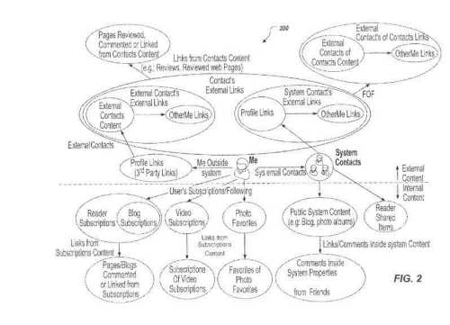

A couple of years ago, Google published a patent that described how the search engine might rank user-generated content in something like Google Plus. I wrote about that in the post, [How Google Might Rank User Generated Web Content in Google + and Other Social Networks](https://www.seobythesea.com/2011/07/how-google-might-rank-user-generated-web-content-in-google-and-other-social-networks/).

The patent described in that post seemed like a good match for Google+, but Google + has gone through some changes since then, recently being identified as consisting of two parts – Photos and Streams. A Marketing Land article described the streams part in more detail recently, in the article [The Web Of Streams](https://marketingland.com/web-streams-120690)

_Streamed content from a person’s social network_

A few days ago, Olivier Duffez mentioned my name in a Google+ post titled How Google+ internal search engine work? In which he pointed out a Google patent. I responded, promising that I would take a look at the patent to see if it did indeed tell us more about how content at Google+ was being ranked and rated in searches.

Interestingly, the patent refers to a person’s contributions to Google+ as part of an “Activity Stream,” which Google recently started calling the stream of content that people share at Google+.

The patent tells us about an “item-ranking score” for pieces of digital content that gets share, and a “user-sharing score”which indicates how likely it is that someone else might share content that social network user has shared. A person might interact with content in these ways:

- Endorsing an item,
- Sharing an item and/or
- Commenting on an item.

Some of the advantages of scoring users and scoring items, we are told by the patent:

Users of social networking services may be categorized and/or ranked based on their activity, and highly interactive users can be provided as recommended contacts to new users of social networking services. They may also be used to help identify “potentially viral digital content before it goes viral.”

The patent is:

[Ranking users and posts in social networking services](http://patft.uspto.gov/netacgi/nph-Parser?Sect1=PTO1&Sect2=HITOFF&d=PALL&p=1&u=%2Fnetahtml%2FPTO%2Fsrchnum.htm&r=1&f=G&l=50&s1=8,972,402.PN.&OS=PN/8,972,402&RS=PN/8,972,402)
Invented by Mangesh Gupte, and Kumar Mayur Thakur
Assigned to Google
US Patent 8,972,402
Granted March 3, 2015
Filed: May 31, 2012

Abstract

> Methods, systems, and apparatus, including computer programs encoded on a computer storage medium, for receiving, from computer-readable memory, a particular item of digital content distributed by a user through a computer-implemented social networking service; identifying, using the one or more processors, a set of items of digital content distributed by the user through the computer-implemented social networking service; receiving interaction data from the computer-readable memory; determining, based on the received interaction data, at least one of a user ranking score associated with the user and an item ranking score associated with the particular item of digital content; and storing the at least one of the user ranking score and the item ranking score in the computer-readable memory.

## Take-aways

It appears that in addition to ranking users of a social network, the digital content that they share might also be ranked, and that can determine the order it is shown in a stream or response to a query at Google+.

Yes, this patent does look like it may describe how different users are ranked at Google+ and how items might be scored by this system determining what gets returned in response to a query. It doesn’t seem like a surprise that content shared by an individual that seems like it encourages others to share or comment upon that content is the higher ranking users, and content that is the most interacted with tends to be the highest scoring items.
