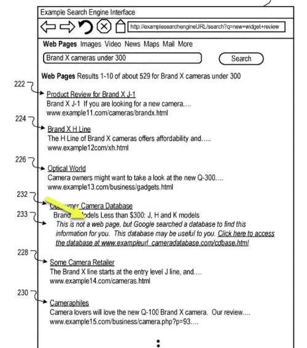
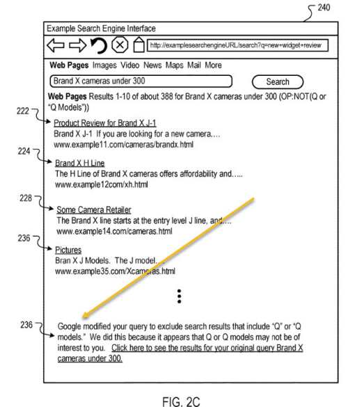

## SEO for Databases

Imagine that Google might rank some sites based upon databases answering queries. A patent from Google refers to this approach as one that looks at database service requirements to rank large sites such as sites that cover products, jobs, travel, recipes, and movies. Such sites might include some static pages that provide examples of the capabilities of their databases, such as being able to provide answers to queries such as: “Brand X Cameras for less than $300.00”.

This SEO Database patent provides some examples of the types of sites that are covered by it, including sites with large databases:

> Many websites for which data available in resources store the data in large databases of structured information. For example, job search websites may have respective job databases and respective resources (web pages) that include forms to search the databases. Likewise, recipe websites have respective databases for recipes, and movie websites have respective databases for movies. Requesting information for a certain recipe or movie causes the website to query its respective database and generate a webpage that presents the information in a structured format.

The patent tells us that most search engines do not account for the abilities of databases of such sites to respond to particular queries, making Google different from those search engines. The patent says:

> However, many scoring algorithms do not score the search capabilities when determining the relevance of a resource generated from data stored in the database. As a result, the search engine may not identify data that are particularly relevant to a query and/or identify particular search capabilities available to the user that issued the query, which may help the user satisfy his or her informational need.

Imagine that Google may rank sites based upon “a service requirement score for the database” or how well their databases answer queries. This would provide a different way of SEO for database sites.

That service requirement score would be a measure of the ability of the database to fulfill the service requirement, which would enable it to respond to a query. I just wrote a post that described how Google is working to create a database of questions and answers to those, showing as “people also ask” questions, in the post: [Google’s Related Questions Patent or ‘People Also Ask’ Questions](https://www.seobythesea.com/2017/03/googles-related-questions-patent-people-also-ask-questions/). It’s not too much of a stretch to imagine that Google is saving up questions that might be asked about Jobs, Travel, commerce, movies, and recipes, and trying to determine which sites might be best at answering those questions, and ranking those sites on their ability to answer questions with different parameters, such as “a recipe for X that is under 1,000 calories.”

## Advantages Under this Patent

The patent provides a couple of examples of advantages of using the processes described in this patent that are practical and helpful:

> Websites need not generate multiple “optimized webpages” that are optimized for particular instances of queries to ensure that the website is identified in a search result. Instead, the underlying capabilities of the website database and the authority of the website are used as metrics to surface websites and databases that are of high quality concerning a particular query. This reduces the overall cost of website management and provides users with data that are more likely to satisfy the user’s informational need than the optimized web pages.

> The systems and methods can utilize the conceptual schemas of the databases to provide additional information for queries that may not otherwise be derived from the queries. For example, a user that types in the search query [Brand X cameras under 300] may be searching for Brand X cameras that cost less than $300. The user, however, may not know that the “Q” models of Brand X cameras are prosumer models that each retail over $300. Thus, using a product database, the search engine may determine that “Q” models are each more than $300. Thus, the search engine may modify the query with an operator that excludes the “Q” models, e.g., [Brand X cameras under 300 OP:NOT(Q)], or modify the query to emphasize resources that include the reference to Brand X models that are priced under $300. Thus, the search engine surfaces fewer resources that include extraneous information, thereby satisfying the user’s informational need more quickly than if the extraneous information were provided.

The patent is:

[Resource identification from organic and structured content](http://patft.uspto.gov/netacgi/nph-Parser?Sect1=PTO1&Sect2=HITOFF&d=PALL&p=1&u=%2Fnetahtml%2FPTO%2Fsrchnum.htm&r=1&f=G&l=50&s1=9,589,028.PN.&OS=PN/9,589,028&RS=PN/9,589,028)
Inventors: Trystan G. Upstill and Jack W. Menzel
Assignee: Google Inc.
US Patent 9,589,028
Granted: March 7, 2017
Filed: March 16, 2016

Abstract

> Methods, systems, and apparatus, including computer program products for structured content ranking. In an aspect, a method determines a service requirement from terms of a query, and the service requirement is one of a plurality of service requirements fulfilled by databases; determines, for each of the databases, a service requirement score for the database, the service requirement score is a measure of an ability of the database to fulfill the service requirement; selects databases based on the service requirement scores; generates data responsive to the service requirement based on the terms of the query and one or more of the selected databases; and generates, from the data identifying resources that are determined to be responsive to the query and from the data responsive to the service requirement, search results that include first search results that each identify a corresponding resource that was determined to be responsive to the query.

## SEO Based Upon Database Capabilities

This patent describes how sites might be ranked based upon their ability to answer questions from searchers instead of just how well optimized those sites might be based upon information retrieval relevance scores and link-based importance scores. We don’t know how much weight Google might give to a database service requirement ranking, but chances are, considering Google would be trying to find the most helpful sites, that may be considered an important metric. The detailed description for the patent starts off telling us this:

> In some implementations, the search engine ranks results using a first ranking algorithm and based on non-semantic search terms, e.g., [nursing jobs]. The search system then accesses database information that describes the content and capabilities of website databases to determine which of the databases can fulfill a database service requirement. For example, if the query is [nursing jobs in Palo Alto over 100,000], the search system will identify jobs databases that have geographic and salary parameters that include the values of “Palo Alto” and “100,000” or more. Using this information, the search engine may promote (or demote) search results referencing resources of a website that includes a database and/or revise the query to include a constraint to filter out (or emphasize) resources that include certain terms.

The patent defines a service requirement:

> a service that is requested, either implicitly or explicitly, by a query. For example, for the query [nursing jobs in Palo Alto over 100,000], the service requirement is a job search. Likewise, for the query [LAX to SFO] (or [Flights LAX to SFO]), the service requirement is a flight search.

## Search Results Using Website’s Databases

The website databases may have different parameter types depending upon the content on the site. For instance:

> …a flight search database may be configured to receive parameter values for the following parameter types: origin location, destination location, times, and dates. Likewise, a job search database may be configured to receive parameter values for the following parameter types: location, job category, and salary.

These database parameters may be responded to by different parameter values, so

> a particular job database may be tailored to only nursing jobs in New York, and thus, the parameter value from the parameter type “Nursing Category” may be limited to specific nursing categories, e.g., Cardiology, Cardiothoracic, Hemodialysis, etc.

If Google is aware of the different parameters and values that respond to queries submitted to a site’s database, it can show those database results right in search results, as shown in this screenshot from the patent:

I haven’t seen any search results quite like this yet, but it seems to be something to keep an eye open for.

Google may exclude some results from a query if they don’t fit what a person might have searched for as shown in this screenshot from the patent:

This makes search engines more like something that is searching for a web-sized database. Thus, databases answering queries may be part of the future of SEO.
