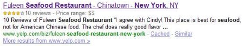
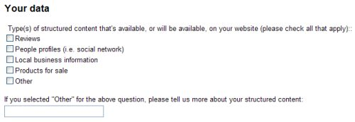

In my last post, I wrote about how Google may be incorporating [Sentiment Analysis](https://www.seobythesea.com/2009/06/googles-new-review-search-option-and-sentiment-analysis/) into the snippets that they showed for some search results. Another new feature that was announced at Google’s [Searchology](https://googleblog.blogspot.com/2009/05/more-search-options-and-other-updates.html) was the display of user ratings for products on some pages. We were told that these reviews could be found in “rich snippets,” which show up under the title to a page in a search result and above the snippet or description for a page.

A recent patent application from Google explores the topic of ratings, assigning quality scores to raters, and discounting or eliminating ratings for dishonest or malicious raters. It made sense to look a little more closely at the ratings that now appear in “rich snippets” and spend some time with the patent filing to see if it might impact how ratings might be shown in the future.

In a search for [new york seafood restaurants], I found one result from Yelp that showed an overall ranking, many reviews, and an indication of how expensive the restaurant listed might be:

One factor determining whether or not rankings will show up for a particular search result is whether or not the site listed in the result has used microformats or RDFa standards for their reviews. On one of their help pages, Google provides examples on the formatting of reviews and tells us that:

> When review information is marked up in the body of a web page, Google can identify it and may make it available in search results pages. Review information such as ratings and descriptions can help users to identify better pages with good content.

One of the keywords in that passage is the word “may.” There’s no guarantee that Google will show reviews for all pages that are marked up correctly.

Google also has a page where organizations that may be interested in showing smart snippets can contact them. In the form on that page, we may be seeing a hint of other areas where Google may show ratings.

So, in addition to reviews, Google may be considering showing smart snippets that contain information about people profiles from places like social networks, local business information, products for sale, and possibly other kinds of information.

**All Ratings Considered Equal?**

When Google shows an aggregate rating on a 1-5 scale for a site, does it count each review equally? If it does now, will it do so in the future?

Google’s patent filing explores ratings for products and services and describes how much weight they might give to certain ratings based upon who may be doing the rating.

The patent filing is:

[Rating Raters](http://appft.uspto.gov/netacgi/nph-Parser?Sect1=PTO2&Sect2=HITOFF&u=%2Fnetahtml%2FPTO%2Fsearch-adv.html&r=1&p=1&f=G&l=50&d=PG01&S1=20090144272.PGNR.&OS=dn/20090144272&RS=DN/20090144272)
Invented by Anurag Adarsh, Apurv Gupta, and Vihari Komaragiri
Assigned to Google
US Patent Application 20090144272
Published June 4, 2009
Filed December 2, 2008

Abstract

> A computer-implemented method includes identifying a plurality of ratings on a plurality of items, wherein the plurality of ratings are made by a first user, determining one or more differences between the plurality of ratings, and ratings by other users associated with the items, and generating a quality score for the first user using the one or more differences.

The patent filing describes how Google might distinguish between honest raters and dishonest raters by looking at how similar rater’s ratings are to others who have rated the same or similar items. It discusses how the ratings of people who always rate positively (optimists) and the ratings of people who always rate negatively (pessimists) might have their ratings adjusted.

Of course, a major concern in providing ratings involves people who might attempt to “game” ratings providing positive reviews for one product to increase its rating while possibly also providing negative reviews to decrease competitors’ scores.

**Search Result Rankings Based Upon Implict Ratings**

While much of the patent filing discusses explicit ratings, where a rater chooses a score for a product or service or comment or web page, there are a few passages in the document about “implicit” ratings, such as the following:

> Users may also implicitly rate an item, such as by viewing an online video without skipping to another video.

This particular part of the document seems to imply that web pages could also be ranked in search results based upon rankings from raters:

> In yet another implementation, a computer-implemented system is disclosed that includes a memory storing ratings by a plurality of network-connected users of a plurality of items, means for generating rater quality scores for registered users who have rated one or more of the plurality of items, and a search engine programmed to rank search results using the rater quality scores. The items can comprise web-accessible documents having discrete, bound rankings from the network-connected users.

**Conclusion**

The patent application does go into detail on how quality scores might be computed for raters of items and how it might eliminate ratings from some people who provide those ratings. Ratings might be eliminated based upon the history of rating items from a particular rater, how quickly ratings might appear from certain raters, and many other reasons.

Google may pay more attention to ratings in the future than just providing a number and average for ratings for items or services or people because the owners of the sites have used the correct formatting to show off their ratings. The processes in this patent filing may be followed in determining good ratings and bad ones and determining which ratings we see in the future.
