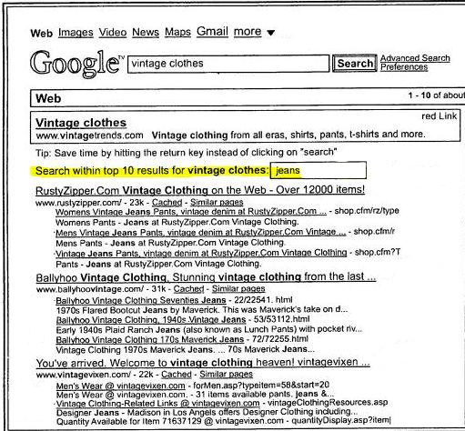

Imagine that you want to find a pair of vintage Levi’s jeans for sale on the Web. You go to Google and enter the search terms [vintage clothes jeans]. Your expectation and mine might be that Google performs a search for all three terms, but what if instead it does a first search for [vintage clothes] and then a second search for [jeans] amongst the sites it receives from the first search. It might also include results from pages linked to or from the pages that show up in the top initial search results? Would Google perform multiple related searches like this?

The chances are that you would get a very different set of search results for each approach. And you wouldn’t even know that Google did two searches instead of one. (Though you may have suspected something really odd was happening if you owned a site that sold vintage Levi’s jeans and oversaw Google results.)

Or imagine that you entered [vintage clothes] as your initial query, and then Google gave you a search box at the top of the results enabling you to enter another search term or phrase to use to search within the top ten results? The image above is a screenshot from a Google patent granted last week that would enable those types of multiple related searches.

The patent tells us that in the first version of this multiple related searches approach, the second automatic search might include searching all of the pages that link to or are linked from a result that appears in one of the top results from the first set of results. Or, if the page showing in the initial search results is the homepage of a site, the second search might include a search of all of the pages of that site.

Google has tried many interface experiments over the years to introduce new interface features that might be there today and gone tomorrow. It might not be a surprise to see something like this spring up overnight and then disappear. Chances are that Google even performed this experiment before applying for the patent and was encouraged enough by the results to file the patent.

As a searcher or site owner, do you think the automatic search-within-a-search that I described first (an initial search for [vintage clothes] and then a second search within those results for [jeans] would yield better results than just one search for [vintage clothes jeans]? Would it be more likely or less likely to deliver relevant results for the whole query?

If Google offered a search box with a chance to search amongst the top results, would that mean that fewer people might look at the second page of search results? I’m not sure, but I think it might. That may depend upon whether or not searchers were satisfied with the results they saw.

The patent is:

[Performing multiple related searches](http://patft.uspto.gov/netacgi/nph-Parser?Sect1=PTO2&Sect2=HITOFF&p=1&u=%2Fnetahtml%2FPTO%2Fsearch-adv.htm&r=1&f=G&l=50&d=PALL&S1=07991780&OS=PN/07991780&RS=PN/07991780)
Invented by Corin Anderson, and Benedict A. Gomes
Assigned to Google Inc.
US Patent 7,991,780
Granted August 2, 2011
Filed: May 7, 2008

Abstract

> A first search is performed in response to a received search query. The first search is based at least in part on the first portion of the search query. In the first search, the first set of content items is searched to identify the first set of search results. Each result in the first set of search results identifies at least one content item of the first set of content items. The second set of content items for performing a second search is determined based at least in part on one or more of the results in the first set of search results. The second set of content items includes content items not included in the first set of search results.
>
> A second search is performed, searching over the second set of content items to identify the second set of search results. The second search is based at least in part on a second portion of the search query. Each result in the second set of search results identifies at least one content item of the second set of content items.

**Conclusion**

It’s easy to assume that when you enter search terms into Google’s search box, the results you see are from a single search, but this patent challenges that assumption.

Imagine a site owner with a hotel in Los Vegas (an example from the patent), who strives to create the finest buffet on the Strip. He or she may spend a lot of time and effort creating a web page about that buffet, and expect it to rank well in search results on a search for [los vegas hotel buffet]. When someone actually performs that search, Google might initially search for [los vegas hotel], and then search within the top results for that query for [buffet], and never return the page from our buffet owner who may have optimized for the longer term.

Could the process described in this patent impact long-tail queries, and the sites that attempt to optimize for them?

It’s possible.

There are two different scenarios described in this patent. The first is where Google breaks a query down into parts and automatically performs a second search. The second is where Google might give searchers a chance to search within results. Both seem like they might benefit established sites that rank well for more competitive and general terms, to the detriment of less established sites attempting to climb in results by focusing upon longer queries.
