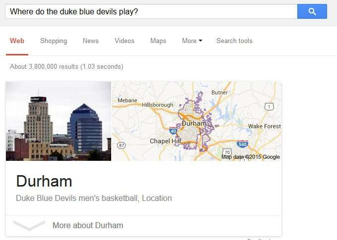
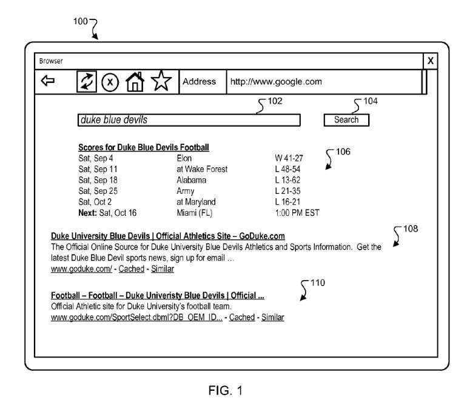
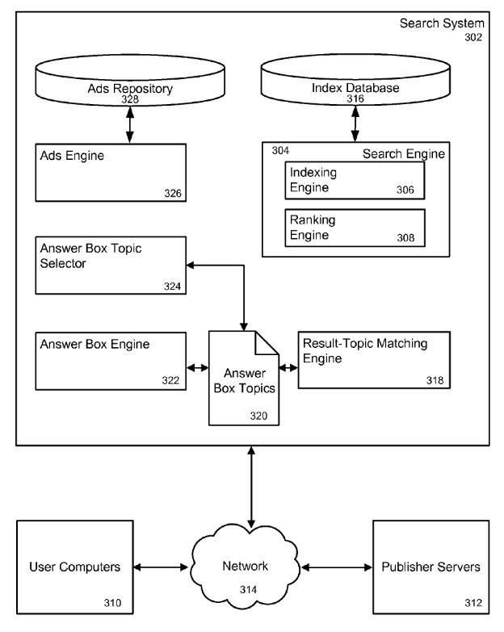

*So, one of the big questions in SEO these days is why some queries end up triggering Answer Boxes in search results, and others don’t.*

Answer box results appear above organic results for a query. They often can have additional content appearing with them, such as images. They are often in response to queries that are questions. These answer box results are sometimes triggered by specific terms in a query, such as “weather.”

A Recent Bloomberg article explores how Google might use machine learning to answer questions, titled, [Google’s New AI Can Answer Dumb IT Questions or Tell You the Meaning of Life](https://www.bloomberg.com/news/articles/2015-06-25/google-s-new-ai-can-answer-dumb-it-questions-or-tell-you-the-meaning-of-life). I came across the article after having read a patent application at Google that covered similar ground. The point behind the patent was to identify sources of answers to queries that are in the shape of Answer Boxes, as seen in this search result:

As this patent application tells us, sometimes searchers are looking for answers to their queries, rather than a list of URLs:

> Users of search engines often look for an answer to a specific question rather than a listing of resources. For example, users may want to know what the weather is in a particular location, what the definition of a particular word is, how to convert between two time zones or the product of multiplying two numbers. An answer box is a user interface element including a formatted presentation of content responsive to the query. So, for example, if the user’s query refers to weather in a particular location, a weather answer box can include a weather forecast in a particular location.
>
> So the purpose behind this patent is to find sources of information, or as it calls them, “resources” that are associated with answer box topics within a set of search results, and it might do that by parsing the resource according to “information from a publisher of the resource or by using a classifier or other system trained using machine learning techniques.”

The many different aspects of this patent described here are the works of the inventors listed with the name of the patent application below.

The process described in the patent, in part, may look like:

(1) Receive a query
(2) Receive search results responsive to the query,
(3) Determine search results that might be associated with an answer box topic identified by the search result
(4) Provide the search results, along with an answer box precursor for the first answer box topic, wherein the answer box precursor includes information that defines an answer box.

An ***Answer Box Precursor*** defines an answer box and may provide a template or script, to which specific values are added, it could also include multimedia. This determines what an answer box result ends up looking like on a search result page at Google. Here are many steps that may be involved in that process:

> (1) Determining that a search result is associated with an answer box topic comprises: for each search result, accessing an index of search results and determining whether a resource referred to by the result is annotated the index with an answer box topic.
>
> (2) Determining that the first search result is associated with the first answer box topic comprises: for each search result, parsing a resource identified by the search result for answer box topics according to information from a resource publisher. The actions further include indexing a plurality of resources to an index; and for each resource, parsing the resource for answer box topics according to information from a publisher of the resource and annotating the resource in the index with any answer box topics identified by the parsing.
>
> (3) Determining that a second search result is associated with another answer box topic and providing search results along with an answer box precursor for the first answer box topic comprises selecting the first answer box topic based on the first search result having a higher ranking position relative to the second search result in the plurality of search results.
>
> (4) Determining that a second search result may be associated with another answer box topic and providing the search results along with an answer box precursor for the first answer box topic comprises selecting the first answer box topic based on one or more strength of association scores for the first and second search results.
>
> (5) The actions further include obtaining the answer box precursor for the first answer box topic using a mapping between many answer box topics and answer box precursors.
>
> (6) The actions further include receiving the answer box precursor for the first answer box topic from the first publisher. The answer box precursor includes content provided by the first publisher for the answer box. In addition, the answer box precursor includes code for obtaining content from a publisher server for the first publisher.
>
> (7) The answer box is a user interface element including a formatted presentation of content. Determining that the first search result is associated with the first answer box topic comprises analyzing the first resource using predefined information regarding the structure of the first resource or a resource locator for the first resource.
>
> (8) The first search result is associated with the first answer box topic comprises identifying one or more ads associated with the first resource and determining that at least one of the ads is associated with the first answer box topic.
>
> (9) Receiving the query comprises receiving the query from a user device, and providing the search results comprises sending a document including the search results to the user device.
>
> (10) Determining that the first search result is associated with the first answer box topic comprises using entity-extraction techniques to extract the first answer box topic from the first resource.

## Advantages Described in the patent

(1) Answer boxes may be presented with search results that are more likely to be relevant to a user’s search than answer boxes presented using conventional techniques that select answer boxes, which use only search queries.

(2) Relevant answer boxes may be triggered more frequently than using a search system with conventional triggering techniques. If more than one answer box is relevant to a user’s search, search results can be analyzed to determine which answer boxes are most relevant to the user’s search. For example, for a query that may relate to multiple topics, the search results for the query can be analyzed to determine which topic is most likely relevant to the user’s search.

(3) Answer boxes can be personalized to particular users by triggering answer boxes based on personalized search results.

The patent is:

[Triggering Answer Boxes](http://appft.uspto.gov/netacgi/nph-Parser?Sect1=PTO1&Sect2=HITOFF&d=PG01&p=1&u=%2Fnetahtml%2FPTO%2Fsrchnum.html&r=1&f=G&l=50&s1=%2220150169750%22.PGNR.&OS=DN/20150169750&RS=DN/20150169750)
Invented by Tal Cohen, Ziv Bar-Yossef, Igor Tsvetkov, Adi Mano, Oren Naim, Nitsan Oz, Nir Andelman, Pravir K. Gupta
Assigned to: Google
US Patent Application 20150169750
Published June 18, 2015
Filed: May 27, 2011

Abstract

> Methods, systems, and apparatus, including computer programs encoded on a computer storage medium, enhance search results. In one aspect, a method includes receiving a query. A plurality of search results responsive to the query is identified. The search results are analyzed to determine that a first search result is associated with a first answer box topic. The search results are provided along with an answer box precursor for the first answer box topic.

## Answer Boxes Triggered by Conventional Search Techniques

On a query for the Duke University Football Team under the name “duke blue devils,” The search Results may contain an answer box and two search results, all responsive to the query. The answer box may be based upon the search results. For example, it could contain scores of football games played by the Duke University football team. It might show an answer box showing football scores even though the query does not explicitly indicate an interest in football. The search engine may analyze those search results to decide whether to determine whether to show an answer box for football instead of one for basketball or another sport, and the search engine analyzes the search results.

_Example answer box results involving the Football named in this query._

This analysis could be done using fairly conventional search techniques. So, conventional search techniques could identify the Duke football team’s results as relevant during the football season and the results for the Duke basketball team being more relevant during the basketball season. Because of this, a top search result is related to the Duke football team, and the search engine triggers an answer box for football scores. Thus, analysis of the search results enables the search engine to trigger “answer boxes for football scores during football season and answer boxes for basketball scores during basketball season.”

## Customization of Answers Based upon Personalization

Search Results could be customized to a particular user based on their specified preferences or search history. Like answer box results being triggered by conventional search methods, an answer box may be “selected using the customized search results can also be customized to a particular user.”

## Pre-Annotation of Associated Answer-Box Topics

The search results may be analyzed for answer box topics by looking to see if any topics are associated with search results. For example, the patent tells us that, “Example answer box topics that a search system could support include sports, sports teams, sports players, television shows, movies, celebrities, weather, and finance.”

## Multiple Answer Box Topic

The search engine might identify answer box topics associated with more than one of the search results. Then, the one matching the highest ranking search result, associated with an answer box topic, may be selected to be displayed. That could be based on “the number of search results associated with the answer box topic.”So, if the first answer box topic is associated with one search result, and the second is associated with two search results, the search system might choose the second result because “it is associated with more search results than the first answer box topic.”

## Answer Box Results Precursors

The patent defines and describes what an Answer Box Results Precursor is, by telling us that it may include “formatting information or content or both, such as a template or a script, to which particular values are added, or code that obtains particular values when executed. In addition, an answer box precursor may include a multimedia object, e.g., a digital image or video.”

For example, someone publishing information about “Duke football” may do so to sources of information on the publisher’s server at goduke.com on a web page available there.

6) The system provides the search results and the answer box precursor (step 212). For example, if the query is received from a program on a user computer, the system may send the answer box precursor to the user computer so that the user computer can present answer box results.

## Repository of Answer Box Topics

When search results are returned in response to a query, the results for that query are checked to see if any of them are associated with answer box topics, which are stored in a repository of content that contains answers to those queries. The patent tells us that, “Some answer box topics relate to content that can be computed rather than read from a data source; such as mathematical formula, sunrise/sunset times, and so on. In addition, some answer box topics relate to data gathered by a system administrator and stored in, e.g., a database.”

## Answer Box Results Engine

This search system uses an answer box results engine to obtain answer boxes for answer box topics.

The answer box results engine has an Answer box selector, which analyzes resources for answer box topics. The selector decides when a resource should be associated with an answer box topic from the answer box topics repository. The selector may use a range of techniques to make such a decision, for instance, by parsing a resource according to information provided by someone who published that information by looking at “information provided by a publisher of the resource, e.g., a page template or schema.”

For example, information might be chosen from specific domains. So, the selector may be configured for a website at nbaplayers.com. Given a resource in search results in response to a query, may have a resource address of “http://nbaplayers.com/player/Joe_Random,” the selector could determine that the resource is associated with an answer box topic for the player “Joe Random.”

The patent also tells us that the search system may use “machine learning techniques to configure the selector.” So, it might train a classifier using a set of resources associated with various answer box topics, e.g., using any other techniques for analyzing resources mentioned in this specification. Those may be used as a “labeled set of examples for supervised or reinforcement learning; alternatively, other methods, e.g., unsupervised or semi-supervised learning techniques can be applied.”

The kinds of resources used to analyze resources for answer box results topics could also use:

- Metadata tags,
- Titles, and
- Other information indicative of topics for a web page.
- Contextual text on a page, such as a caption for an image,
- Metadata for that image,
- Text of a web page including the image
- Advertisements associated with a resource for answer box topics,
- Log file information about queries that cause a resource to appear in search results.
- Entity-extraction techniques to analyze resources for answer box topics, such as linguistic grammar-based techniques, statistical models (e.g., based on training data), and other techniques.

_Topics of Ads could influence what content shows up in response to a query as an answer box topic._

Google may also look through query logs to find meaningful substitutions for queries, which I wrote about in [Google Search Synonyms Are Found in Queries](https://www.seobythesea.com/2009/12/how-google-may-expand-searches-using-synonyms-for-words-in-queries/)
