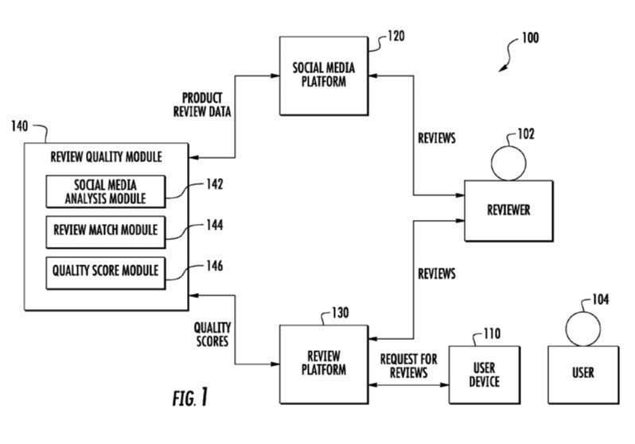
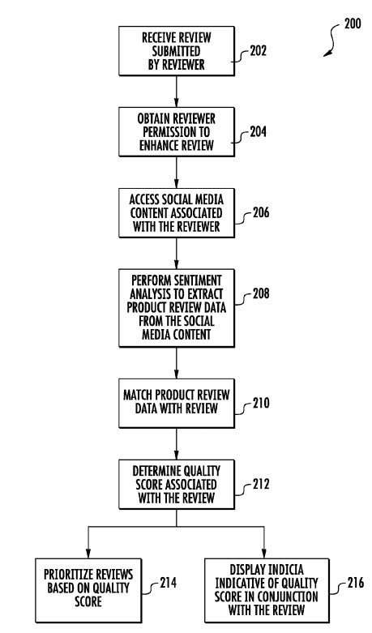

Can Google use social media, like Google+ to improve the quality of reviews it shows for products and services? Google does like to show reviews to searchers, possibly because many searchers ask for reviews.

A Google patent application published in June explores and discusses analyzing reviews, and creating quality scores for reviews from social media content and other review generated content.

Imagine leaving a review of a business or a product at Google, and it asking you if it could used any related social media content about that product or service that you may leave at a place such as Google+ (it does mention Google+ specifically) to augment your review. That’s the focus of this patent application.

Do people leave reviews of places or products and then talk about those places or products on a social network? If so, this patent describes a process that does some social listening to see how well social commentary a person leaves might match up with a review that they publish.

Before the patent describes that, it tries to put the review process into context for us.

It tells us that many reviews appear on the Web, which are offered by many content providers, with an aim of assisting people to evaluate products or services they may buy. People researching products or services might use a search engine to look for reviews and sort through them. Reviews are a mixed bag. Some reviews are helpful, some can mislead, some may be paid reviews, for some the reviewers may have little or no experience with the things being reviewed, or some reviews may be contrary to the reviewer’s actual feelings.

On the other hand, it then tells us that in social media, many people comment about products and services. Often statements made on social media are typically representative of a reviewer’s true sentiment about a product or service. The patent points out that in social media and other platforms, with user consent, they have analyzed social media content to assess information about products or services.

So, the focus of this patent is to give searchers access to online social media generated content about products and services that have been reviewed.

It also explores a way of using that social media content to assess the quality of reviews in an online review platform. This means accessing the reviewer generated social content associated with the reviewer.

The reviewer generated content includes information about a product or service posted outside of the review platform, like on the social network.

This method includes analyzing the reviewer generated social content to extract product review data and matching the product review data with the review provided by the reviewer in the online review platform.

A quality score may be created for the review based on product review data that may be extracted from the reviewer generated social content.

This quality score is intended to provide a measure of the consensus between the product review data extracted from the reviewer generated social content and the review that they may have left.

The patent is:

[Assessing Quality of Reviews Based on Online Reviewer Generated Content](http://appft.uspto.gov/netacgi/nph-Parser?Sect1=PTO1&Sect2=HITOFF&d=PG01&p=1&u=%2Fnetahtml%2FPTO%2Fsrchnum.html&r=1&f=G&l=50&s1=%2220150178279%22.PGNR.&OS=DN/20150178279&RS=DN/20150178279)
Invented by:
US Patent Application 20150178279
Published June 25, 2015
Filed: May 31, 2013

Abstract

> Systems and methods for assessing the quality of a review submitted to a review platform are provided. Reviewers that submit reviews may desire for their reviews to be more prominent or to be assigned greater weight by users of the review platform.
>
> According to aspects of the present disclosure, reviewers can optionally enrich reviews posted to an online review platform by associating a quality score with the reviews. The quality score for the review can be determined based on the reviewer’s commentary regarding a product or service in a social media setting or in other settings.
>
> Reviews posted in an online platform can be prioritized based on the quality score such that reviews consistent with other reviewer generated content are more prominent. Indicia indicative of the quality score can be displayed in conjunction with the reviews such that reviews that are consistent reviews are more readily discernible.

## Take-Aways

One question I was left with after reading this patent was how much people might talk about products or services at Google+ that they leave reviews for at Google. I don’t know if many people who write reviews do write more about those products or services. But if they do, it might be interesting seeing what they may write, or if it matches up with the review they wrote, that might mean that the review is a higher quality one.

The patent discusses the use of sentiment analysis, to compare if the review content about a service or product is negative or positive, and if the social media mentions are positive or negative as well. Where the content from the two different sources matches up, that would indicate a higher quality score for the review. Where those two sources match up, the information provided is deemed to be more reliable. Some of the content from the social media mentions might be displayed with the reviews as well.

A quality score might be determined for the rater based upon all of the reviews submitted by him or her. Reviews may be shown to people based on those reviewer ratings, so that people with higher ratings may have their reviews displayed more prominently in the review platform.

The patent provides more details on how this process to show higher quality reviews might work, but the thing that stood out to me was the use of Google+ to support and augment a user’s reviews.
