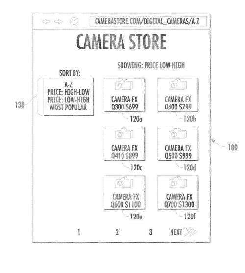
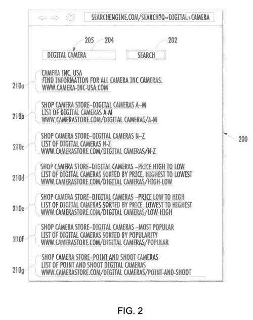
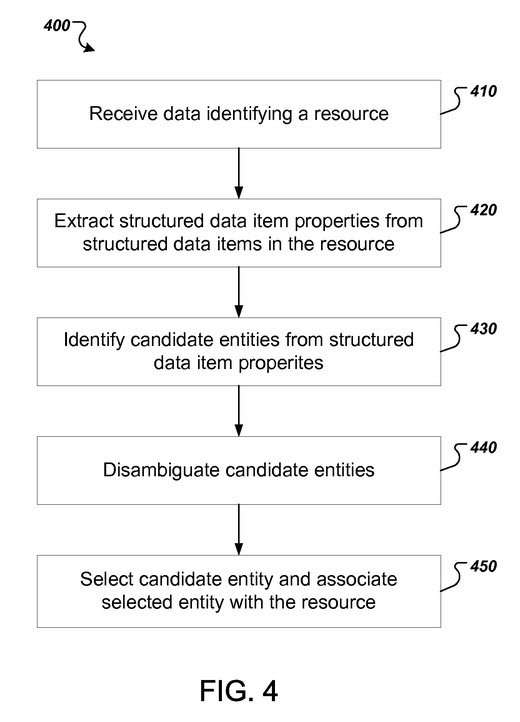
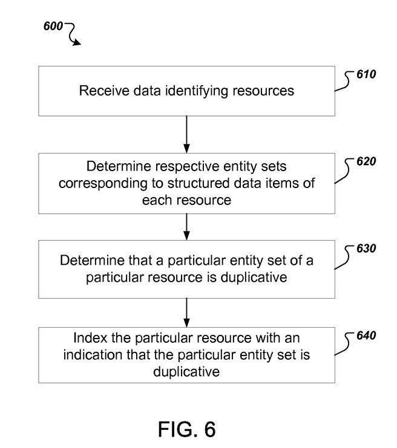

*Updated*I was checking up on this patent this week and noticed this statement about it: 2019-02-26 Application status is Abandoned. No explanation was attached to that decision, but it seemed challenging to implement. I think there still are many good reasons to include product schema markup on the pages of an ecommerce site. It looks like the process described in the patent I wrote about in this post isn’t something that Google decided to patent. My guess is that it isn’t necessarily an innovative approach to use, but practicably a good approach anyway.

One of the challenges of optimizing an e-commerce site that has lots of filtering and sorting options can be to try to create a click path through the site so that all the pages on the site that you want to be indexed by a search engine get crawled and indexed. This could require setting up the site so that some URLs are stopped from being crawled and indexed by use of the site’s robots.txt file, the use of parameter handling, with some pages having meta robots elements that are listed as being set as noindex.

If that kind of care isn’t performed on a site, a lot more URLs on the site might be crawled and indexed than there should be. I worked on one e-commerce site that offered around 3,000 products and category pages; and had around 40,000 pages indexed in Google that included versions of URLs from the site that included HTTP and HTTPS protocols, www and non-www subdomains, and many URLs that included sorting and filtering data parameters. After I reduced the site to a number of URLs that were closer to the number of products if offered, those pages ended up ranking better in search results.

_The structure of a site, and filtering and sorting options may cause lots of duplication._

What if a search engine could better identify what products or entities that the pages on a site are about. It appears that there may be a way to make that happen. And that could lead to less search results that might potentially contain a lot of duplicative content:

_It’s possible for pages with duplicative content to rank in the same search results_

A Google patent application published last year describes how the search engine could use Schema vocabulary that describes entities, like that found at [Schema.org](https://schema.org/), to identify when pages are about the same entities, and reduce the rankings for a duplicated page, or remove it from search results, or possibly cluster it in results with other pages about the same entity. The patent tells us that these are the advantages of following the processes described within the patent:

> A search system can map structured data items to entities to determine what entities, if any, are referenced by a web page. Reducing duplicative search results from the same site can provide a user with a greater diversity of search results that identify a larger number of sites.

The patent points out an example of web page content that is marked up with vocabulary from schema.org to refer to a specific camera model:

CameraFX Q410 Digital Camera

CameraFX

The CameraFX Q410 Digital Camera is ideal for any photographer, combining both high quality imaging that makes taking pictures easy.

Product ID: 32720176

The schema vocabulary may enable entities to be associated with specific web pages, and help the search engine to avoid showing a lot of pages about the same entities.

_Entities on pages might be identified and associated with those pages._

The patent is:

[Using structured data for search result deduplication](https://patents.google.com/patent/US20140280084)
Publication number US20140280084 A1
Publication type Application
Publication date Sep 18, 2014
Filing date Mar 15, 2013
Inventors Daniel W. Dulitz
Assigned to: Google

Abstract

> Methods, systems, and apparatus, including computer programs encoded on computer storage media, for providing deduplicated search results. One of the methods includes receiving a plurality of search results obtained in response to a query, wherein the plurality of search results identify respective resources that include markup language structured data items, wherein each resource is associated with an entity set of entity identifiers corresponding to respective structured data items of the resource. If a particular entity set of the plurality of entity sets is duplicative, a ranking score of a particular search result that identifies a resource associated the particular entity set that is duplicative is modified.

## Take-Aways

The text on a page might identify the entity a page is about, but that might be a challenge sometimes. The patent gives us the example of the real-world entity the Statue of Liberty, which could be associated with aliases “the Statue of Liberty” and “Lady Liberty.”

It also might be described as being related to other entities such as being in a “located in:” relationship with New York City. The alias information and location information could be more easily identified using schema, and pages about the same entity could be more easily identified.

By including schema.org vocabulary markup on webpages, structured data items found on those pages are better understood to be on those pages, perhaps on more than one page when they are on multiple pages.

On some sites, the same camera model might be presented in multiple ways, such as sorted A-Z by name, sorted from highest price to lowest price, and or by popularity. The search system might map these structured data items on the pages of the site to potentially “remove potentially duplicative search results that refer to the same camera models.”

The patent talks about assigning reference scores for entities that may be seen as related entities and entities which are the same entities but which use alias names.

This does seem to be a transition to a ranking system that better understands the entities found on pages, and can map those entities to pages on a site, and might then care less about links on pages. The entities found on pages might be grouped into pages that can be seen as parts of entity sets:

> For example, suppose that web pages of a camera merchant’s website are associated with camera model entities to represent four camera models. Structured data items on web page A can be parsed and mapped to entities to generate an entity set with elements {c1, c2, c4}. Likewise, structured data items on web page B can be parsed to generate an entity set with elements {c1, c2}, and structured data items on web page C can be parsed to generate an entity set with elements {c3, c4}.

_Entities may be identified on pages of the site, and sets may be identified as appearing on pages._

The search engine being aware of which entities are covered on which pages, and which pages duplicate coverage of entities, can decide which pages to display to searchers, in an intelligent manner that sounds similar to Google, using pagination markup.

Updated 2/26/2019
