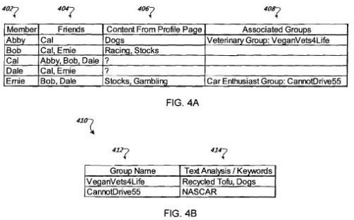

If you were an advertising network, interested in presenting ads on a social network, what kind of advertising model might you come up with to offer the owners of that network, that might encourage people to advertise upon that site?

A recent patent application from Google explores using social profile information from members of a social network, and from their friends or contacts, to determine which advertisements to show viewers when they visit pages of that social network.

The patent filing describes a process that would look at information submitted by members about their interests as well as what kinds of groups they might be a member of, to determine what ads to show on their profile pages.

Since some people don’t provide much information about themselves or their interests on their social profiles, advertisements on those members’ profile pages might be inferred based upon profile or group membership information from others whom they might be related to in some manner on the social network.

We are told that:

> The systems and techniques described here may provide one or more of the following advantages.
>
> First, social network users can be targeted (e.g., for advertising purposes) regardless of whether the users have generated an adequate user profile.
>
> Second, user interests can be inferred based on the interests of the users’ friends that are also members of the social network.
>
> Third, users’ interests can be inferred based on group membership and information about the group.
>
> Fourth, the influence of a friend’s interests can be adjusted based on the type and degree of relationship between the user and the friend.

The patent filing is:

[Inferring User Interests](http://appft1.uspto.gov/netacgi/nph-Parser?Sect1=PTO2&Sect2=HITOFF&u=%2Fnetahtml%2FPTO%2Fsearch-adv.html&r=1&p=1&f=G&l=50&d=PG01&S1=20080275861.PGNR.&OS=dn/20080275861&RS=DN/20080275861)
Invented by Shumeet Baluja, Yushi Jing, Dandapani Sivakumar, and Jay Yagnik
Assigned to Google
US Patent Application 20080275861
Published November 6, 2008
Filed May 1, 2007

Profiles might also include interests that don’t easily correspond to keywords that advertisers might choose to use when targeted their campaigns. The patent filing refers to those terms as “non-advertising keywords,” and describes a way that those terms might be mapped to keywords that are used by advertisers:

> In some implementations, the inferred associations between the non-advertising keywords and the advertising keywords are based on social relationships specified in user profiles.
>
> For example, Jacob may include terms in his profile, such as “hax0r” (i.e., hacker) and “btcn” (i.e., better than Chuck Norris) that do not correspond to advertising keywords. Jacob’s profile specifies that Leah and Rachel are friends. Both Leah and Rachel include terms in their profile, such as “Ajax” (i.e., asynchronous JavaScript and XML) and Perl (Practical Extraction and Reporting Language) that do correspond to advertising keywords.
>
> An advertising system, such as the server system 104, can be used to generate associations between Leah and Rachel’s terms and Jacob’s terms so that advertisements targeted for Leah and Rachel based on the keywords in their profile can also be used to target ads for Jacob because an association is inferred between Jacob’s profile and terms in Leah and Rachel’s profiles.

The profile information used for this method might include more than just interests listed by a member in their profile, such as:

- User blogs,
- Postings by the user on her or other users’ profiles (e.g., comments in a commentary section of a web page),
- A user’s selection of hosted audio, images, and other files, and;
- Demographic information about the user, such as age, gender, address, etc.

Both broad categories and specific keywords could be associated with specific members based upon the content that they’ve generated on the site or could be associated to them based upon their relationships with others on that network.

The patent filing goes into considerably more detail on topics such as how much weight might be given to the interests of others, and how clickthroughs of ads might influence which advertisements are shown.

Another patent application published by Google this summer, [Network Node Ad Targeting](http://appft1.uspto.gov/netacgi/nph-Parser?Sect1=PTO1&Sect2=HITOFF&d=PG01&p=1&u=%2Fnetahtml%2FPTO%2Fsrchnum.html&r=1&f=G&l=50&s1=%2220080162260%22.PGNR.&OS=DN/20080162260&RS=DN/20080162260), took a different approach, attempting to target ads to the “influencers” of communities, by looking at members who might have the most links to their profiles (or connections to other members), and showing ads on their pages as well as community areas which those “influential” members participate.

**Conclusion**

I’m not sure how unique or [nonobvious](https://en.wikipedia.org/wiki/Inventive_step_and_non-obviousness) the process described in the *Inferring User Interests* patent filing might be, but it does provide some insights and details into an advertising model that Google might use to show ads on a social network.

There are many [different reasons and motivations](https://firstmonday.org/ojs/index.php/fm/article/view/1418/1336) behind [friending](https://www.theguardian.com/commentisfree/2006/oct/05/friendingisfrightening) someone on a social network, and people who have thousands of “friends” may not have a lot of interests in common with those they have befriended.

Might inferring interests from “friends” be a mistake, or basing ads on the interests of people who are considered influencers by the number of connections that they have to others?

Something to think about – what kinds of ads would Google show on your profile page at different social networks based upon the interests you’ve listed, the blogging and other activities you’ve performed there, and the “friends” that you’ve made?
