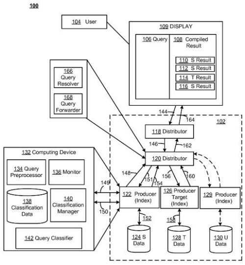
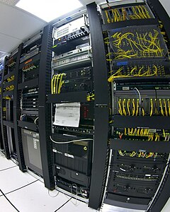
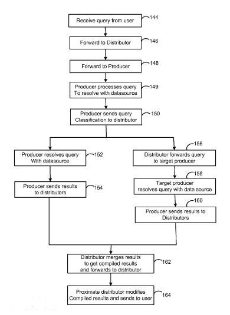
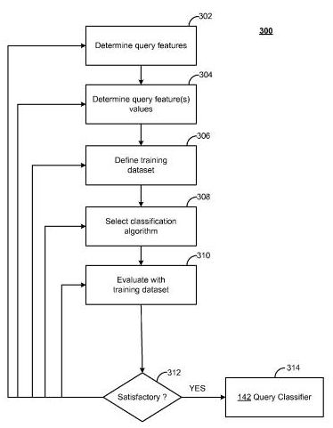
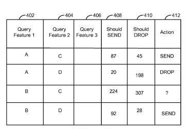

*There’s [some evidence](https://www.seobythesea.com/2011/03/searching-google-for-big-panda-and-finding-decision-trees/) that the Panda updates to Google’s ranking algorithm may be based upon a decision tree approach to classifying and creating [quality scores](https://www.seobythesea.com/2011/06/googles-quality-score-patent-the-birth-of-panda/) for web pages and sites. Curious about whether Google might be using a decision tree approach to classify other information, I went digging through some of Google’s other patent filings that I might not have covered here in the past.*

I found one that may have interesting implications regarding how queries are classified and different data that may be stored and emphasized at different Google data centers or data partitions.

When we think of how a search engine works, we usually focus upon the results that they present to us, and not the methods that they use to deliver them. In addition to displaying relevant results to us quickly, search engines are also concerned about things such as how they use their resources to provide results to us.

If you’ve looked at Google’s [Pagespeed](https://developers.google.com/speed/) or Yahoo!’s [YSlow](https://developer.yahoo.com/yslow/), one of the recommendations that they will often make to large sites that have audiences around the globe are the use of [content delivery networks](https://developer.yahoo.com/performance/rules.html#cdn) or content distribution networks, which would enable those sites to distribute content such as images or downloads or streaming media on servers closer to the users asking for it.

**Different Results at Different Data Centers**

If you perform a search in Google from one location (maybe home), and then perform the same search later in the same day from a different location (maybe work), you may notice that some of the rankings of results have changed, that some pages that were listed in the first search might not be visible in the second search, and that some new results have been added. If you then return to the first location (after a day of work), and perform the same search, you may see the same results from that first search again.

While Google’s localization (video) and [personalization](https://googleblog.blogspot.com/2009/12/personalized-search-for-everyone.html) functions might play a role in the different results that you see, another thing to consider is that you might be looking at results from different data centers.

People on SEO and webmaster forums have noted for years that you might see different results if they are being served from different data centers. You might receive results from different data centers because you’ve changed locations, or because one data center is busy, and your query has been routed over to another one. The “reasons” for the differences are often cited as one data center testing a different algorithm or having been updated somehow while the other isn’t. Another possibility that I haven’t mentioned is that different data centers may optimize their search results based upon making searches better for people located closer to each data center. This patent filing describes how that might be done.

Google has several wholely owned and rented data centers around the globe, and they try to deliver services to searches from data centers that are close to searchers. In some cases, you may receive results from a data center that is more distant from you when the closest data center might be busy.

**Classifying Queries at Different Data Centers**

A patent application published by Google last year describes how the search engine might classify queries to store data responsive to those queries in places where it may be closest to those searchers who request the information.

The patent filing tells us that this system may use a hierarchical, tree-shaped architecture to accept queries and return results to searchers in a way that both “optimizes a usefulness/accuracy” of the results while also managing resources and costs associated with running the system. The results that are delivered to a searcher may come from more than one data source, but the idea behind the system is to make searches both more efficient and effective.

Under this system, a query might be sent to a “distributor node,” which would decide between many “producer nodes” to send that query to. Producer nodes are associated with indexes of data sources, which would search words or phrases within documents or metadata about those documents (including audio, video, and images).

It might be more expensive to access some of those producer nodes than others, based upon things such as a producer node being physically distant from a distributor node, or have a limited ability to respond to queries because it’s busy, or the database at that producer node may be so large that search times may be unreasonably long.

To reduce costs associated with creating results for queries, these producer nodes may be set up to focus upon to be more “local” and provide results for more widely accessed and more frequently-desired results for queries they may receive from nearby searchers and may be set up to contain fewer possible total results so that they are “relatively fast and easy to update, access, and search.”

***Example***

When someone in Australia searches for [Football], they may expect to see search results involving Australian Rules Football. A data center or source near them (in Australia) may be set up to be faster and less costly to access information about Australian Rules Football than information about American Football, or the Football that most Americans refer to as Soccer. Europeans searching for information about [Football] expect a whole different set of results, and data centers set up in Europe may be optimized to respond to queries involving those results. Americans anticipate a completely different set of results on their search for [Football], and data centers in the US might be optimized for their queries.

The patent filing is:

[Productive Distribution for Result Optimization Within a Hierarchical Architecture](http://appft.uspto.gov/netacgi/nph-Parser?Sect1=PTO2&Sect2=HITOFF&u=%2Fnetahtml%2FPTO%2Fsearch-adv.html&r=1&p=1&f=G&l=50&d=PG01&S1=20100318516.PGNR.&OS=dn/20100318516&RS=DN/20100318516)
Invented by John Kolen, Kacper Nowicki, Nadav Eiron, Viktor Przebinda, William Neveitt, and Cos Nicolaou
Assigned to Google
US Patent Application 20100318516
Published December 16, 2010
Filed: October 30, 2009

Abstract

> A producer node may be included in a hierarchical, tree-shaped processing architecture, the architecture including at least one distributor node configured to distribute queries within the architecture, including distribution to the producer node and at least one other producer node within a predefined subset of producer nodes.
>
> The distributor node may be further configured to receive results from the producer node and results from the at least one other producer node, and output compiled results.
>
> The producer node may include a query pre-processor configured to process a query received from the distributor node to obtain a query representation using query features compatible with searching a producer index associated with the producer node to obtain the producer node results. A query classifier configured to input the query representation and output a prediction, based thereon, as to whether processing of the query by the at least one other producer node within the predefined subset of producer nodes will cause results of the at least one other producer node to be included within the compiled results.

**Intelligently Deciding Which Queries are Routed Where**

Attempting to make an educated guess regarding which queries should be routed to which producer node or nodes isn’t an option. There are too many queries, and too much information involved. A system like this will only work well if it produces search results that provide the “best-available query results for the query.”

There may be times when the query results can only be adequately answered by gathering information from more than one producer node. Still, the more likely it is that a query can be answered by a single producer node, the better – it reduces both computational expense and access latency, or time.

So, this system will attempt to predict how likely it is that relevant information may be found at a particular producer node, and may or may not consider particular topics or subject matter that may be relevant to the query. Remember, this is a “prediction” before the query is processed, so as much that can be done without actually finding all results to predict whether or not the query may have to be sent to more than one producer node, the better.

This prediction is based upon query pre-processing that might look at query features such as:

- Length of the query (i.e., a number of characters),
- Number of terms in the query,
- Boolean structure of the query,
- Synonyms of one or more terms of the query,
- Words with similar semantic meaning to that of terms in the query,
- Words with similar spelling (or misspelling) to terms in the query, and/or
- A phrase analysis of the query.

The analysis of phrases may include:

- The length of each phrase,
- An analysis of which words are close to one another within the query, and/or
- An analysis of how often two or more words that are close within the query tend to appear close to one another in other settings (e.g., on the Internet at large).

One of the inventors listed, Nadav Eiron, is also one of the inventors on a second-generation phrase-based indexing patent filing from Google, [Index Server Architecture Using Tiered and Shared Phrase Posting Lists](http://appft.uspto.gov/netacgi/nph-Parser?Sect1=PTO2&Sect2=HITOFF&u=%2Fnetahtml%2FPTO%2Fsearch-adv.html&r=1&p=1&f=G&l=50&d=PG01&S1=20100161617.PGNR.&OS=dn/20100161617&RS=DN/20100161617). There might be a relationship between that type of indexing and the phrase analysis mentioned in this *Result Optimization* patent filing.

Including synonyms and possible misspellings in the prediction, and then in the pages returned from the index may result in a larger set of search results from the data source.

These types of features related to queries enable the search engine to classify the query to predict whether a specific producer node might contain sufficient search results to satisfy a searcher.

Machine learning techniques might be used to build a model regarding the probability that each producer node contains a useful amount of results to respond to a query and determine whether other producer nodes should be included.

Using a query model like this enables the system to make more intelligent decisions about whether or not there might be sufficient results from a particular data source. The features related to each query can also be used to retrieve information from the index in each producer node as well.

In addition to looking at information about the query itself, the search engine might perform a cost/benefit analysis, looking at other factors such as whether or not the network is currently congested, and how costly it might be to access a particular producer node for a particular query.

We’re told that the classification algorithm that might be used with query predictions for different producer nodes might be a decision tree algorithm:

> Thus, a classification algorithm may be selected which attempts to maximize the sending of productive queries, while minimizing lost queries/results. Such examples may include, e.g., a decision tree algorithm in which query results are sorted based on query feature values, so that nodes of the decision tree represent a feature in a query result that is being classified. Branches of the tree represent a value that the node may assume.
>
> Then, results may be classified by traversing the decision tree from the root node through the tree and sorting the nodes using their respective values. Decision trees may then be translated into a set of classification rules (which may ultimately form the classification model), e.g., by creating a rule for each path from the root node(s) to the corresponding leaf node(s).

Other possible classification algorithms might also be used, and a training dataset might be used to work with that classification system.

Actual results produced from a particular producer node may be compared to the predictions regularly to ensure that the classification model is working well, or needs to be updated.

**A side note**

When looking for more information about the inventors involved in this patent, I came across the resume of one of the inventors. I thought his section involving what he did at Google might be interesting for those looking for more information about Panda:

> John Frederick Kolen
>
> Employment
>
> 8/2008-5/2011 Senior Software Engineer (Web Search Infrastructure), Google, Inc., Mountain View, CA.
>
> Developed machine learning approaches for optimizing the quality of and resources used for web search. Experience with large-scale distributed systems. Developed metrics for web page similarity.

We know little about the people involved in the Panda upgrades, except that someone with the name of “Panda” provides some of the impetus behind the development of the system involved.

How similar web pages may be on a site or upon multiple sites appears to be an important issue with the Panda upgrades, as do machine learning approaches to classifying web pages and websites based upon quality. One or more of the people who were involved with this *may result from optimization* patent may have also been involved with Panda.
