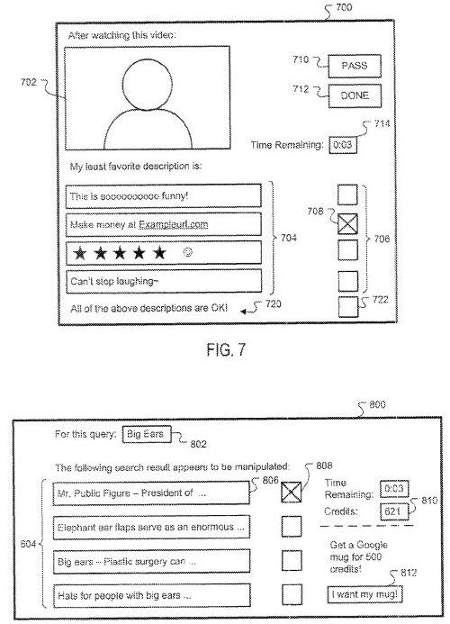

Manipulative repetitive anchor text, blog comments filled with spam, Google bombs, and obscene content could be the targets of a system described in a patent granted to Google today that provides arbiters (human and possibly automated), with ways to disassociate some content found on the Web, such as web pages, with other content, such as links to that content.

In an Official Google Blog post, [Another step to reward high-quality sites](https://webmasters.googleblog.com/2012/04/another-step-to-reward-high-quality.html), Google’s Head of Webspam Matt Cutts wrote about an update to Google’s search results targeted at webspam that they’ve now started calling the Penguin update. The day after, I wrote about some patents and papers that describe the kinds of efforts Google has made in the past to try to curtain web spam in my post [Google Praises SEO, Condemns Webspam, and Rolls Out an Algorithm Change](https://www.seobythesea.com/2012/04/google-praises-seo-condemns-webspam-rolls-out-algorithm-change/).

The patent doesn’t describe in detail an algorithmic approach to identifying practices that might have been used to manipulate the rankings of pages in search results. Instead it tells us about a content management system that people engaged in identifying content impacted by such practices might use to disassociate certain content with webpages and other types of online content.

The patent is:

[Content entity management](http://patft.uspto.gov/netacgi/nph-Parser?Sect1=PTO2&Sect2=HITOFF&u=%2Fnetahtml%2FPTO%2Fsearch-adv.htm&r=1&p=1&f=G&l=50&d=PTXT&S1=8,176,055.PN.&OS=pn/8,176,055&RS=PN/8,176,055)
Invented by Mayur Datar and Ashutosh Garg
Assigned to Google
US Patent 8,176,055
Granted May 8, 2012
Filed: March 27, 2007

Abstract

> A first content entity and one or more associated second content entities are presented to one or more arbiters. Arbiter determinations relating to the association of at least one of the second content entities with the first content entity are received.
>
> A determination as to whether the at least one of the second content entities is to be disassociated from the first content entity based on the arbiter determinations can be made.

We’re told that some types of “content entities” such as video and/or audio file, web pages, search queries, news article, and others might have associated second content entities such as “user ratings, reviews, tags, links to other web pages, a collection of search results based on a search query, links to file downloads, etc.”

That association could be created by user input, such as someone entering a review, or by a relevance determination by a search engine.

Like many patents, this one describes the problem it was intended to resolve. In this case, that problem is that sometimes those types of associations can produce results that could negatively impact how a search engine might work:

> Frequently, however, the second content entities associated with the first content entity may not be relevant to the first content entity, and/or may be inappropriate, and/or may otherwise not be properly associated with the first content entity.
>
> For example, instead of providing a review of a product or video, users may include links to spam sites in the review text, or may include profanity, and/or other irrelevant or inappropriate content. Likewise, users can, for example, manipulate results of search engines or serving engines by artificially weighting a second content entity to influence the ranking of the second content entity.
>
> Fox example, the rank of a web page may be manipulated by creating multiple pages that link to the page using a common anchor text.

The patent describes how those associations between content entities might be presented to arbiters or reviewers who could decide to disassociate those content entities.

Some other content associations described in the patent include:

- Items offered for sale in an online retail store, and user comments related to the item
- An entry in a blog, and readers’ comments on the blog post
- An image or a video clip, and annotations or comments on that media file
- A search query at a search engine, and search results for the query

It’s possible that the system described in this patent may have been intended to be used by the human evaluators who Google hires to evaluate search results during testing, or by search engineers who evaluate the real time quality of search results, or by both.

I did write about a couple of patents last November that also focused upon the evaluation of search results. One focused upon the use of [human evaluators](https://www.seobythesea.com/2011/11/how-human-evaluators-might-help-decide-upon-rankings-for-search-results-at-google/), while the other described an [automated evaluation](https://www.seobythesea.com/2011/11/automated-evaluations-search-results-google/) approach. Both of those described some of the signals that those approaches might look at when deciding upon the quality of search results.

This patent is less about specific signals that might indicate something about the quality of search results, and more about a content system that could be used to act upon associations that might have problems.

For example, if there’s an image of Mount Kilimanjaro on the Web, and it has been tagged as Mt. Fuji. that tag might be disassociated from the image using this content system. The disassociation might take more than one arbiter determination or vote.

This system also tells us that arbiters might be given points for their determinations under this system, as well as time limits to make decisions regarding content associations as well.

We’re also told that an arbiter might not necessarily be human either, but could be “implemented as a software agent.”

Such a software agent could make determinations to disassociate content according to algorithms aimed at making such decisions.

For example, one algorithm might determine a relevance measure for a second content entity compared to a first one, when the relevance measure is below a certain threshold. Another algorithm could determine the presence of profanity and possibly disassociate something like a comment from a blog post, or an annotation from a video.

We’re also told that an arbitrator might be chosen based upon certain factors, such as location:

> In another implementation, the content management engine can select the arbiters based on an arbiter location. For example, arbiters in the San Francisco area may be more often selected to review comments related to a video of local landmark, e.g., the Golden Gate Bridge.

When an arbiter makes a decision to disassociate content, they might provide a reason for doing so:

> The rationale can, for example, be predefined, e.g., check boxes for categories such as “Obscene,” “Unrelated,” “Spam,” “Unintelligible,” etc. Alternatively, the rationale can be subjective, e.g., a text field can be provided which an arbiter can provide reasons for an arbiter determination.
>
> The rationale can, for example, be reviewed by administrators for acceptance of a determination, or to tune arbiter agents, etc. In another implementation, the rational provided by the two or more arbiters must also match, or be. substantially similar, before the second content entity is disassociated from the first content entity.

The content management system could also help identify irrelevant content and assign a low association score between two different content items. For example, on an article about a programming language, a comment relating to a website about marketing may be considered to not be very relevant.

A ranking freshness signal could also be used by the content management system to identify search results for a specific query that suddenly moved up highly in search results.

**Takeaways**

If you’re interested in the processes that Google might use to enforce its webmaster guidelines and how it might do things like devalue links to a website that might be used to manipulate the rankings of search results, you might be interested in spending some time with this patent. The patent itself is fairly long, and while I’ve described some of what it covers, it goes into much more detail.

It makes sense for Google to have some kind of interface that could be used to both algorithmically identify webspam and allow human beings to take actions such as disassociating some kinds of content with others. This patent presents a framework for such a system, but I expect that whatever system Google is using at this point is probably more sophisticated than what the patent describes.

While I’ve seen a few people state that Google doesn’t like excessive links pointed to a particular page with the same anchor text, I can’t recall seeing an explicit statement from Google about that before until the mention in this patent. We’re not given any “magical” percentage of how many links pointed to a page might start being considered excessive though.
