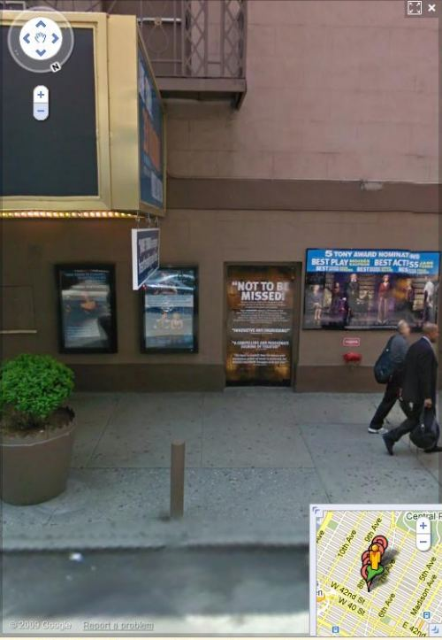
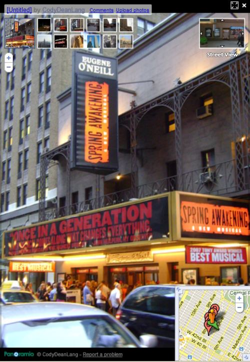
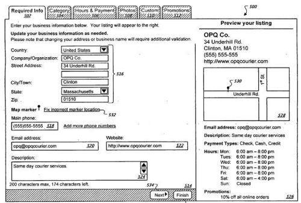
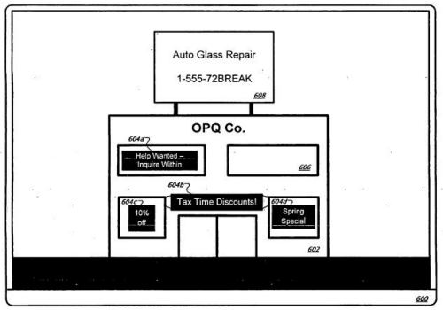
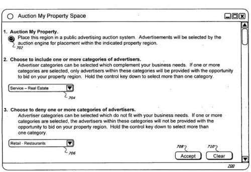
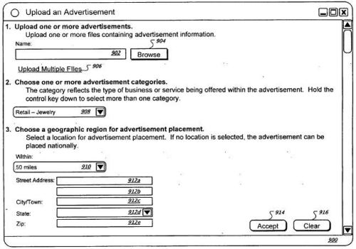
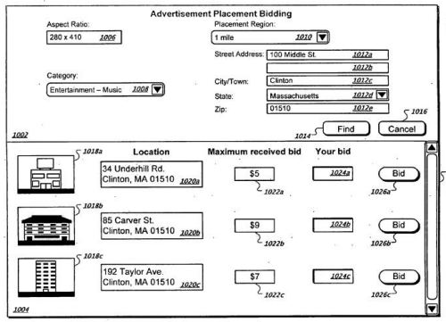

## Imagine Ads in Streetviews Images

Imagine that you are the owner of the Eugene O’Neill Theatre in Manhattan, New York, and you have a marquee banner that lets passerbys know what performances are currently taking place on your stage, as well as posters advertising coming attractions. How helpful might streetviews Images with Ads in them be?

Google has captured images of your theatre for Google Maps [StreetViews](https://www.google.com/streetview/), and have included many images that you may have uploaded via Google’s Local Business Center, or that others have taken of the area around the theater.

An image from Google’s Streetview of the theatre shows at least four billboard posters on the front wall of the building, which viewers can see.

The chances are that the posters may be outdated. Imagine being able to update them as the owner of the theatre. Or to sell those spots to advertisers?

Google has also added the ability for business owners to add images to their local business listings that can display a Streetviews image display of a business location, such as the following:

People other than a business owner can add images of a business to Google, but consider that some of those images may be old and may contain some dated information. As cold as it is today, I’m ready for a springtime production of anything, even a broadway “Spring Awakening” show like the one shown on the marquee above.

Imagine a site owner being able to update parts of images, such as marquees. I would imagine that they would only be able to change their images, rather than one’s submitted by someone else, as the above image seems to be.

Or imagine a property owner allowing others to bid upon adding images, or adding messages in posters or banners that might appear in an image in Google’s Streetview images.

A patent filing from Google describes a way for Google to let property owners claim their properties in Streetview, to make changes to streetview scenes and associated images, and to allow people to bid to advertise on those pictures.

The Streetviews Images Ad patent is:

[Claiming Real Estate in Panoramic or 3D Mapping Environments for Advertising](http://appft1.uspto.gov/netacgi/nph-Parser?Sect1=PTO2&Sect2=HITOFF&u=%2Fnetahtml%2FPTO%2Fsearch-adv.html&r=1&p=1&f=G&l=50&d=PG01&S1=20100004995.PGNR.&OS=dn/20100004995&RS=DN/20100004995)
Invented by Ryan Hickman
Assigned to Google
US Patent Application 20100004995
Published January 7, 2010
Filed July 7, 2008

Abstract

> Techniques for identifying groups of features in an online geographic view of real property and replacing and/or augmenting the groups of features with advertisement information are described.
>
> The techniques include:
>
> - Providing a geographic view of a property within an online property management system,
> - Identifying a region of interest in the geographic view,
> - Analyzing the geographic view to locate one or more promotional features within the geographic view positioned upon a real property region,
> - Providing a user-selectable link associated with the region of interest in the geographic view,
> - Receiving a request for the region of interest in the geographic view via the user-selectable link,
> - Receiving data to alter at least one of the behavior or the appearance of the region of interest,
> - Storing the data in association with the geographic view, and;
> - Updating the region of interest within the geographic view based upon the received data.

Streetview has been one of my favorite parts of Google Maps because it allows you to take a look at places that you might consider visiting in person. It also seems to be an important part of the mobile [Google Maps Navigation](https://www.google.com/maps/about/#p=default), since as Google tells us on their Google Maps Navigation page, the application “…automatically switches to Street View as you approach your destination.”

While the patent filing describes how such an advertising system might work with Google Streetview, it also provides some nice images that capture how that advertising process might work. Rather than summarizing the process, I’m going to provide a number of those images.

From one of the first images, it appears that this process would work through the Google Local Business section of Google. They show us the interface that a business owner uses to add their business to Google, or update information about their business and location:

An example image in the patent filing shows many possible places that advertising might be shown on an image:

An auction interface screen allows a business owner to elect to have people bid upon advertisements upon images of their property, including the chance to select categories of advertisers and to deny some other categories:

The patent application images also include an example advertisement upload interface that advertisers can use to submit their ads, including selections of categories and geographic/location information for those ads.

Finally, an advertisement placement bidding screen enables advertisers to bid upon where their ads might appear, including the locations and images that they might be shown at:

**Conclusion**

While this Streetviews advertising process hasn’t been put into place by Google, it may be something they might launch. Streetview looks like it has become an important part of Google Maps Navigation, and Google has invested a fair amount of money and effort into its Streetview project.

If the opportunity became available, would you advertise in Streetview? Would you allow others to advertise on your property?

Keep in mind that property owners could also update their information within StreetView under the process described in this patent filing. So, for instance, if you were the owner of the Eugene O’Neill Theatre, you could make sure that the image of your theatre appearing in Streetview showed the name of the current production being performed on your stage.
