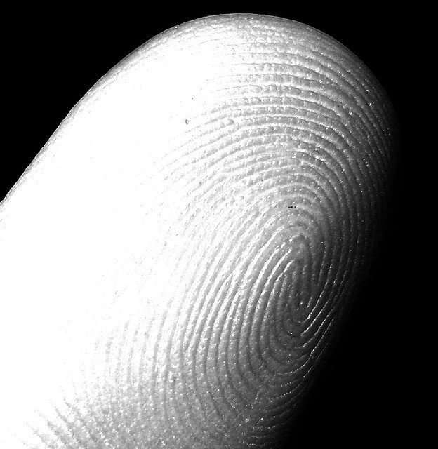
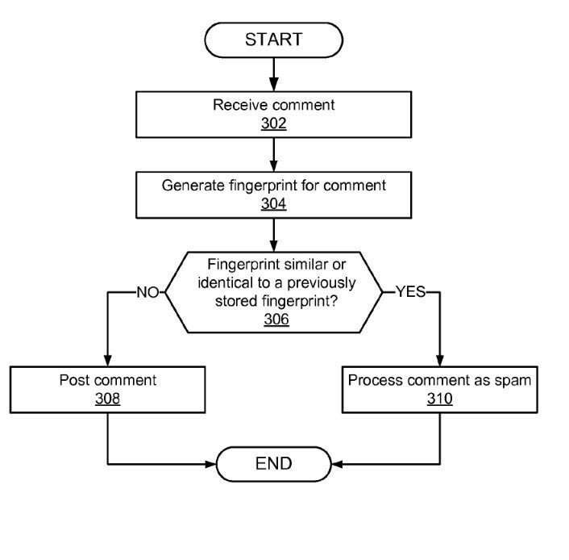
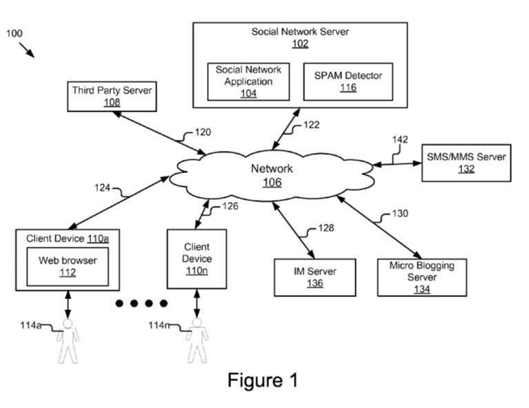
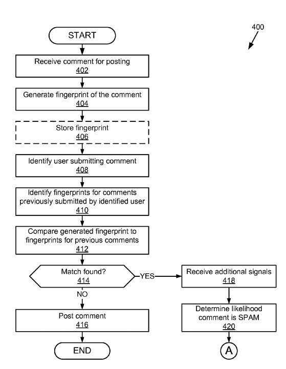

For as long as SEOs have known, Google has had one person in charge of leading their fight against Webspam. His name was [Matt Cutts](https://www.mattcutts.com/blog/), and his position had evolved over the years into that of being a mouthpiece for Google, speaking on actions that Google might take to fight web spam, and low quality content. Matt Cutts is presently on an extended [leave of absence](https://www.mattcutts.com/blog/on-leave/) from Google.

_[my fingerprint (index, left hand)](https://www.flickr.com/photos/fazen/3778408), [Stefano Mortellaro](https://www.flickr.com/photos/fazen/), [Some Rights Reserved](https://creativecommons.org/licenses/by/2.0/)_

News came out a few days ago, that Google would be [replacing Matt Cutts as Google’s Head of Spam](https://searchengineland.com/google-head-web-spam-221482), but that news tells us that the new person in charge of WebSpam at Google wouldn’t be as vocal as Matt Cutts had been, nor reveal his or her identity.

So, how will Google move forward?

A patent granted today to Google targets detecting spam across a social network. It starts early on with a definition of spam that informs the solution it presents:

> Spam is a rampant problem across the Internet. Spam (e.g., junk or unsolicited bulk messages) is generally identical messages sent to numerous recipients who did not request it. While spam is typically thought of in the e-mail context, it is also becoming widespread on social networks. A spammer can attempt to elicit random users to help monetize. The spammer makes a large number of identical or nearly identical posts. This can be done by email, online service pages, or comments on a blog or a social network. A relevant aspect to a spammer is coverage. The greater the number of unique users that view a spam post, the greater the number of possible monetize-able events that may occur. That is, random users responding to or otherwise following the instructions in a spam post result in the spammer accruing money.
>
> Some social networks allow public posting. A user can comment on a public post. Spammers can also comment on a post.

This patent specifically targets spam in social networks, and the unique features of those. It tells us that one feature of a social network is their approach towards finding and identifying popular content that is shared within a social network. That allows popular posts to be surfaced to other members of the social network, and enables them to view these trending posts. Spammers supposedly have been taking advantage of the “high number of views the comments of such posts will receive.”

## Fingerprint Detection

The patent proposes an approach to detecting spam across a social network. It does this by including a spam detector that includes modules such as a fingerprint generator, a comparison module, and a response module, so that once spam is found and identified, it can be responded to. The fingerprint module captures the characteristics of spam seen elsewhere. The comparison module can be used to identify that fingerprint in comments left in a social network. It then tells us:

> The fingerprint is compared to other fingerprints previously generated and stored. If the fingerprint matches any previously stored fingerprints, it is considered to be spam and processed accordingly. If the fingerprint does not match any previously stored fingerprints, it is posted in the social network.

The patent tells us what the advantages it brings with it:

- First, the spam detector prevents comments that are spam from being posted in a social network
- Second, the spam detector can be used with other signals to improve the accuracy of identifying spam
- Third, the spam detector can be used for any user generated content to reduce or eliminate spam

The patent is:

[Detecting spam across a social network](http://patft.uspto.gov/netacgi/nph-Parser?Sect1=PTO1&Sect2=HITOFF&d=PALL&p=1&u=%2Fnetahtml%2FPTO%2Fsrchnum.htm&r=1&f=G&l=50&s1=9,043,417.PN.&OS=PN/9,043,417&RS=PN/9,043,417)
Inventors:Christopher Jones and Stephen Kirkham
Assigned to Google
US Patent 9,043,417
Granted May 26, 2015
Filed: July 10, 2012

Abstract

> A system and method for detecting spam across a social network using a spam detector is disclosed. The system comprises a post receiving module, a fingerprint generator, a fingerprint comparison module, fingerprint storage and a spam response module. A comment is received by the post receiving module and a fingerprint is generated by the fingerprint generator using the comments.
>
> The fingerprint is compared to other fingerprints previously generated and stored by the fingerprint comparison module. If the fingerprint matches any previously stored fingerprints, it is assumed to be spam and processed accordingly by a spam response module. If the fingerprint does not match any previously stored fingerprints, it is posted in the social network.

The patent tells us that its use isn’t limited to just social networks, but it can be used more widely for other types of user generated content:

> While the present disclosure will now be described in the context of a social network, it should be understood that the principles of the present disclosure could be applied to any service that collects and posts user generated content. For example, any third party systems that accept comments, reviews, posts, tips, check-ins, comments on WordPress blogs, etc. may use the spam detector described below.

The Spam Detector acts to:

- Prevent content from being posted or transmitted in the social network.
- Remove abusive users from the social network.

This patent tells us that it errs on the side of people making innocent mistakes when they post duplicate content:

> If the fingerprint does not match the previously stored fingerprint, then the method continues to post the comment on the social network. However, if the fingerprint matches the previously stored fingerprint, the spam detector has identified that it is a duplicate comment. This may be an innocent error or it may be a spam attempt. If a post of an accepted comment is the same as that of the proposed comment being considered, the proposed comment can be considered as being a duplicate made in error. On the other hand, if the proposed comment is to a different original post, the likelihood of the comment being made in error is much lower and the present method identifies the user as a potential spammer. The method continues to process the proposed comment as spam. As has been noted above, this additional processing may reject the comment for posting, perform automated or manual review of the user’s post, silence the user or disable the user’s account.

Most of the patent doesn’t describe how it might potentially recognize spam, but it includes a method to try to “determine the likelihood that a comment is spam by applying various rules such as those identified above as well as other policies to categorize comments based on the signals associated with that comment.” So, it might include “five different categories and each has a different corresponding action that the spam response module will perform based upon the categorization.” The patent doesn’t tell us what these particular rules are.

Users of a social network might be terminated from the service based upon this patent:

> For example, if there have been a number of duplicate comments from this user, and they are all within a very short time-frame, or the user account location is identified as one often used by spammers, there may be a very high likelihood that the comment is spam. If so, the method disables the account of the user and the method ends.

Other, less definite signals that someone is potentially engaging in spam might trigger a manual review of their actions.

OK, the patent doesn’t give us a road-map as to what spam is exactly, and provide ways for us to trigger the negative implications of spam. But if it did, it probably shouldn’t share information like that – a patent that may make it easier for people to spam the search engine would be highly undesirable. Especially to Matt Cutt’s replacement, whomever he or she might be.
