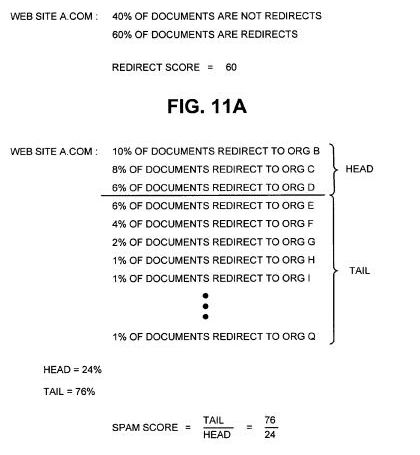

## Just What are Bounce Pad Sites?

I hadn’t heard the term “Bounce Pad” being referred to websites before, but it’s useful knowing the language of search engines, and the things they might look for when crawling and indexing webpages, and serving results to searchers. Determining whether a site is a bounce pad involves an analysis about redirects appearing on the site, like in the image below from a Google patent granted this week:

One of the mysteries associated with Google’s search results is how it determines which pages to show when there are duplicate or substantially duplicated documents within its index. A search engine doesn’t want to show searchers a list of search results that contains substantially the same pages, so when it finds pages that are pretty close to being the same, it will create a “cluster” of those pages and choose a representative page to display.

That kind of duplication can happen for a number of reasons, such as someone copying content from another page (with or without permission or license to do so), the majority of the content on a page being a manufactor’s or publisher’s description, a content management system set up so that the same page gets published more than once at different URLs, content being republished on a mirror site or sites set up so that if there’s too much traffic to one of the sites that the others may handle overflow, and more.

The Google patent describes one way the search engine may filter out some choices of pages, based upon whether or not those pages appear upon sites that the search engine considers bounce pads, or sites that contain a high number of redirects that tend to redirect to multiple other pages, usually on other sites. Bounce Pad sites are usually considered to contain documents belonging to spammers, especially since many spammers will copy document content and frequently attempt to pass it off as their own.

Search engines don’t necessarily even want to index all of the duplicate documents that they find, since doing so wastes space in their indexes. But they also strive to index content from the legitimate sources of that content, while not showing duplicated content documents from spammers.

**Types of Redirects and Uses**

When I analyze a website, one of the things that I look at is how the site might be using redirects. It’s usually a good idea to remove as many unnecessary internal redirects from a site as possible to speed up a site, reduce the work that a search engine crawling program needs to do when crawling the pages of a site, and get a better picture of how the pages of a site relate to one another. I have seen at least one site that had chains of redirects at least 8 levels deep, which caused search engine crawlers to balk at indexing the pages of that site.

The patent itself defines redirects very broadly as a way of sending a browser (or search engine) from one web address to another, and provides a number of classifications for redirects:

*Manual redirects* – a document explicitly requests that a visitor follow a link to another page.

*Status code redirects* – A browser (or search engine user agent) receives an HTTP status code telling it that the document at the address it is trying to visit has moved to a new address, either temporarily (a 302 status code) or permanently (a 301 status code).

*Meta refresh redirects* – a Meta tag that tells a web browser to replace a source document with a target document after a delay specified in the meta tag (the amount of delay can be listed as “0”.

*Frame redirects* – A source document includes an HTML frame that contains a target document

*Javascript redirects* – A document contains javascript that causes a web browser to redirect to a target document when the javascript is executed by the web browser

*Full screen pop-ups* – A source document causes a full screen popup of a target document to be displayed.

**Some Reasons for Using Redirects**

Redirects might be used for legitimate reasons, and they may be used for malicious reasons.

For instance, if you change the domain that your content appears upon to a new domain, you’ll want to include the proper redirects from the addresses at the old domain to the new one (while actually changing the on site URLs to reflect the new domain on the pages of your site. This is like informing the post office that you’ve moved to a new address so that the mail will be sent to that address.

If you notice in your error log files that people are trying to reach a certain page on your site, but are following a wrong address because of a typo or common misspelling, you could set up a redirect so that those visitors find the correct pages.

If your domain name is commonly misspelled, you might want to register the misspelling of the address and redirect traffic to the correct domain.

The Bounce Pad Sites patent tells us that there are malicious reasons some people may use redirects for as well, such as attempting to fool a search engine into serving a spammer’s page, or to confuse visitors as to which web page they are on to try to get them to reveal private information as part of a phishing attack.

**Implications of Being Seen as Bounce Pad Sites**

This patent doesn’t actually look at whether the content of the pages of a site includes actual web spam, but rather looks at how frequently redirects are used on a site, and how frequently they point to other domains and may classify sites as bounce pads based upon that analysis. If the content on a page from a site identified as a bounce pad site is substantially similar to content found on another page that isn’t on a bounce pad site, the page from the bounce pad site would be filtered out of search results.

In simple terms, sites may be considered bounce pad sites based upon the following analysis:

(1) The content of a site, including information associated with the pages such as addresses, metadata (e.g., refresh meta tags, refresh headers, status codes, etc.), may be analyzed to determine whether or not the documents are redirects.

(2) A redirect score might be given the site based upon the number of pages that are redirects compared to the number that isn’t.

(3) A spam score might be given to the site based upon how many different targets the site might have, with those targets broken into head targets (the three most commonly redirected sites) and tail targets. For instance, Site A includes 100 redirects to Site B, 60 redirects to Site C, and 40 redirects to site D. It also includes 20 redirects to Site E, 20 to Site F, 10 to Site G, and 5 each to Sites H, I, J, and K. The head targets (B,C,D) amount to 200 redirects, and the tail targets (E,F,G,H,I,J,K) amount to 70 redirects.

The patent tells us that it might not count the redirects between sites that are associated between the same organization, so if Site A is “example.com” and Site B is “example.co.uk” it might not include the redirects to Site B in its analysis.

It might then calculate a ratio of tail targets over head targets to come up with a spam score. So, if we don’t count the redirects to Site B, the spam score might be 70/100 or .7. As an alternative which isn’t explained well by the patent, the process might instead use a ratio of head targets over tail targets to come up with a spam score, or 100/70.

4) This combination of redirect score and spam score might be used to come up with a determination of whether or not sites are bounce pad sites.

The patent doesn’t provide much in terms of describing why the top 3 targets (or some other number) might be chosen as head targets, and the remainder as tail targets, or why it might prefer to look at tail targets over head targets, or vice versa. It also doesn’t directly describe the function used with the redirect score and the spam score to determine if a site is a bounce pad.

The patent is:

[Detection of bounce pad sites](http://patft.uspto.gov/netacgi/nph-Parser?Sect1=PTO2&Sect2=HITOFF&p=1&u=%2Fnetahtml%2FPTO%2Fsearch-adv.htm&r=1&f=G&l=50&d=PALL&S1=08037073&OS=PN/08037073&RS=PN/08037073)
Invented by Rupesh Kapoor, David Michael Proudfoot, Joachim Kupke
Assigned to Google Inc
US Patent 8,037,073
Granted October 11, 2011
Filed: December 29, 2008

Abstract

> A system may identify a set of related documents, identify one or more documents in the set of related documents that are sources of redirects, and identify organizations that are targets of the redirects. The system may also determine a redirect score based on the number of the identified documents that are sources of the redirects, determine a spam score based on a number of the organizations that are targets of the redirects, determine whether to classify the set of related documents as a bounce pad based on the redirect score and the spam score, and storing information associated with the result of the determination of whether to classify the set of related documents as a bounce pad.

**Conclusion**

A website that contains a large number of redirects pointing to pages on a number of other domains appears to be somewhat suspicious to Google (and probably for good reasons). One that has been classified as a bounce pad, and has pages with content that are substantially similar to that found on other pages upon the Web might not be the best choice to show searchers pages from.

I guess it’s possible that some sites that aren’t web spam sites may include a lot of redirects to different sites, and also be the originators of the content found on their pages, with that content possibly copied elsewhere on the Web, but it does sound like an unusual setup.

As I wrote at the start of this post, I hadn’t heard of the term “bounce pad sites” being used to refer to sites before.

There are a number of other methods that a search engine might use to try to identify web spam that can include analyzing the actual content on pages, looking at links between pages and so on, but this one takes on the subject from a different perspective by focusing upon redirects.

Updated June 9, 2019.
