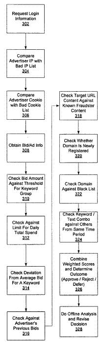

Usually when you hear the word “fraud” associated with online advertising through something like Google’s adwords, the topic being discussed revolves around click fraud, where invalid clicks are made on ads and advertisers are being charged by the click.

But what about people who use online ads to commit fraud upon unsuspecting consumers, or advertisers who sign up for multiple accounts to try to grab more than one advertising space on search results page for particular queries? (see Google’s Policy on [Double serving](https://support.google.com/adspolicy/answer/6020954?hl=en&rd=1) of ads on the same page.)

A Google patent application available on the World Intellectual Property Organization (WIPO) site describes many of the steps that Google might take to try to avoid fraud in advertising within their advertising system. The patent application has not yet been published on the United States Trademark and Patent database.

**Overview**

A high level overview of how Google might uncover fraud in advertising:

1) An advertiser creates a new advertising account in an advertising system.

2) Information about the advertiser’s campaign and account are sent to an automated fraud system, which considers that information to see if there is a significant likelihood of fraud associated with the account.

3) If the information is considered to indicate the possibility of fraud, the advertising campaign may be rejected.

4) If the information is found by the fraud system to likely not be fraudulent, the campaign is accepted, subject to any other business rules in the system.

5) Visitors should then be able to see the advertiser’s ads.

6) If the fraud system can’t determine whether a transaction is fraudulent or not with more than a threshold degree of certainty, the transaction is flagged for review by a fraud analyst.

7) The fraud system may also contain:

- a bad IP list database, for storing a list of IP addresses known to be associated with fraudulent activity;
- a bad cookie list, for storing a list of cookies known to be associated with fraudulent activity;
- a fraud patterns database, for storing pattern information extracted from web pages known to be associated with fraud, the patterns describing page content and layout features that are associated with web pages hosted by fraudsters, and;
- An offline analyzer, for performing additional evaluations of transactions where a real-time fraud /no-fraud decision is not required.

**The Patent Application**

[Fraud Detection in Web-Based Advertising](https://patentscope.wipo.int/search/en/detail.jsf?docId=WO2007061877)

Publication Number: WO/2007/061877
International Application No.: PCT/US2006/044738
Publication Date: 31.05.2007
International Filing Date: 17.11.2006

Inventors: Jie Zhou, Chirag Khopkar, Asher Walkover, Peter Kappler, and Yueh-chwen Charity Lu

Abstract:

> Attributes of new account information and advertising campaigns for advertisers are evaluated by a fraud detection engine of a fraud system and a fraud score is augmented where fraud is suspected. The fraud detection engine evaluates the attributes of the advertising campaign, including attributes such as bid amount, maximum cost per day, average bid, and keyword selection.

**A Deeper Look at Detecting Fraud in Online Advertising**

*A Check Against Known Bad IP Addresses*

An advertiser accesses the advertising system and enters login account information.

If there is no account yet, and advertiser can create a new account.

If there is an account, the advertiser enters information to be authenticated according to data in the advertiser account information database.

When the new account is created, or the existing account is validated, the fraud system may compare the IP address associated with the advertiser against a list of known bad IP addresses – ones that are known to have been used by fraudsters in the past.

This has limits because IP addresses can be dynamically assigned by an internet service provider and can change, or different advertisers can share the same public work station. So, a match against the bad IP list will not indicate fraud on its own, but can be considered a signal or factor to be take along with others.

*A Search for Cookies*

A check might then take place to see whether the advertiser has any site-created cookies on their computer. It’s possible for the system to place a cookie on the advertiser’s computer when an account is established.

If the user is claiming to be a new advertiser, and is attempting to establish a new account, but he or she already has a cookie on his computer, this could be another possible signal of fraud, and the fraud score may be updated. But this by itself also may not be dispositive of fraudulent activity. More than one advertiser may share a single computer.

Cookies on the advertiser’s computer, when not registering a new account, can be looked for on a list of cookies known to be associated with previous fraudulent activity. If one is there, the fraud score may be augmented.

*A Comparison of Keywords Selected*

The advertiser enters campaign information that they want to bid on, including impressions (with URLs), one or more keywords or keyword groups, and a bid amount.

Advertising text along with a set of keywords are entered, as well as the creation of keyword groups. Bid amounts from different advertisers are compared, and based upon stats collected for keywords and keyword groups, a threshold fraudulent bid amount may be associated with each keyword group, possibly related to the average bid amount. As an example, the patent application tells us that “a threshold fraudulent bid amount may be two standard deviations greater than the average bid amount for the keyword group.”

This amount may also be set manually, or according to other criteria. If the amount bid is higher than the threshold, that may indicate fraud, though there may be other reasons for a particular advertiser to place a legitimately high bid for a particular advertising campaign. So, once again, this by itself isn’t a dispositive indication of fraudulent activity.

*A Consideration of Spend Amount*

A prediction might be made for a daily total spend amount for the specified bid and keywords supplied by advertiser based upon historical information from a usage statistics database. If the actual exceeds the prediction, the fraud score could once again be increased for an advertiser.

An average could also be considered, as well as a comparison of an advertisers previous bids. That historical comparison might be helpful in detecting when a legitimate advertisers account may have been compromised by a fraudster.

*A Look at Target URLs and Domains*

The fraud detection engine being used may analyze the target URL supplied by advertiser, to look for fraud patterns that are maintained in a fraud patterns database. If the target URL includes such patterns, it may potentially be affiliated with fraudulent activity, increasing the fraud score.

The registration date for the domain of the target URL may be checked to see if it was recently registered. If so, that too may be considered a potential indication of fraud, increasing the fraud score.

A blacklist of domain names may be consulted, with inclusion on the list resulting in the fraud score being increased. The black list would preferably include not only domain names, but also names and address of individuals or companies associated with the domain, which can also be looked at.

*A Contemplation of Overlap from “Different” Advertisers*

Overlap between keyword groups and the text of ads from advertisements originating at different advertiser accounts may be considered. If there is a substantial similarity between the text of an ad, and the text of other ads for the same or similar keywords, this could be determined to be an indication of fraudulent activity.

It may indicate the existence of a duplicate account, which may be a problem if the terms of service of the advertising system do not allow duplicate accounts. The patent application tells us:

> In addition, existence of duplicate accounts is consistent with fraud because a fraudster will open new accounts to replace those that are detected and confiscated. To detect duplicates, for all accounts created within a given time period, for example a day or a week, fraud detection engine compares the keyword groups and the advertisement texts. If some number greater than a first threshold, for example 90%, of the keywords between two accounts are the same, and some number greater than a second threshold, for example 90%, of the text of the impressions are the same, then the accounts are considered to be duplicates and are flagged as potentially fraudulent. In one embodiment the accounts are only flagged if a certain minimum number of accounts, e.g., three, are found to be duplicates of each other.

**Combining the Indications of Fraud**

It’s possible that the indications I mentioned above are only some of the things being looked at. But, each is a signal that can be combined in some mannner, and perhaps given different weights, to come up with a final fraud score.

Such a score may be considered against some threshold, and rejected, or reviewed by a fraud analyst.

While some determinations of fraud may be handled in real-time, others may be sent for an offline determination, such as the pattern analysis methods that I mentioned above.

**Conclusion**

Is Google using a system like this? It’s possible. The link I provided above to a Google page on “Double serving” does mention that if you have a reason to have more than one account, that you should contact Google, and explain that you do, and why. I guess that might provide them with an understanding of why they shouldn’t reject one of them.

The patent application doesn’t go into details regarding how some IP addresses or domain names or domain information are “known” to be associated with fraudulent activity. It also doesn’t detail aspects of the kinds of “fraud patterns” they are seeing might be.

Added 6/10/2007 – published at the USPTO at [Fraud detection in web-based advertising](http://appft1.uspto.gov/netacgi/nph-Parser?Sect1=PTO2&Sect2=HITOFF&u=%2Fnetahtml%2FPTO%2Fsearch-adv.html&r=1&p=1&f=G&l=50&d=PG01&S1=20070129999.PGNR.&OS=dn/20070129999&RS=DN/20070129999)
