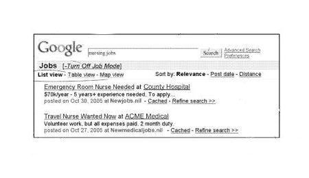
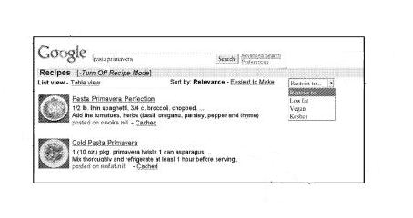

> If you could mandate just one change to the dynamics of search ranking, what would that change be?

Answering this question, I described how Google might make search results more interactive by allowing searchers to decide which algorithm they might use to search with, describing different search modes that a searcher could use when they were looking for results that might be relevant to them.

I mentioned how a reference librarian mode might help me find informational results. A village expert mode might let me see answers from my friends or people with expertise in a subject. A buying agent may make it easier to find reviews for products. A tour guide mode might show me businesses and services and history about a specific place.

So, I was excited to see a Google patent granted last week that seems like a step in that direction. It describes how Google might offer different search modes based upon a query showing some intent to search for specific results. For example, in the image above from the patent, one intent discussed is a “job” mode, which can allow people to search for jobs in many ways, including by a salary that might be associated with a job or employment within a certain location, as well as a display of a map that might show where those jobs were located.

In the image below, we see the results of a recipe search that provides several additional search options within the interface as well, including a list and a table view, the ability to sort by relevance or “easiest to make,” and a dropdown that allows a searcher to refine results further:

Of course, Google sometimes shows a sidebar link to “recipes” these days that will allow people to search specifically for recipes that they will show when there seems to be an intent by the searcher to see recipes. So the sidebar approach may be how Google decided to implement the process described in this patent. However, the patent hints at the possibility of many other “modes” that Google could show.

The patent tells us that search modes might become available through a button, a query suggestion, a link, or other ways. It also notes that some queries may trigger more than one possible search mode, such as searching for [cajun], where a search mode for recipes and another search mode for restaurants might become available.

The idea behind a job search mode seems like it might have been partly inspired by Google researcher Alon Halevy’s site Everyclassified.com, which he ran through Transformic, Inc., which Google acquired in 2005 or 2006. That site looked at the different collections of job records at different sites and how information was organized on those to draw them all together on one site. Approaches like that behind everyclassified.com, which likely inspired Google Squared and Google’s [Relational Web](http://sirrice.github.io/files/papers/relweb-webdb08.pdf) and [WebTables](http://sirrice.github.io/files/papers/webtables-vldb08.pdf) Projects, may play a role in whether or not we see several different search modes offered in the future.

Google’s metadata for rich snippets, such as the ones behind [recipes](https://developers.google.com/search/docs/data-types/recipe?hl=en&rd=1) may also make search modes like the ones described in the patent more likely.

The patent is:

[Unified search interface](http://patft.uspto.gov/netacgi/nph-Parser?Sect1=PTO2&Sect2=HITOFF&p=1&u=%2Fnetahtml%2FPTO%2Fsearch-adv.htm&r=1&f=G&l=50&d=PALL&S1=08010525&OS=PN/08010525&RS=PN/08010525)
Invented by Dustin Boswell
Assigned to Google Inc.
US Patent 8,010,525
Granted August 30, 2011
Filed: January 12, 2011

Abstract

> Methods, systems, and computer program products feature determining a plurality of search result items responsive to a search query. A plurality of search modes is identified based on the query or the plurality of search result items, or both. Each search mode is associated with a respective collection of records.
>
> The plurality of search result items is provided to a user with an indication of each search mode in the plurality of search modes. User input selecting a first search mode is received, where the first search mode is one of the plurality of search modes. One or more mode-specific search result items are determined based on the search query, where each mode-specific search result item is from the collection of records associated with the first search mode. One or more mode-specific search result items are provided to the user.

**Conclusion**

Making different search modes like the ones I’ve described become available to searchers through Google’s web search interface rather than adding more vertical searches and tabs for those searches, such as the ones you see for image search or local search or Google Scholar seems to make sense because searchers often don’t appear to choose those smaller but more focused searches by choosing the tabs for them.

It also doesn’t seem to make sense for Google to start adding more and more specialized search engines, such as a job search or a real estate search, but offering easy access to different search modes during a Web search when they seem like they might be appropriate could make searching easier for Google users.

Google metadata such as the metadata they’ve developed for recipes may be one way for these search modes to start appearing in search mode results. In addition, Google may introduce other “rich snippet” markup languages for other search mode results. If Google published new metadata for job listings, is that something that you would use for your “careers” page or section if you had one?

The search modes described in the patent aren’t quite the kinds of search modes that I described in my answer to Doc Sheldon’s question, but I see them as a step in the right direction.

By the way, one of the things that attracted me to participate in the creation of *Critical Thinking for the Discerning SEO* is that a donation of $20.00 or more to a charity of your choice will entitle you to a free copy of the ebook. See the link to the book above for more details.
