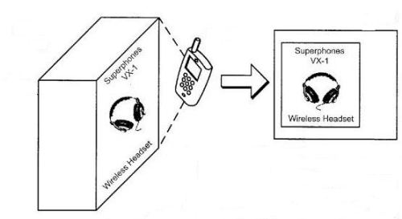
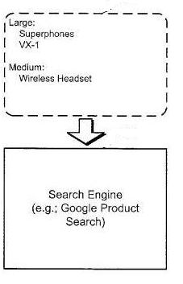
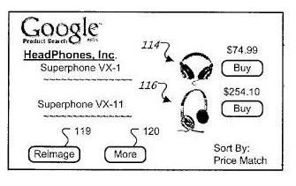
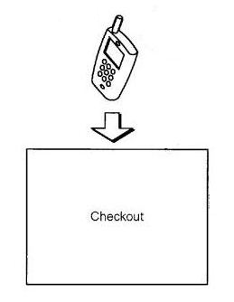
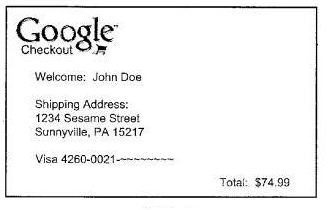

A few months ago, I stopped at a store to search for a new phone. The place I stopped at offered a couple of dozen different models of phones with different features, and I narrowed my search down to three or four that listed features on their boxes that sounded interesting. Usually, I’ll look online before buying something like this, but I needed a new phone, and wanted to get one quickly.

I pulled out my mobile phone in the middle of the shopping aisle and started to search for reviews of the choices of phones in front of me. It would have been great if I could just take a picture of them and had more information about them come up automatically, including reviews and alternative prices elsewhere, to compare costs as well.

A patent application from Google describes a way of using a mobile phone to take pictures of items and sending them to the search engine to have it search through Google Product Search as well as other web sites, to find prices and reviews and other information about those items, and make a purchase online if you would like to. The images could be of a shirt that a friend is wearing, or a bicycle that you see parked on the street, or a package on a store shelf.

The search could be based upon the actual image itself and words that might appear on a box for the image or other information. The information that you receive could include such things as technical specifications, nutritional value for food items, country of origin, prices from various vendors, and more. If the phone was GPS enabled, Google might see that I was in the middle of a specific store and look up the store’s online catalog to show me that item and other items offered by the store.

In addition to mentioning Google Product Search, the patent filing describes how Google Checkout could be used to allow people to buy products they see as part of this process as well. However, it tells us that neither Product Search nor Checkout is essential. People could be brought to the websites of vendors who might offer the products in question, and could use the ordering processes on those sites as well.

The process would start out by you taking a picture with your camera phone, or that you’ve uploaded to your computer or that someone sent to you electronically, or that you’ve found on a web site.

The image is sent to the search engine, along with text on a package, if available, where matches could be searched for at Google product search or elsewhere on the Web.

You may be shown the same item, or items that contain the same features or which are related, as well as related items such as accessories.

Information about those items are sent back to your phone, or your desktop computer, where you can decide whether you want to purchase the items.

It’s possible that you could use Google Checkout to make a purchase, though the patent filing mentions that purchases could also possibly be made upon vendors’ sites as well.

The patent filing is:

[Image Capture for Purchases](http://appft.uspto.gov/netacgi/nph-Parser?Sect1=PTO2&Sect2=HITOFF&u=%2Fnetahtml%2FPTO%2Fsearch-adv.html&r=1&p=1&f=G&l=50&d=PG01&S1=20090319388.PGNR.&OS=dn/20090319388&RS=DN/20090319388)
(**Note:** the USPTO link appears to be broken, but the patent filing is still available through WIPO – [Image Capture for Purchases](https://patentscope.wipo.int/search/en/detail.jsf?docId=WO2009155604))
Invented by Jian Yuan and Yushi Jing
US Patent Application 20090319388
Published December 24, 2009
Filed: June 20, 2008

Abstract

> A computer-implemented item identification method that includes identifying an item in an image received from a remote electronic device; transmitting search results containing information about the item for one or more vendors of the item; and, transmitting to the remote device code for executing an order for the item from the one or more vendors of the item.

**Actual Image Search**

The image that you take with your camera and send to Google would be compared to other images, and “feature points,” or areas in a picture where there are sudden changes in pixel colors or in the brightness of the image, might be analyzed to come up with what might be considered a “sort of digital line drawing of the object in the image.” Your image might be compared to other images collected by the search engine to find a match.

The search engine might have collected other information about products, such as manufacturer names and model names, like the kind of information found at Google Product Search.

That kind of information may have been gathered by the search engine in a number of ways, such as:

- By the search engine directly from vendors (e.g., by vendors submitting data in a pre-approved format),
- Manually (e.g., by agents copying information from vendor pages),
- Semi-manually (e.g., by agents marking up portions of pages and automatic systems extracting product data from similarly-formatted pages), or;
- Automatically (e.g., by a search engine crawler program trained to recognize product and pricing data).

The search engine might attempt to show close matches, which might include the same model number and brand as the items shown in images, or which have the same features but aren’t the same brand. It might show similar matches, which could be the same brand but a different model, or related items – such as a headphone case when the item shown is a set of headphones.

The patent filing describes some of the different technologies that might be used to capture images and information about items that a person sends a picture of, including image technologies that recognize different objects, and Optical Character Recognition, for products that have written upon them, or that are within boxes that mention the name and possibly the product numbers for those items. Barcodes, Universal Product Codes, or ISBNs from books could also help identify products.

The images that can be used in this system might be from something that you see and take a picture of in person, or through the media such as on a television show or in a magazine, or from a picture message that someone sends to you, or from an image that you see on the Web, and right-click upon to “learn more about an item in the image.”

An interesting example from the patent filing – take a picture of a “chocolate cupcake with chocolate ganache and buttercream frosting,” and the search engine will attempt to find a match, and tell you where you might be able to buy that cupcake:

> At an initial step, the process receives an image. For example, an image received through a picture message can be received. The image can be a specialty item that the user would like to buy. In some examples, the image can show a chocolate cupcake with chocolate ganache and buttercream frosting.
>
> The process then identifies feature points in the image. For example, the feature points on the cupcake wrapper can be determined from its accordion shape using the shadows and lights in the image. The color palette of the image can also be used to determine potential matching flavors in the cupcake (e.g., chocolate versus lemon). A preliminary check can also be made at this point to determine if a particular item can be found in the image–for example, if the image is very out of focus, a contiguous group of points may not be found, and the user can be told to submit a better image.

If you offer products on the web through an eCommerce site, this cupcake example may offer some helpful suggestions to make it more likely that a product from your site may show up in a search like this. Ideally, it seems that you would want your products to show up in Google’s product search as a first step. But, if you offer products that may look different at different angles (say shoes instead of art prints), you may want to include more than one image at different angles. You may also want to choose good names for your images as well:

> The process then compares the image to an image library. For example, the cupcake image can match an East End Chocolate Stout cupcake from Dozen Cupcakes in Pittsburgh. The image can also match a cookies-and-creme cupcake from Coco’s Cupcakes in Pittsburgh. In other implementations, comparisons can be determined through a naming filter. For example, if the image file has a name, such as “cupcake,” the image library can be filtered to images having cupcakes in them. More likely, because various cupcakes are not very distinct from each other, the image could simply match an image associated with the tag “chocolate cupcake” or “lemon cupcake” or the like, and not a particular brand of the cupcake.

**Google Goggles and Visual Search**

Google just recently released into Google Labs a kind of visual search they’ve named [Google Googles](http://www.google.com/mobile/goggles/#landmark), which lets you use a picture to perform a search. The search engine describes how this visual search can be used with landmarks, books, contact information (such as business cards), artworks, places, wine, and logos. The Google Goggles Help pages also mention barcodes and products as things you can take pictures of and search for:

> Remember that Google Goggles works best on books & DVDs, landmarks, logos, contact info, artwork, businesses, products, barcodes, or text. Right now, it’s not so good at pictures of animals, plants, cars, furniture, or apparel.

In the “book” example, Google provides links to let you “compare prices at Google Product Search,” and “Preview this Book at Google Book Search.” That seems like a good starting point from Google towards letting you search for, and buy other items online as well.

**Conclusion**

With Google Goggles, this kind of product search seems to have a good start. Google Goggles has some limitations, such as requiring a device running Android 1.6 or above, with a QVGA, and an autofocus camera, but it’s possible that Google might make a visual item search available on other devices as well, including searches through a desktop computer for pictures you upload or find online or that are sent to you.

It’s possible that this kind of visual search could become very popular. If you run an eCommerce store, you may want to take steps to make it more likely that your images can show up in matches for this kind of visual search.
