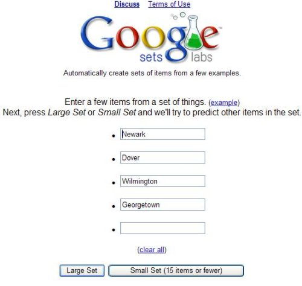
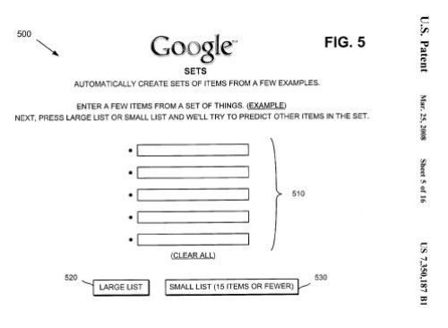

## Google was Granted a Patent on Google Sets

A tool from Google that is often overlooked is Google Sets, which allowed you to “automatically create sets of items from a few examples.” It has been officially sunsetted by Google and is no longer available.

Google Sets was one of the first applications in the Google Labs pages.

Google Labs were “Google’s Technology Playground,” and they contained many programs that may or may not be tomorrow’s useful applications from the search engine. As Google tells us,

> Google labs showcases a few of our favorite ideas that aren’t quite ready for prime time. Your feedback can help us improve them. Please play with these prototypes and send your comments directly to the Googlers who developed them.

Google was granted a patent this week on the process behind Google Sets, and the patent document provides some details on how the program finds additional words based on “items from a set of things” that you enter.

I haven’t used Google Sets much in the past, but now that I have a sense of how it works, I might use it more often.

Since the program allows you to enter several items that might be members of a set, I decided to type in the names of 4 cities in Delaware:

> Newark, Dover, Wilmington and Georgetown

You can then choose to get a small set or a large set in response to the items that you chose. Here are the results that I received after picking a large set:

> wilmington, georgetown, newark, dover, new castle, rehoboth beach, bear, milford, hockessin, lewes, seaford, smyrna, millsboro, middletown, claymont, milton, selbyville, townsend, laurel, harrington, felton, greenwood, clayton, magnolia, camden, wyoming, dover afb, odessa, elsmere, delaware city, bethany beach, dewey beach, ocean view, fenwick island, bridgeville, newport, montchanin, ellendale, brookside, dagsboro, millville, winterthur, saint georges, philadelphia, delmar, yorklyn, glasgow, frankford, lincoln, port penn

Most, but not all of these results, are cities in Delaware.

Not all sets received provide such good results, but if you have an idea of how Google Sets works, you may end up with better results when using the tool.

The simple explanation of how the program works is that Google attempts to identify lists on the web as it crawls pages. It may look for these lists by considering:

- HTML tags (e.g., <UL>, <OL>, <DL>, <H1>-<H6> tags).
- Items placed in a table,
- Items separated by commas or semicolons,
- Items separated by tabs.
- Other ways.

Items typed into the Google Sets interface by users are matched up against these lists, and probabilities are calculated to determine which items might be a good match for the items submitted by someone using Google Sets.

If you keep in mind that Google Sets is suggesting additional terms for your set by considering words that might appear together in lists on Web pages, you may find the results you receive more useful.

The patent is:

[System and methods for automatically creating lists](https://patents.google.com/patent/US7350187B1/en)
Invented by Simon Tong and Jeff Dean
Assigned to Google
US Patent 7,350,187
Granted March 25, 2008
Filed April 30, 2003

Abstract

> A system automatically creates a list from items in existing lists. The system receives one or more example items corresponding to the list and assigns weights to the items in the existing lists based on the one or more example items. The system then forms the list based on the items and the weights assigned to the items.

While the Google Sets application isn’t named in the patent filing itself, one of the images that accompany the patent is a screenshot of the front page of Google Sets.

