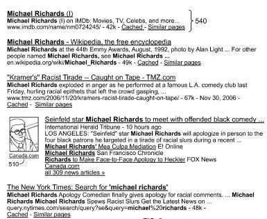

When you do a search for some terms over at Google, you might get a mix of results from different types of searches, including Web pages, news stories, images, videos, book listings, and others. That mix of results is known as Universal Search.

While we’ve been seeing results like this for over a year, we really haven’t heard much from Google on how they go about deciding what to show us within search results.

We now have some ideas on how those results are blended together, straight from Google, through a patent application published this week at the US Patent and Trademark Office.

David Bailey, one of the inventors listed on the patent, gave us a look [Behind the scenes with universal search](https://googleblog.blogspot.com/2007/05/behind-scenes-with-universal-search.html) at the Official Google Blog last year, where he told us of one of the challenges behind Universal Search:

> If only we could smartly place such results elsewhere on the page when they don’t quite deserve the top, we could share the benefits of these great Google features with people much more often.

So, how did Google meet the challenge of blending search results from different kinds of databases, such as news and images and videos, into Universal Search?

[Interleaving Search Results](http://appft1.uspto.gov/netacgi/nph-Parser?Sect1=PTO2&Sect2=HITOFF&u=%2Fnetahtml%2FPTO%2Fsearch-adv.html&r=1&p=1&f=G&l=50&d=PG01&S1=20080140647.PGNR.&OS=dn/20080140647&RS=DN/20080140647)
Invented by David R. Bailey, Jonathan J. Effrat, and Amit Singhal
Assigned to Google
US Patent Application 20080140647
Published June 12, 2008
Filed: December 6, 2007

Abstract

> Methods, systems, and computer program products are provided for interleaving search results. A method includes presenting multiple first search results received from a first search engine. The first search results satisfy a search query directed to the first search engine and are presented in an order.
>
> A second search result from a second search engine is inserted at a position between two otherwise adjacent first search results. The second search result is received from a second search engine in response to the search query.

Here’s a quick run through about how Universal Search works:

1) Someone conducts a search, and the search engine receives the query, and possibly metadata such as a search history profile of the user.

2) Web search results are created from the generic web search engine.

3) Search result quality scores are created for each of the search results, based upon multiple distinct scoring features, which may be based upon:

1. Features based on attributes of the resources in question,
2. Features based on historical data describing access to or use of the resources, or both.

Some of the scoring features are pre-calculated, and others are dynamically created based upon the search result, the user’s query, and user-based metadata like a search history profile.

4) The scores for the different features may be added together, or multiplied together, to come up with individual search result quality scores for each search result.

5) The Web search results may be then be ranked based upon their search result quality scores.

6) The query may then be sent to one of the vertical search engines, such as the news search engine, where a search is performed and search result quality scores are calculated for those results.

7) Search Quality Scores for news results may be based upon some unique favors, such as news freshness. Some of the scoring features may be the same as for web search results, but they may be given a greater or lesser weight than in a Web result.

8) Like the Web results, the news search results are ranked based upon the scores associated with the search features.

9) A results mixer blends together the news and generic web page search results so that composite search results can be presented in response to the search query.

We’re told that the purpose for blending together results is to “increase the diversity of search results presented to the user.” (Another aim of Universal Search)

10) When blending the results together from more than one source, the mixing program may recalculate search quality scores of search results for any of the results for a given search engine after the second result from each search engine, but with a decrease in the contribution of the “unique” scores for results from the different search engines.

11) The results may then all be re-ranked based upon the recalculated search result quality scores to rank the news and generic web page search results in a single ranking. There are a few different ways that may determine how results are listed. The results mixer may not blend results based upon the final scores for each, but may strategically group the non web search results in a few different ways, for instance:

- The results mixer may insert a non web search result at any of a number of positions within a list of ten generic web page search results.
- The results mixer may only insert the highest ranked non web search result among the generic web page search results.
- The results mixer may determine not to insert any non web search result among the generic web page search results because none of the non web search results have a high enough rank.
- A group of non web search results may be inserted at a position among the generic web page search results.
- A group of non web search results may be inserted at a fixed position, such as the top, bottom, or center of a list of generic web page search results.
- There may be some limitations to where non web search results may be inserted, such as either the third-ranked result or a lesser ranked result.
- Or a non web search result may be limited to a position in the order that is more than two (or some other number) of positions away from another news search result.

**Other Results from Other Search Engines**

Each of the results from the different kinds of search engines, such as news searches, book searches, and web searches, are formatted differently and may contain different types of information. When some results are grouped together, there may be a unique way of presenting those results, such as putting images next to news search results.

The example of how this blending works above focused upon web search and news search, but additional searches such as video or images may also be included in the mix.

Some feedback information may also play a role in determining what kinds of search results are blended into universal search results. For instance, a user feedback mechanism may include user-click-data to learn characteristics of queries, or of results of queries, that correlate with high-quality clicks. It might learn that queries that begin with “how to . . . ” often lead to clicks on book search results, and may cause such results to have an enhanced search result quality scores.

Some personalization information may also play a role in Universal Search for users who may prefer one type of search result, such as news search results, and those results could have an enhanced search result quality score for that user.

**Conclusion**

The main reason for blending together search results from different vertical searches into universal search results appears to be to provide a diverse set of search results.

While the scoring of search results from different sources include features that are unique to each of those sources, such as freshness for news results, the search result quality scores are set so that it is possible for results from different sources may be blended together.

A new version of the Universal Search patent was published in 2019, which I have written about in [Universal Search Updated at Google](https://www.seobythesea.com/2019/01/universal-search-updated-at-google/)
