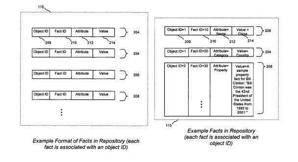
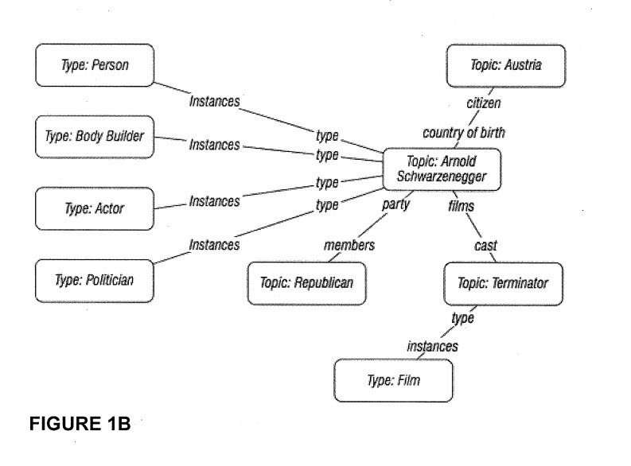
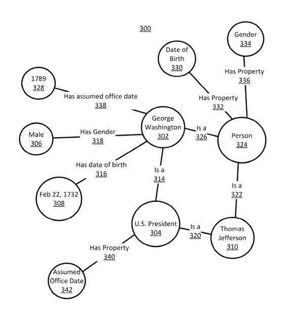
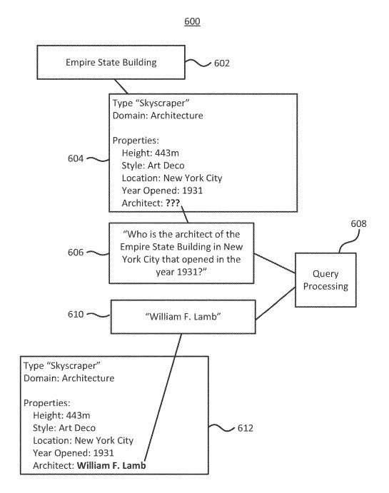

[Elijah Hail](https://unsplash.com/@elijahhail?utm_medium=referral&utm_campaign=photographer-credit&utm_content=creditBadge)

## The Future of Search is in Providing Knowledge to Searchers through a Knowledge Graph

To us who do Search Engine Optimization (SEO), we’ve been looking at URLs filled with content, and links between content, and algorithms such as [PageRank](https://en.wikipedia.org/wiki/PageRank) (based upon links pointed between pages) and [information retrieval scores](https://en.wikipedia.org/wiki/Ranking_(information_retrieval)) based on the relevance of that content have been determining how pages rank in search results responding to queries entered into search boxes by searchers. Web pages connected by links are information points connected by nodes. This was the first generation of SEO.

Many of the methods that we have used to do SEO will remain the same as new features appear in a Knowledge Graph-based search, such as knowledge panels, rich results, featured snippets, structured snippets, search by photography, and expanded schema covering many more industries and features then it does at present.

Search has been transforming. In 2012, Google introduced the [knowledge graph](https://en.wikipedia.org/wiki/Knowledge_Graph), which they told us would focus on indexing things instead of strings. By “strings,” they referred to words that appear in queries and documents on the Web. By “things,” they referred to named entities, or real and specific people, places, and things. So when people searched at Google, the search engine would show Search Engine Results Pages (SERPs) filled with URLs to pages that contained the strings of letters that we were searching for. Google still does that and is changing to showing search results about people, places, and things.

Before introducing the Google knowledge graph, Google started an annotation framework project, which included a precursor to the knowledge graph. I wrote about that in [Google’s Browseable Fact Repository – an Early Knowledge Graph](https://www.seobythesea.com/2014/09/googles-browseable-fact-repository-early-knowledge-graph/).

## After Working On the Annotation Framework, Google Acquired Metaweb

In addition to the annotation framework, Google acquired the company MetaWeb, which had built a knowledge directory called Freebase, which Google used to populate the knowledge graph with entities and attributes about those entities and related information between entities. I wrote about that in [Google Gets Smarter with Named Entities: Acquires MetaWeb](https://www.seobythesea.com/2010/07/google-gets-smarter-with-named-entities-acquires-metaweb/).

Google started showing us in patents how they were introducing entity recognition to search, as I described in this post:
[How Google May Perform Entity Recognition](https://gofishdigital.com/google-entity-recognition/)

Google now uses information from the knowledge graph to show us [knowledge panels in search results](https://www.seobythesea.com/2015/03/googles-knowledge-cards/) that tell us about the people, places, and things they recognize in the queries we perform. So, in addition to crawling web pages and indexing the words on those pages, Google is collecting facts about the people, places, and things it finds on those pages. That is the knowledge graph in action.

## How The Google Knowledge Graph Updates Itself When It Collects Information About Entities

Google has filed a few patents that tell us about the knowledge graph. A Google Patent that was just granted in the past week tells us how the Google knowledge graph updates itself when it collects information about entities, their properties and attributes, and relationships involving them. This is part of the evolution of SEO that is taking place today – learning how Search Engines are changing from returning search-based results to showing knowledge-based results. Here is an example of part of a knowledge graph:

What does the patent tell us about knowledge?

This is one of the patent sections that detail what a knowledge graph is like Google might collect information about when it indexes pages these days:

> Knowledge graph portion includes information related to the entity [George Washington], represented by [George Washington] node. [George Washington] node connects to [U.S. President] entity type node by [Is A] edge with the semantic content [Is A], such that the 3-tuple defined by nodes and the edge contains the information “George Washington is a U.S. President.” Similarly, “Thomas Jefferson Is A U.S. President” has the tuple of [Thomas Jefferson] node 310, [Is A] edge, and [U.S. President] node. Knowledge graph part includes entity type nodes [Person], and [U.S. President] node. The person type has connections from the [Person] node. For example, the type [Person] has the property [Date Of Birth] by node and edge and has the property [Gender] by node and edge. These relationships define in part a schema associated with the entity type [Person].

Notice that SEO is no longer just about how often certain words appear on pages of the Web, what words appear in links to those pages, page titles and headings, alt text for images, and how often certain wordget used or related words appear. Google is looking at the facts about entities, such as entity types like a “person,” and properties, such as “Date of Birth,” or “Gender.” We see the knowledge graph moving into other aspects of search at places like Google Trends and reverse image search, which I wrote about in [Image Search and Trends in Google Search Using Freebase Entity Numbers](https://www.seobythesea.com/2016/01/image-search-trends-freebase-entity-numbers/)

Note that the quote also mentions the word “Schema” as in “These relationships define in part a schema associated with the entity type [Person].” As part of the transformation of SEO from Strings to Things, The major Search Engines joined forces to offer us information on how to use [Schema](https://schema.org/) for structured data on the Web to provide a machine-readable way of sharing information with search engines about the entities that we write about, their properties, and relationships.

I’m writing about this patent because I am participating in a Webinar online about the Google Knowledge Graph, and it is being used and updated. The Webinar is tomorrow at:
[#SEOisAEO: How Google Uses The Knowledge Graph in its AE algorithm.](https://www.semrush.com/webinars/seoisaeo-how-google-uses-the-knowledge-graph-in-its-ae-algorithm/) I haven’t been referring to SEO as Answer Engine Optimization, or AEO and it’s unlikely that I will start, but I see it as an evolution of SEO

I’m writing about this Google Knowledge Graph Patent because it starts with the following line, which it titles “Background:”

*This disclosure generally relates to updating information in a database. This works with user input.*

This line points out that this approach no longer needs users to enter data into a knowledge base. Instead, it involves how Google knowledge graphs may begin to update themselves.

## Updating the Google Knowledge Graph

I attended a Semantic Technology and Business conference a couple of years ago, where the head of Yahoo’s knowledge base presented. He answered several questions in a question-and-answer session after he spoke. For example, someone asked him what happens when information from a knowledge graph changes, and it adds information and needs updating?

He answered that a knowledge graph manually updates with new information.

That wasn’t a satisfactory answer because it would have been good to hear that the information from such a source could be easily updated, and it was a little difficult to hear that a search engine would need to work as a newspaper would. This may have been the answer that the people from Yahoo believed was the proper answer, and I’ve been waiting for Google to answer a question like this to see what their answer would be. That made seeing a line like this one from this patent interesting:

> In some implementations, a system identifies information missing from a collection of data. The system generates a question-to-answer service based on the missing information and uses the response from the question answering service to update data collection.

This would be a knowledge graph update so that the patent provides details using language that reflects that exactly:

> In some implementations, a computer-implemented method works. The method includes identifying an entity reference in a knowledge graph, wherein the entity reference corresponds to an entity type. The method further includes identifying a missing data element associated with the entity reference. The method further includes generating a query based at least in part on the missing data element and the type of entity reference. The method further includes providing the query to a query processing engine. The method further includes receiving information from the query processing engine in response to the query. The method further includes updating the knowledge graph based at least in part on the received information.

How does the search engine do this? The patent provides more information that fills in such details.

The approaches to achieve this would be to:

> …Identifying a missing data element comprises comparing properties associated with the entity reference to a schema table associated with the entity type.

> …Generating the query comprises generating a natural language query. This can involve selecting, from the knowledge graph, disambiguation query terms associated with the entity reference, wherein the terms comprise property values associated with the entity reference, or updating the knowledge graph by updating the data graph to include information in place of the missing data element.

> …Identifying an element in a knowledge graph at least in part on a query record. Operations further include generating a query based at least in part on the identified element. Operations further include providing the query to a query processing engine. Operations further include receiving information from the query processing engine in response to the query. Operations further include updating the knowledge graph based at least in part on the received information.

## The Google Knowledge Graph updates itself in these ways:

(1) The knowledge Graph works with one or more previously performed searches.
(2) The knowledge Graph may work with a natural language query, using disambiguation query terms associated with the entity reference. The terms comprise property values associated with the entity reference.
(3) The knowledge Graph may use properties associated with the entity reference to include information updating missing data elements.

The patent that describes how the Google knowledge graph updates itself is:

[Question answering to populate knowledge base](http://patft.uspto.gov/netacgi/nph-Parser?Sect1=PTO1&Sect2=HITOFF&d=PALL&p=1&u=%2Fnetahtml%2FPTO%2Fsrchnum.htm&r=1&f=G&l=50&s1=10,108,700.PN.&OS=PN/10,108,700&RS=PN/10,108,700)
Inventors: Rahul Gupta, Shaohua Sun, John Blitzer, Dekang Lin, and Evgeniy Gabrilovich
Assignee: Google
US Patent: 10,108,700
Granted: October 23, 2018
Filed: March 15, 2013

Abstract

> Methods and systems are provided for question answering. In some implementations, a data element identified in a knowledge graph, and a query is at least in part from the data element. The query is from a query processing engine. Information from the query processing engine in response to the query. The knowledge graph is based at least in part on the received information.

Nicolas Torzec tweeted me a link to a paper published on the Google AI Blog, which shares several authors with this patent. It was from 2014 (a year after the patent from this post came.) The paper explains in more detail how a knowledge graph might become more complete. As the Abstract of the paper tells us:

> We discuss how to aggregate candidate answers across multiple queries, ultimately returning probabilistic predictions for possible values for each attribute. Finally, we evaluate our system and show that it can extract many facts with high confidence.

The paper is [Knowledge Base Completion via Search-Based Question Answering](https://research.google/pubs/pub42024/) I recommend reading this paper along with the patent. It presents a much more nuanced look at some of the issues that the people working upon this problem came across and some of the solutions they found to address them. One of the problems that they use to illustrate how this system works involves identifying the parents of Frank Zappa (His Band was “The Mothers of Invention,” which made that task have some issues unique, as well.)

It seems like it is difficult to update a knowledge graph using questions and answers like this, and it is a problem that faces some challenges. Besides, it is interesting seeing what stage we are at in having problems like this addressed – so read this paper carefully and the patent.

We have seen other approaches that look at a knowledge graph from other directions, such as:

[3 Ways Query Stream Ontologies Change Search](https://www.seobythesea.com/2018/03/3-ways-query-stream-ontologies-change-search/) – this is about Google looking at query stream information to identify data that it can extract from the Web to use to build ontologies. By looking at searchers’ queries, in effect, it is crowdsourcing information about topics that may help build those ontologies.

[Constructing Knowledge Bases with Context Clouds](https://searchnewscentral.com/blog/2018/10/19/constucting-knowledge-bases-with-context-clouds/) – This tells us about how Google could look at unstructured content that it might be able to use to build up knowledge bases. We see statements like this from the patent the post is about:

> Extending the number of attributes known to a search engine may enable the search engine to answer more precisely queries that lie outside a “long tail” of statistical query arrangements, extract a broader range of facts from the Web, and/or retrieve information related to semantic information of tables present on the Web.

We haven’t quite reached the point where you can automate the updating or building of a knowledge base. That would mean updating some knowledge graph information about some sensitive topics that change may be necessary still. We have some examples of approaches that are underway towards such updates as a possibility.

I’ve written a few posts about named entities. These are some that I wanted to share:

- [Do You Have a Named Entity Strategy for Marketing Your Web Site?](https://www.seobythesea.com/2013/12/named-entity-strategy/)
- [How I Came to Love Entities and Start Doing Entity Optimization](https://www.seobythesea.com/2014/10/came-love-entities/)
- [How Google Uses Named Entity Disambiguation for Entities with the Same Names](https://www.seobythesea.com/2015/09/disambiguate-entities-in-queries-and-pages/)
- [How Named Entities Connected to Trending Topics can be used to Address Real Time Search Results](https://www.seobythesea.com/2015/03/how-named-entities-connected-to-trending-topics-can-be-used-to-address-real-time-search-results/)
- [Not Brands but Entities: The Influence of Named Entities on Google and Yahoo Search Results](https://www.seobythesea.com/2010/08/not-brands-but-entities-the-influence-of-named-entities-on-google-and-yahoo-search-results/)
- [How Knowledge Base Entities can be Used in Searches](https://www.seobythesea.com/2014/07/knowledge-base-entities-used-in-searches/)
- [Finding Entity Names in Google’s Knowledge Graph](https://www.seobythesea.com/2014/06/entity-names-in-google/)
- [Google Gets Smarter with Named Entities: Acquires MetaWeb](https://www.seobythesea.com/2010/07/google-gets-smarter-with-named-entities-acquires-metaweb/)
- [Entity Associations with Websites and Related Entities](https://www.seobythesea.com/2014/01/entity-associations-websites-related-entities/)
- [How Google Might Identify Entity Synonyms Using Anchor Text](https://www.seobythesea.com/2014/06/synonyms-for-entities/)
- [Extracting Facts for Entities from Sources such as Wikipedia Titles and Infoboxes](https://www.seobythesea.com/2014/08/extracting-facts-for-entities-from-sources/)
- [Extracting Semantic Classes and Corresponding Instances from Web Pages and Query Logs](https://www.seobythesea.com/2014/09/extracting-semantic-classes-instances-from-web-pages-query-logs/)
- [How Google May Identify Main Entities](https://www.seobythesea.com/2015/04/how-google-may-identify-central-entities-from-resources/)
- [How Google’s Knowledge Graph Updates Itself by Answering Questions](https://www.seobythesea.com/2018/10/how-googles-knowledge-graph-updates-itself-by-answering-questions/)

Last Updated June 26, 2019.
