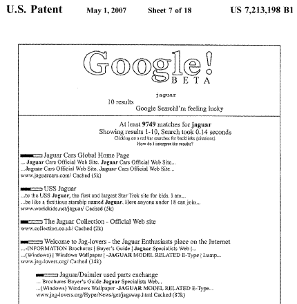
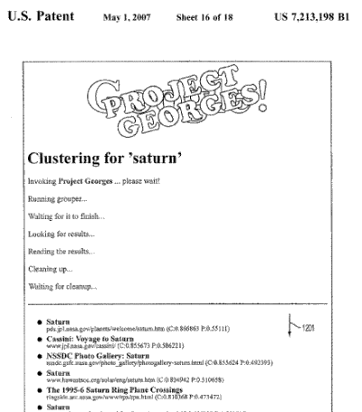
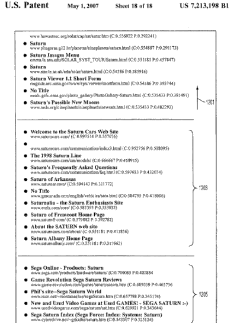

A new patent granted to Google this week, but filed back in 2000, explores a way of grouping together search results that deal with different topics as a result of a search for a specific query, by looking at the shared links pointing to pages within the search results.

With the process involved in this patent application being originally filed in 2000, I wonder if the folks at Google decided to follow other methods rather than the one described here. One of the screenshots shows Google pages still has the word “beta” under Google in an image attached to the patent filing.

Some fun stuff going on in that screenshot, including PageRank indicators showing next to results, and instruction above the results stating that “Clicking on a red bar searches for backlinks (Citations).” This must have been created in the days before a decision was made to make the PageRank indicators use a green bar. I’m not sure that we will see PageRank indications next to search results in the future.

This screenshot is a vision of Google before the effects of the process described in the patent application – remember, I wrote above that this was filed in the year 2000. I have a couple of screenshots below of Google results after the process described in the patent.

OK, so Google didn’t end up looking like that, and it’s quite possible that Google won’t use this particular patented process. But, the idea of how they could group topics by looking at links is something to think about a little. Here’s some information about the patent.

**The Link Based Clustering Patent**

[Link based clustering of hyperlinked documents](https://patents.google.com/patent/US7213198B1/en)
Invented by Georges R. Harik
Assigned to Google
US Patent: 7,213,198
Granted May 1, 2007
Filed: August 10, 2000

Abstract

> Techniques for grouping hyperlinked documents are provided. Links near or in the neighborhood of the hyperlinked documents are analyzed in order to group the hyperlinked documents by topic. For example, links that are search results can be grouped by identifying other hyperlinked documents that have multiple forward links to the search results. The search results can then be grouped according to the forward links of the other hyperlinked documents.

The screenshots are a good way to show how this patent document might (maybe could have) reshaped search results. I think what is more interesting is how Google might look at links from documents to group results based upon topics. Consider that instead of showing you grouped results for different topics, that Google could instead look at a users preferences and interests (say for instance, gathered from personalized search and that person’s search or Web history, and other information collected about the searcher.

Here’s the top part of a results page, with some fun tweaks, such as the “George’s Project” title written over “Google” at the top of the page.

That screenshot didn’t show grouping on the first page of the results. It isn’t until the third page that we see results in a topic other than the planet “Saturn.”

One question that I have after looking at this is whether or not people would scroll through results to find different groups of topics. I’m not sure that they would. Maybe that’s why we haven’t seen this implemented. What do you think?

The patent tells us that as the Web increases in size, it would be helpful to find a way to efficiently group hyperlinked documents by topic. If they were to display links to web pages grouped into topics, they would avoid confusion that results when search results jump from one topic to another and then back again. The process involved also enables them to group search results by topic through an analysis of the link structure of the Web.

## How Link Based Clustering of Search Results Might Work

1. A search is performed, and a set of search results is received

2. Links pointing to the pages listed in the search result are collected and compared. It’s not a bad assumption to make that pages on the same general topic are likely to be linked to from the same set of pages. It’s possible that two pages on Saturn cars could be linked to from a common page (e.g., a page reviewing cars). It’s much less likely that a page about Saturn cars will also link to a page about the Sega Saturn game system. While that could happen, statistically, it’s less likely. This is how the link structure of the Web might allow pages that are on the same topic can be grouped together.

3. There may be some issues raised in this method based upon the fact that there may not be a lot of linking going on between pages on certain topics.

> However, this violates one desirable rule of such a distance definition, that if page A is close to page B, and page B is close to page C, then page A should not be very far from page C. Although this goal of transitivity may seem intuitive and certainly holds for distances in the physical world, it may not hold for some definitions of distance over the Web, because there is too little citation information available for most pairs of pages.

A method of using hierarchical clustering may help that, where smaller groups are first formed, and then grouped together into larger groups if they are determined to be close based upon links to the members of those groups.

> One solution to this problem is not to assign a distance between two web pages until further information about the pages is ascertained. This technique can utilize hierarchical clustering. With hierarchical clustering, initially, each page can be considered its own group. Two groups that are very close together are then merged into one group. This accomplishes two things. First, it gets closer to the end goal of a complete grouping of the set of results. Second, more information can be obtained about each of the two groups to be merged. More specifically, it is known that the new group is related to another page if any of its members are related to that page.
>
> Hierarchical clustering benefits from a new definition for distances, one that relates not only pairs of pages, but also pairs of groups of pages. One approach, for example, is to use the distance between the closest pair of pages, one from each group. A potentially better distance measure is to use the co-citation number as applied not only to individual pages, but also to pages in a group. Thus, the co-citation number can be applied to groups of pages. To get the distance between two groups of pages, the number of pages that link to both groups simultaneously can be counted. The inverse of this number can then be used as a distance measure between the groups of web pages.
>
> This distance measure may be highly precise with an advantage that as groups of pages get larger, there are more links to utilize, and therefore a better distance measure results.

## Link Based Clustering Conclusion

The patent goes into a lot more detail about how this process might work, and it’s worth looking through and considering. It shows a view of links based upon citations and academic citations much like [PageRank](http://infolab.stanford.edu/~backrub/google.html) has been:

> Academic citation literature has been applied to the web, largely by counting citations or backlinks to a given page. This gives some approximation of a page’s importance or quality. PageRank extends this idea by not counting links from all pages equally, and by normalizing by the number of links on a page.

The process shown in the “George’s Project” screenshots isn’t something that has come about, and it’s possible that we won’t see it from Google. It’s also possible that the method of link-based clustering based on the similarity between backlinks from the initial results may not be used. But, it shows some insight into a possibility.
