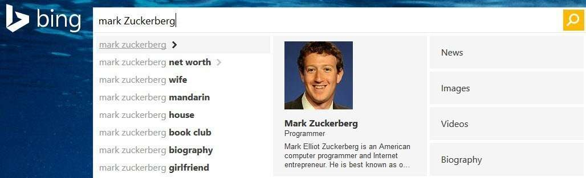

When someone performs a search at one of the major search engines, the search engine focuses upon returning as quick and helpful an answer as possible. Part of that can involve looking the query up in a “trending topics” database to see if there’s some recent news that should be reported to the searcher. This is how the search engines are increasingly becoming a real-time monitor of world events.

_Yahoo suggests a number of real time news results on a query for Mark Zuckerberg_

A recently granted patent at Yahoo (Bing has taken over crawling of web pages for Yahoo, but the deal between the two companies allows Yahoo to massage the data they receive and show off the results they want to) describes how they might “identify… and recommend… queries related to trending topics based on a query received from a user of an information retrieval system.”

The patent describes its focus and the challenges it intends to overcome as follows:

> The user of a search engine may submit a query to obtain time-sensitive information about a particular topic (e.g., breaking news, current events, or the like). Such users may also be interested in obtaining information about topics related to the subject matter of their queries that are currently becoming popular with others. Such topics may be referred to herein as “trending” topics. However, the search engine may not return information about such trending topics when returning search results based on the original query. As a result, the user may fail to retrieve the desired information. This may be frustrating to the user. Furthermore, if the search engine is a Web search engine, such failure to retrieve desired information on behalf of users can lead to a decline in key metrics associated with the search engine, such as page views, click-through rates, and the like.

The system described in the patent includes:

- a trending topic identification module and
- a query recommendation module

The ***trending topic identification module*** attempts to identify topics that are trending in real-time content sources, such as microblog posts or other user-generated data, like tweets or Facebook source updates, news feeds, or the like.

The ***query recommendation module*** is set up to suggest at least one candidate query in response to receiving a user query, by comparing words and named entities of the user query with words and named entities associated within trending topics identified by the trending topic identification module.

By finding related topics, and suggesting search results related to entities that are identified in a query, the purpose behind this process is to help a search engine become more of a real-time monitor of things happening in the world

The patent is:

[System and method for recommending queries related to trending topics based on a received query](http://patft.uspto.gov/netacgi/nph-Parser?Sect1=PTO1&Sect2=HITOFF&d=PALL&p=1&u=%2Fnetahtml%2FPTO%2Fsrchnum.htm&r=1&f=G&l=50&s1=8,990,241.PN.&OS=PN/8,990,241&RS=PN/8,990,241)
Invented by Huming Wu, and Siva Gurumurthy, and Hang Su
Assigned to Yahoo! Inc.
US Patent 8,990,241
Granted March 24, 2015
Filed: December 23, 2010

Abstract

> Systems and methods for identifying candidate queries related to a trending topic based on a user query are described. A trending topic identification module identifies topics trending in one or more real-time content sources. The real-time content source(s) may include, for example, a source of microblog posts or other user-generated data, a news feed, or the like.
>
> A query recommendation module suggests at least one candidate query in response to receiving a user query. The query recommendation module obtains the at least one candidate query by comparing words and named entities of the user query with words and named entities associated with the trending topics identified by the trending topic identification module.

## Take Aways

This patent shows how much value the search engines places in tracking and collecting information about specific entities – and that it finds value in connecting information about them for searchers. The better a Yahoo or Google or Bing can do this, the more satisfied searchers will be with the search results they see. Over at the Go Fish Digital Blog last week I wrote about [how Bing is working to associate authoritative images with entities in search results](https://gofishdigital.com/bings-satori-associates-authoritative-images-of-people-entities-in-snapshot-panels/), which shows that they place some value in showing searchers more about those entities.

_A dropdown on a search for Mark Zuckerberg shows Bing’s “authoritative image” for him to searchers._

I’ve written a few posts about named entities. These are some that I wanted to share:

- [Do You Have a Named Entity Strategy for Marketing Your Web Site?](https://www.seobythesea.com/2013/12/named-entity-strategy/)
- [How I Came to Love Entities and Start Doing Entity Optimization](https://www.seobythesea.com/2014/10/came-love-entities/)
- [How Google Uses Named Entity Disambiguation for Entities with the Same Names](https://www.seobythesea.com/2015/09/disambiguate-entities-in-queries-and-pages/)
- [How Named Entities Connected to Trending Topics can be used to Address Real Time Search Results](https://www.seobythesea.com/2015/03/how-named-entities-connected-to-trending-topics-can-be-used-to-address-real-time-search-results/)
- [Not Brands but Entities: The Influence of Named Entities on Google and Yahoo Search Results](https://www.seobythesea.com/2010/08/not-brands-but-entities-the-influence-of-named-entities-on-google-and-yahoo-search-results/)
- [How Knowledge Base Entities can be Used in Searches](https://www.seobythesea.com/2014/07/knowledge-base-entities-used-in-searches/)
- [Finding Entity Names in Google’s Knowledge Graph](https://www.seobythesea.com/2014/06/entity-names-in-google/)
- [Google Gets Smarter with Named Entities: Acquires MetaWeb](https://www.seobythesea.com/2010/07/google-gets-smarter-with-named-entities-acquires-metaweb/)
- [Entity Associations with Websites and Related Entities](https://www.seobythesea.com/2014/01/entity-associations-websites-related-entities/)
- [How Google Might Identify Entity Synonyms Using Anchor Text](https://www.seobythesea.com/2014/06/synonyms-for-entities/)
- [Extracting Facts for Entities from Sources such as Wikipedia Titles and Infoboxes](https://www.seobythesea.com/2014/08/extracting-facts-for-entities-from-sources/)
- [Extracting Semantic Classes and Corresponding Instances from Web Pages and Query Logs](https://www.seobythesea.com/2014/09/extracting-semantic-classes-instances-from-web-pages-query-logs/)
- [How Google May Identify Main Entities](https://www.seobythesea.com/2015/04/how-google-may-identify-central-entities-from-resources/)
- [How Google’s Knowledge Graph Updates Itself by Answering Questions](https://www.seobythesea.com/2018/10/how-googles-knowledge-graph-updates-itself-by-answering-questions/)

Last Updated June 26, 2019.
