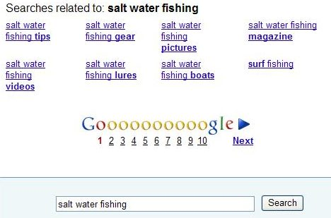
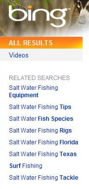
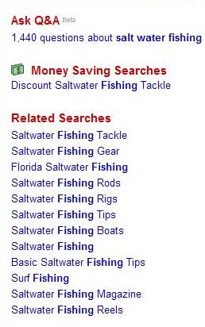

Choosing the right words to search with can sometimes be difficult, especially when searching for information about a topic you don’t know much about. This can be true regardless of whether you might be searching for information on the gravitational effects of binary stars on each other or the best way to groom a certain breed of dog or different approaches for making your homemade ice cream.

When you enter some words for your query in a search box and hit enter, you’ll often see some suggested or related searches in addition to links and descriptions of pages that may be relevant for your search. These suggestions might be at the top of the search results, at the bottom, to one side or another, in the middle of results, or any or all of those locations.

For example, when searching for [salt water fishing] at the major search engines, I see many related terms and other suggestions for my searches.

Google often shows query suggestions at different places in search results, including “query refinements” at the top and in the middle of results, and “searches related” at the bottom of results, like in the following screenshot:

Yahoo frequently shows query suggestions in a drop-down under the search box. Note the option to click on an arrow and see even more suggestions in the following image:

Bing displays query suggestions in a left-hand column, where you might often find the main navigation on many web pages.

Ask.com, in contrast to Bing, shows related searches in a right-hand column.

**Problems with Offering Query Suggestions**

If you’re curious like I am, you may be asking yourself how the search engines come up with those alternative query terms. If you’re a searcher and don’t know much about the topic you’re searching for, you may wonder if those are helpful suggestions. If you’re a site owner, you might be wondering if you should include some information on your site about topics revealed in those suggested searches.

A recent patent application published by Microsoft discusses several approaches that they might take to decide which query suggestions to present and how they might present them. It also discusses some of the problems that offering such suggestions might bring. The chances are that other search engines may be using some similar methods and face similar challenges.

Many patent applications start with a description of the problem or problems they are attempting to address with their invention methods and processes. Microsoft gives us a couple of issues that they are trying to solve.

1) A limited amount of space to present query suggestions

2) Deciding how best to organize suggested and related searches

3) Avoiding the possibility of distracting searchers and keeping them from finding the information they originally set out to locate.

4) Overwhelming searchers with too many choices (what the patent filing refers to as “cognitive load.”)

5) Making sure that the additional information shown – the query suggestions – are relevant and helpful.

The patent filing gives us some insight into how they might best present and organize query suggestions, how they might focus upon suggesting related words or phrases frequently searched for, and how they might provide a wide range of suggestions for searchers to choose from.

[Toward Optimized Query Suggestion: User Interfaces and Algorithms](http://appft.uspto.gov/netacgi/nph-Parser?Sect1=PTO2&Sect2=HITOFF&u=%2Fnetahtml%2FPTO%2Fsearch-adv.html&r=1&p=1&f=G&l=50&d=PG01&S1=20090171929.PGNR.&OS=dn/20090171929&RS=DN/20090171929)
Invented by Feng Jing, Shuo Wang, Yang Jiangming, and Lei Zhang
Assigned to Microsoft
US Patent Application 20090171929
Published July 2, 2009
Filed December 26, 2007

Their method for query suggestions involves:

1) Using algorithms to find candidate queries related to a search for a query,
2) Calculating the relevance and frequency of use for those potential candidates,
3) Presenting the query suggestions based on a ranked score,
4) Clustering the query suggestions in an organized fashion, and;
5) Describing the relationship between query suggestions and submitted queries to improve the experience of a searcher.

Some of the algorithms that Microsoft tells us could be used to identify query suggestions:

1) *A query string and frequency algorithm* – Determines query candidates related to the submitted query. Query candidates may be related to the query submitted by the searcher if they contain all of the terms within it. For the related queries, the more frequently they appear, the more relevant they may be considered. For example, if my search terms are [salt water fishing] and the query term [salt water fishing Florida] is fairly popular since it contains all of the terms in my search, the search with “Florida” added to my terms may be identified as a candidate query if it shows up in a lot of searches in the search engine query log. The focus of this algorithm is on how frequently these queries show up in searches.

2) *A query log session algorithm* – This algorithm also looks at query logs, but it looks for other search terms that may have been used in the same query session. Many people searching for [salt water fishing] also look for [surf fishing] in the same query session, which may be considered a good candidate query suggestion. This algorithm may also look at those related key phrases and look at search results associated with them, and attempt to extract key phrases from top search results from those queries. The focus of this algorithm is to find relevant query suggestions that “reflect[s] the search intentions of the user.” This approach means that query suggestions that may not contain the original query terms may be suggested.

3) *A search result content algorithm* – Search results are looked at for the query term, and key terms or phrases may be extracted from those. This approach may be used when there isn’t much data in the query logs to use with the first two algorithms and is independent of information found in the search engine’s query log files.

Query Suggestions might be:

1) Single keywords,
2) Combinations of keywords,
3) Popular phrases,
4) Related queries, and/or;
4) Functional or semantically similar suggestion cluster terms.

Queries are determined to be related if the queries:

1) Include terms of the submitted query,
2) Appear in a substantial number of user query sessions, and;
3) Have high-frequent terms or phrases of the top search results.

Query Suggestions might be shown:

1) Along with search results as related searches
2) Along with search results as most searched suggestions
3) In a list of suggestions as a searcher types in a query, under the search box
4) In other ways

Here are some of the different “classifications” of query suggestions referred to in the Microsoft patent filing:

*Related Searches* – are searches that are considered the most relevant frequently used search queries for the search term that someone searched for. In Google, you often see these at the bottom of your set of search results.

*Most searched* – are relevant query terms and phrases that are the most frequently used (as opposed to the most relevant). These tend to be placed at the top of search results – if they are a better match for what a searcher is trying to find than the original query used, a searcher doesn’t have to scroll through search results before being offered these suggestions.

*Refine by Searches* – these are intended to narrow and focus the original search. A search for [salt water fishing] might be refined by offering a query suggestion for the more narrowly focused search [salt water fishing Florida].

*Expand by Searches* – These result from expanding and broadening a search. A search for [salt water fishing Florida] might be expanded by offering a query suggestion for the broader search [salt water fishing].

*“Also try” searches* – Related queries that contain no or only part of the original query. For example, a search for [Derek Jeter] might return an “also try” query suggestion of [Alex Rodriguez] since the two are well-known teammates and are often mentioned together.

**How Query Suggestions might be clustered**

The patent filing provides a good example of clustering for query suggestions based upon a search for the word “Prada.”

Those query suggestions might be organized into categories, like the following:

> [Product lines] Prada women, Prada sport, Partum spray
>
> [Prada Bags] handbag, backpack, shoulder bag, messenger bag, Prada vela
>
> [Texture] leather, leather strap, plastic, black leather
>
> [Styles] dark, red, hot
>
> [Prada Culture] devil wears prada, herzog meuron.

This kind of organization through clustering is intended to make it easier for a searcher to understand the query suggestions and why they were offered.

**Mobile Search and Auto Completion**

The patent filing points out that it might be convenient for mobile searchers if a search engine offered query suggestions in a drop-down under the search box as a searcher typed in their query terms. The idea behind this is that it means that a searcher may have to do less typing on keyboards that may be harder to use than those found on desktop and laptop computers.

Of course, the major search engines now offer this type of auto-completion of query terms for all searchers and not just mobile phone users.

**Conclusion**

Suggested searches for related and frequently appearing queries are shown to searchers to make searching a better experience for the people who use search engines.

The patent application describes three different algorithms that might be used to identify query suggestions but don’t detail how they may be ranked against one another. There’s some suggestion that how frequently they appear may be part of that determination, as well as another approach that sees if they provide a range of meanings and intents that may be associated with a searcher’s query.

Query suggestions may be purposefully presented to searchers in different parts of search results based upon the type of suggestion.

Suggestions that may be offered based upon popularity, or frequency of appearance, may be presented at the tops of those results so that a searcher doesn’t have to go through a page of search results before seeing them. Suggestions based on relevance and relatedness may be presented at the bottom of search results to provide a searcher with alternatives that might not take a searcher off in too different a tangent as the suggestions shown at the top of the results.

Have you seen more query suggestions in your searches?

Do you find them useful?

What do you think about where they are placed on a search result page?
