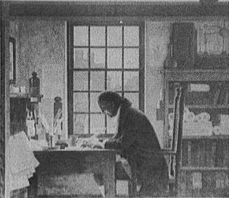

## Hopw Does a Search Engine Rank User-Generated Content on Web Pages?

The term “User-Generated Content,” often abbreviated as “UGC,” covers a fairly broad range of the words and pictures, images and videos, and sounds that you see and hear on the Web.

One thing that tends to distinguish “User Generated Content” from other content on the web is that visitors to a site, possibly including a site’s owners, are the ones who help build the site, and add to it.

User-Generated Content can include message boards and forums, wikis and product reviews, public mailing lists and Q & A sites, blogs and blog comments, podcasts, and other kinds of content.

Would you consider twitter to be UGC? I would. When you visit Amazon.com and read reviews of books and music, and other content, you’re reading User Generated Content. When you visit Wikipedia, the human-created encyclopedia you see relies upon User Generated Content.

A patent application from Yahoo explores an approach for indexing UGC and including it in Web search results.

The inventors of the patent filing tell us that there’s some beneficial information that shows up in places like reviews on product pages, and other areas that the search engines haven’t been beneficial in showing to searchers.

Why might search engines have problems ranking information found in User Generated Content? Here are three reasons we are told that “typical ranking mechanisms for ranking of a document in a web search, however, are unsuitable for ranking UGC:”

- User Generated Content tends to be fairly short,
- There usually aren’t links to or from UGC; and,
- Spelling mistakes tend to be common in UGC.

The patent application introduces us to three concepts that might be helpful in ranking User-generated content (UGC,) so that it will show up in Web search results when useful. These concepts are:

- Document goodness,
- Author rank, and;
- Location rank.

I’ll describe those in more detail below. The user-=generated content patent application is:

[Method and Apparatus for Rating User Generated Content in Search Results](http://appft.uspto.gov/netacgi/nph-Parser?Sect1=PTO2&Sect2=HITOFF&u=%2Fnetahtml%2FPTO%2Fsearch-adv.html&r=1&p=1&f=G&l=50&d=PG01&S1=20090271391.PGNR.&OS=dn/20090271391&RS=DN/20090271391)
Invented by Jaya Kawale, and Aditya Pal
Assigned to Yahoo
US Patent Application 20090271391
Published October 29, 2009
Filed April 29, 2008

Abstract

> Generally, a method and apparatus provide for rating user-generated content (UGC) concerning search engine results. The method and apparatus include recognizing a UGC data field collected from a web document located at a web location.
>
> The method and apparatus calculate: a document goodness factor for the web document; an author rank for an author of the UGC data field; and a location rank for web location. The method and apparatus thereby generate a rating factor for the UGC field based on the document goodness factor, the author rank, and the location rank.
>
> The method and apparatus also output a search result that includes the UGC data field positioned in the search results based on the rating factor.

The first step towards ranking User Generated Content is creating a score for *document goodness* of a review, or a blog post, or a forum post, or another piece of UGC.

Some of the attributes that a search engine might look at in determining document goodness can include:

- User rating (if available);
- Frequency of posts before and after a document is posted;
- Document’s contextual affinity with a parent document;
- Root of thread or subject;
- A number of page clicks/views for the document (if available);
- Assets in the documents such as images, links, videos and embedded objects;
- Length of the document;
- Length of thread in which document lies; and,
- Goodness of child documents (if any).

The next step towards ranking UGC is to create an *author rank* for the creator of UGC. An author rank is a “measure of the expertise of the author in a given area.”

Attributes a search engine might consider in generating an author rank may include:

- A number of relevant/irrelevant messages posted;
- Document goodness of all documents initiated by the author;
- Total number of documents initiated posted by the author within a defined time period;
- Total number of replies or comments made by the author; and,
- A number of groups to which the author is a member.

The first two steps consider the User Generated Content itself, and the creator of that content. The third step looks at where that content is located, such as a message board or forum, or group, and provides a rank for the location.

Attributes that a search engine might take into account in ranking UGC involving a *location rank* for that content include:

- An activity rate in the web location, for example a number of documents posted per hour;
- A number of unique users in the web location;
- An average document goodness factor for the documents in the web location;
- An average author rank of the users in the web location; and,
- An external rank of the web location.

The user-generated content patent filing provides a few ways that these three measures might be combined to help UGC show up ranking for queries in Web search results.

As I was reading this, I wondered if signals like those listed here might account for whether or not we see UGC like certain twitter posts for some search results, or reviews for some products, or other UGC in rankings.

It’s likely that if Google and Bing have been exploring how to rank UGC (and they probably have), they may be looking at some of the same signals.
