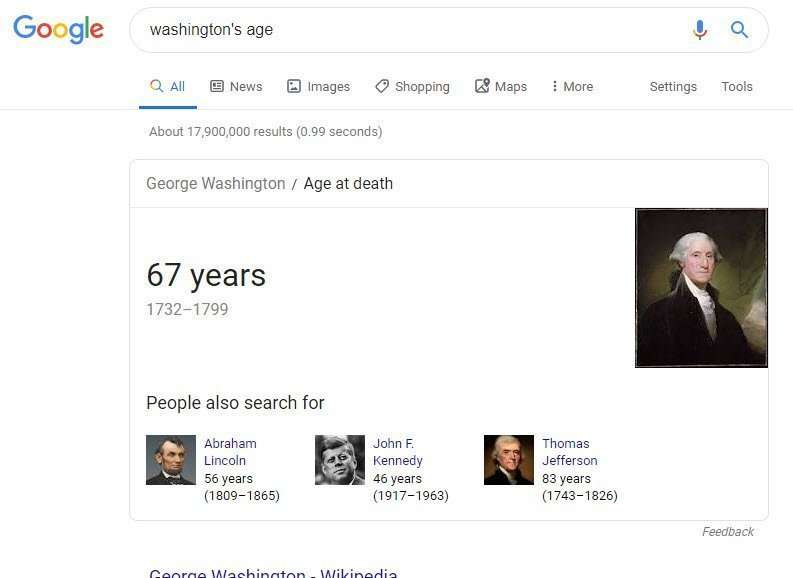
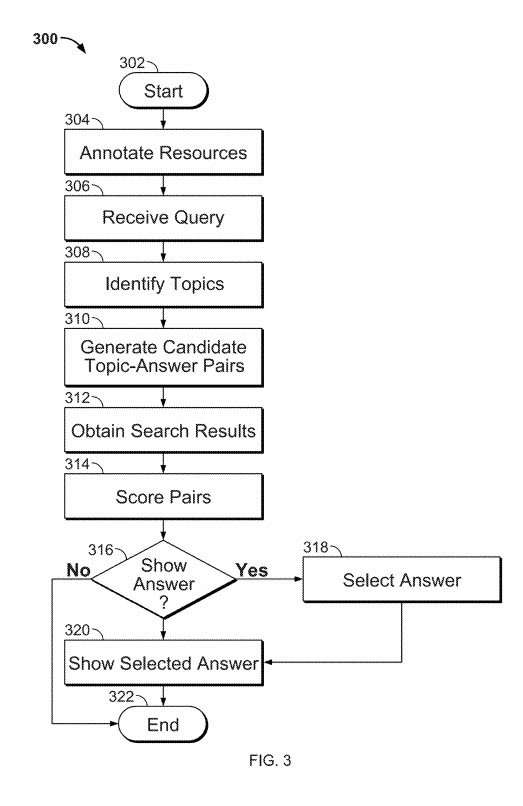
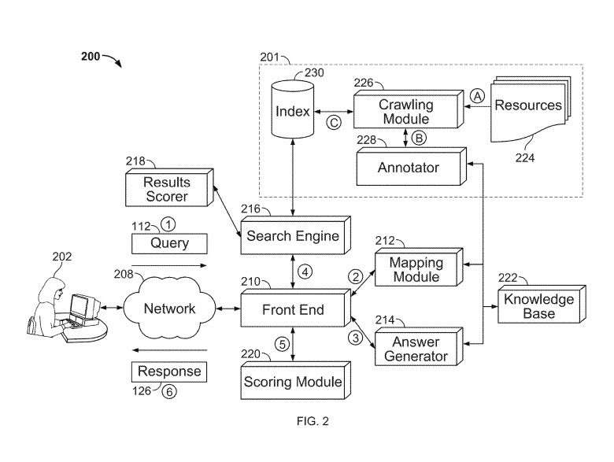

“How Long is Harry Potter?” is asked in a diagram from a Google Patent. The answer to this vague question is unlikely to do with a length related to the fictional character but may have something to do with one of the best-selling books or movies featuring Harry Potter.

When questions are asked as queries at Google, sometimes they aren’t asked clearly, with enough preciseness to make an answer easy to provide. So how does Google Answer vague questions?

Question answering seems to be a common topic in Google Patents recently. I wrote about one not long ago in the post, [How Google May Handle Question Answering when Facts are Missing](https://www.seobythesea.com/2019/07/how-google-may-handle-question-answering-when-facts-are-missing/)

So this post is also on question answering but involves issues involving the questions rather than the answers. And particularly vague questions.

Early in the description for a recently granted Google Patent, we see this line, which is the focus of the patent:

> Some queries may indicate that the user is searching for a particular fact to answer a question reflected in the query.

I’ve written a few posts about Google working on answering questions, and it is good seeing more information about that topic being published in a new patent. As I have noted, this one focuses upon when questions asking for facts may be vague:

> When a question-and-answer (Q&A) system receives a query, such as in the search context, the system must interpret the query, determine whether to respond and if so, select one or more answers with which to respond. Not all queries may be received in the form of a question, and some queries might be vague or ambiguous.

The patent provides an example query for “Washington’s age.”

Washington’s Age could be referring to:

- President George Washington
- Actor Denzel Washington
- The state of Washington
- Washington D.C.

For the Q&A system to work correctly, it would have to decide which searcher who typed that into a search box the query was likely interested in finding the age of one of the Washingtons. Trying that query, Google decided that I was interested in George Washington:

The problem that this patent is intended to resolve is captured in this line from the summary of the patent:

> The techniques described in this paper describe systems and methods for determining whether to respond to a query with one or more factual answers, including how to rank multiple candidate topics and answers in a way that indicates the most likely interpretation(s) of a query.

## How would Google potentially resolve vague questions problem?

Narrowing the question to a specific topic can make a difference. For example, which topic are people most likely asking about?

It would likely start by trying to identify one or more candidate topics from a query. Then, it may try to generate, for each candidate topic, a candidate topic-answer pair that includes both the candidate topic and an answer to the query for the candidate topic.

It would obtain search results based on the query, which references an annotated resource, which would be a resource that, based on automated evaluation of the resource’s content, is associated with an annotation that identifies one or more likely topics associated with the resource. For each candidate topic-answer pair,

There would be a Determination of a score for the candidate topic-answer pair based on:

(i) The candidate topic appearing in the annotations of the resources referenced by one or more of the search results
(ii) The query answer appearing in annotations of the resources referenced by the search results or in the resources referenced by the search results.

A decision would also be made to respond to the query, with one or more answers from the candidate topic-answer pairs, based on the scores for each.

## Topic-Answer Scores for Vague Questions

The patent tells us about some optional features as well.

1. The scores for the candidate topic-answer pairs would have to meet a predetermined threshold
2. This process may decide to not respond to the query with any of the candidate topic answer pairs
3. One or More of the highest-scoring topic-answer pairs might be shown
4. An topic-answer might be selected from one of several interconnected nodes of a graph
5. The Score for the topic-answer pair may also be based upon a respective query relevance score of the search results that include annotations in which the candidate topic occurs
6. The score to the topic-answer pair may also be based upon a confidence measure associated with each of one or more annotations in which the candidate topic in a respective candidate topic-answer pair occurs, which could indicate the likelihood that the answer is correct for that question

## Knowledge Graph Connection to Vague Questions?

This vague question-answering system can include a knowledge repository that includes several topics, including attributes and associated values for those attributes.

It may use a mapping module to identify one or more candidate topics from the topics in the knowledge repository, which may be determined to relate to a possible subject of the query.

An answer generator may generate for each candidate topic, a candidate topic-answer pair that includes:

(i) The candidate topic, and
(ii) An answer to the query for the candidate topic, wherein the answer for each candidate topic is identified from information in the knowledge repository.

A search engine may return search results based on the query, which can reference an annotated resource. Based on automated evaluation of the content of the resource, a resource is associated with an annotation that identifies one or more likely topics associated with the resource.

A score may be generated for each candidate topic-answer pair based on:

(i) An occurrence of the candidate topic in the annotations of the resources referenced by one or more of the search results
(ii) An occurrence of the answer in annotations of the resources referenced by the one or more search results or in the resources referenced by the one or more search results. A front-end system at one or more computing devices can determine whether to respond to the query with one or more answers from the candidate topic-answer pairs, based on the scores.

The additional features above for topic-answers appears to be repeated in this knowledge repository approach:

1. The answering system may decide to respond or not to the query based on a comparison of one or more of the scores to a predetermined threshold
2. Each of the numbers of topics in the knowledge repository can be represented by a node in a graph of interconnected nodes
3. The returned search results can be associated with a respective query relevance score, and the scoring module can determine the score for each candidate topic-answer pair based on the query relevance scores of one or more of the search results that reference an annotated resource in which the candidate topic occurs
4. For one or more of the candidate topic-answer pairs, the score can be further based on a confidence measure associated with each of one or more annotations in which the candidate topic in a respective candidate topic-answer pair occurs, or each of one or more annotations in which the answer in a respective candidate topic-answer pair occurs

## Advantages of this Vague Questions Approach

1. Candidate responses to a query can be scored so that a Q&A system or method can decide whether to respond to the query.
2. If the query does not ask a question or if none of the candidate answers are sufficiently relevant to the query, then no response may be provided
3. The techniques described here may interpret a vague or ambiguous query and provide a response that is most likely to be relevant to what a searcher was looking for when submitting the query.

This patent on answering vague questions is:

[Determining question and answer alternatives](http://patft.uspto.gov/netacgi/nph-Parser?Sect1=PTO1&Sect2=HITOFF&d=PALL&p=1&u=%2Fnetahtml%2FPTO%2Fsrchnum.htm&r=1&f=G&l=50&s1=10,346,415.PN.&OS=PN/10,346,415&RS=PN/10,346,415)
Inventors: David Smith, Engin Cinar Sahin, and George Andrei Mihaila
Assignee: Google Inc.
US Patent: 10,346,415
Granted: July 9, 2019
Filed: April 1, 2016

Abstract

> A computer-implemented method can include identifying one or more candidate topics from a query. For each candidate topic, the method can generate a candidate topic-answer pair that includes both the candidate topic and an answer to the query for the candidate topic. The method can obtain search results based on the query, wherein one or more of the search results references an annotated resource. For each candidate topic-answer pair, the method can determine a score for the candidate topic-answer pair for use in determining a response to the query, based on (i) an occurrence of the candidate topic in the annotations of the resources referenced by one or more of the search results, and (ii) an occurrence of the answer in annotations of the resources referenced by the one or more search results, or in the resources referenced by the one or more search results.

## Vague Questions Takeaways

I am reminded of a 2005 Google Blog post called [Just the Facts, Fast](https://googleblog.blogspot.com/2005/04/just-facts-fast.html) when this patent tells us that sometimes it is “most helpful to a user to respond directly with one of more facts that answer a question determined to be relevant to a query.”

The different factors that might be used to determine which answer to show if an answer is shown include a confidence level, which may be confident that an answer to a question is correct. That reminds me of the association scores of attributes related to entities that I wrote about in [Google Shows Us How It Uses Entity Extractions for Knowledge Graphs](https://gofishdigital.com/entity-extractions-knowledge-graphs/). That patent told us that those association scores for entity attributes might be generated over the corpus of web documents as Googlebot crawled pages extracting entity information, so those confidence levels might be built into the knowledge graph for attributes that may be topic-answers for a question answering the query.

A webpage that is relevant for such a query and that an answer might be taken from may be used as an annotation for a displayed answer in search results.
