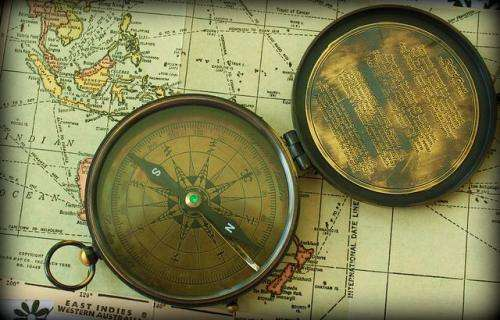

## Acquistions Behind Mapping Indoor Spaces

A couple of years ago, Google acquired the startup Behavio. One of the selling points behind Behavio was how it used [behavior data from Phones](https://vator.tv/news/2013-04-13-google-picks-up-behavioral-sensing-company-behavio) to better understand human behavior. Google likely acquired the company Zipdash back in 2004 to [learn about real-time traffic data](https://venturebeat.com/2005/03/30/google-acquires-traffic-info-start-up-zipdash/).

_[Compass Study](https://www.flickr.com/photos/calsidyrose/4925267732/in/photolist-8vehvb-5yM2pE-apgpCT-di4W8P-6mKLG7-4qUQRH-26RpWu-3KBnLW-8mHxhM-bNDPaK-bGyQr4-5CsUyY-bUZpUc-8vbd3v-bHX4zT-nU7DV5-di4WdR-dxnob7-2RVaF-af6Xuw-5zSZEx-naqjZK-67que2-7uD3a3-7TkMGU-82Uw6D-fDYxQx-fEg74A-gXzRui-3rGecn-naqwhA-naqrQE-naqtfC-naqpLJ-naqnsk-gXzTt8-ncttKK-nct694-gXyWVn-kMQmbh-kMNQw8-3o5xG8-kMQumW-bKHkXZ-gkCnzw-gkDn2p-gkD8J5-kFbuz-eqfA6n-gkDaiN), [Calsidyrose](https://www.flickr.com/photos/calsidyrose/), [Some rights reserved](https://www.seobythesea.com/2015/07/how-you-may-be-helping-google-map-indoor-spaces/<a)_

A Google patent application published in the last week describes how Google might be using Mobile data from phones for mapping indoor spaces, combining the technologies behind Behavio, with traffic monitoring from Zipdash to better understand indoor spaces that many people navigate through while carrying a mobile device that connects to the internet with wireless signals and carries sensor data that can indicate the location and movements of those devices.

The patent tells us that current approaches for mapping indoor spaces using mobile devices are based on interior scans of wireless access points. These scans could be used to build a database that can model an indoor space by determining locations of the access points and their corresponding signal strengths at those locations. To create a database like this, an indoor wireless location provider would have to conduct site surveys at selected locations.

An undertaking like this could require surveying tens of thousands of buildings and floors to determine the location of the wireless access points. And this database could become stale and inaccurate over time due to location changes in the access points after the surveys are complete.

This patent is aimed at providing a scalable method that could be used to conduct site surveys to construct wireless access point models of indoor spaces. This would be done by crowd-sourcing the wireless and INS (Inertial navigation systems) signals from multiple devices moving through the indoor location. The end goal of this would be to provide a more accurate and up to date model database of access points.

The approach behind the patent is the following method.

(1) Identifying maps of indoor spaces,

(2) Receiving inertial navigation signals (sensor signals from accelerometers, etc.) from a set of mobile devices moving through those indoor spaces and

(3) Calculating user trajectories based on the inertial navigation signals. This method provides direction and speed of movement of the mobile devices being tracked. Tracking these trajectories helps to identify walkable areas of the indoor space being targeted, and where turns take place among these paths. The inertial navigation signals (INS) may include accelerometer data, gyroscope data, and compass data.

This is how large indoor spaces such as shopping malls transit stations, airports, and similar indoor places may be mapped by looking at sensor data and wireless access signals from those devices.

This indoor spaces patent is:

[Crowd-Sourcing Indoor Locations](http://appft.uspto.gov/netacgi/nph-Parser?Sect1=PTO1&Sect2=HITOFF&d=PG01&p=1&u=%2Fnetahtml%2FPTO%2Fsrchnum.html&r=1&f=G&l=50&s1=%2220150204676%22.PGNR.&OS=DN/20150204676&RS=DN/20150204676)
Invented by: Faen Zhang, Edward Y. Chang, Yongqiang Huang, Shuchang Zhou
Assigned to Google
US Patent Application 20150204676
Published July 23, 2015
Filed: August 15, 2012

Abstract

> Aspects of the present disclosure provide techniques for constructing a scalable model of an indoor space using crowd-sourced inertial navigation system (INS) signals from mobile devices. By tracking INS signals from many participating users, the user’s trajectories can be estimated as they move their mobile devices indoors. The estimated trajectories can be scored against similar routes taken by other users. Routes with the highest scores are then laid out over a map of the indoor space to identify areas most often traveled to and from landmarks and distances between the landmarks.

Locations within indoor spaces may also be identified in other ways as well. The patent points out:

(1) Other signals to identify locations for indoor spaces may also be used that could include radiofrequency (RF) signals, light, sound image recognition signals, and other types of signals and/or environmental factors or any combination of these.

(2) The server building a database may look at map information, which could include floor plans representing indoor spaces within a building.

(3) “Beacon” messages may also be used to send out information to identify wireless network access points. The beacon messages may also include additional network access information which also assists devices in accessing the network.

(4) The patent tells us that Personal Identifiable Information need not be collected, and may be removed to protect the privacy of the wireless network’s users.

(5) A GPS receiver may be included in the mobile devices, that could be used to determine the geographic location of the client device, and could identify the device’s latitude, longitude, and altitude position.

(6) Mapping indoor spaces may help identify interior constraints, such as walls, which people cannot walkthrough, as well as frequent landmarks within that indoor space, such as offices, conference rooms, bathrooms.

## Mapping Indoor Spaces Take-Aways

Having people provide data about their locations can be essential for their use of such services. Information collected from the devices of people using those services help to provide such services. I can’t remember the last time I tried to navigate somewhere with the use of a paper map. I can remember visiting places, and using Google Maps to find walking directions to busy Urban spaces. This does seem to be a capability that helps make our lives easier.

Last Updated May 18, 2019
