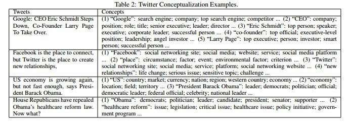
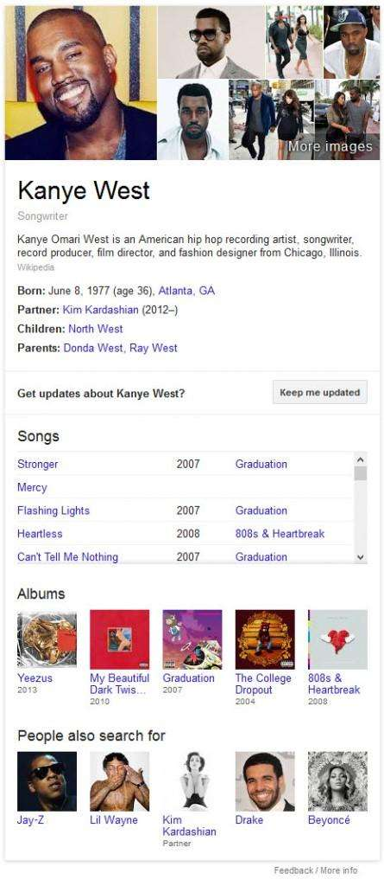

*Is Hummingbird the key to understanding an author’s expertise for things like In-Depth articles, and a possible future Author Rank? With content from an author considered using a concept-based knowledge base, it’s quite possible.*

The Google [Hummingbird](https://www.seobythesea.com/2013/09/google-hummingbird-patent/) rewrite of Google’s search engine wasn’t just aimed at providing a way to understand better long and complex queries, like the type that someone might speak into their phone. It was also likely aimed at better understanding the concepts and topics written about and discussed on Web pages, and in social signals such as posts at Google+ and comments on those posts, in Tweets, in Status Updates, and other short text-based messages where there might not be a lot of additional contexts to go with those messages.

The following screenshot shows the concepts that might appear for Tweets when they are analyzed using the Probase Concept-Based knowledge base (from [Short Text Conceptualization using a Probabilistic Knowledgebase](https://www.ijcai.org/Proceedings/11/Papers/388.pdf)):

Google has been presenting knowledge panels next to search results, especially when a query includes a named entity in it. For example, search for [Jerry Lewis] and Google shows off facts about Jerry Lewis that it has extracted from pages on the Web. These include facts from Wikipedia, upcoming events where the comedian is performing, movies and TV shows that he’s been in, and other people that are often searched for when someone searches for Jerry Lewis, such as Dean Martin, Bob Hope, Tony Curtis, Milton Berle, and others.

Search for Kanye West, and you’ll see some similar results that include facts, songs that he has written and performs, Albums he’s released, and other people who might be searched for by people who search for Kanye West. Jerry Lewis isn’t included in those people.

In both cases, Google recognizes that there is a named entity in the query being performed, and it looks up what it has in its knowledge base to show off those knowledge panels. It also might use that information for the web search results that it sees as well. But, Google is likely doing more than just looking for entities. It can also look for the concepts and attributes of entities when it considers queries that people have searched for. A knowledge base that includes entities and their attributes, concepts, and keywords can be useful in expanding queries that someone searches for, to show a wider range of relevant search results, like in the Probase example above.

## Building a Concept-Based Knowledge Base at Google

To learn more about Hummingbird, I’ve been exploring Microsoft’s Concept-Based Knowledge Base Probase recently, in the posts [Are You, Your Business, or Products in a Knowledge Base?](https://gofishdigital.com/you-your-business-products-knowledge-base/), and in [Concept-Based Web Search](https://www.seobythesea.com/2013/11/concept-based-web-search/). Google has been granted patents within the last year on different ways to construct a concept-based knowledge base and better understand the content of queries. Another white paper on Probase, titled [Short Text Conceptualization using a Probabilistic Knowledgebase](https://www.ijcai.org/Proceedings/11/Papers/388.pdf), covers some of this same territory. From the abstract:

> In this paper, we improve text understanding by using a probabilistic knowledge base that is as rich as our mental world regarding the concepts (of worldly facts) it contains. We then develop a Bayesian inference mechanism to conceptualize words and short text. We conducted comprehensive experiments on conceptualizing textual terms and clustering short pieces of text such as Twitter messages.
>
> Our approach brings significant improvements in short text understanding compared to purely statistical methods such as latent semantic topic modeling or methods that use existing knowledge bases (e.g., WordNet, Freebase, and Wikipedia). Our approach brings significant improvements in short text understanding as reflected by the clustering accuracy.

I’m going to be digging into several patents recently granted to Google that describe how they may be building a concept-based knowledge base that can be used to understand short text messages better and to understand the topics that authors write about, and the topics and concepts discussed on pages on the Web.

## Authorship and Determining Expertise in Topics

Google’s authorship program allows people to digitally sign the content that they create on the Web and within Google Plus and other places on the Web. Google is likely exploring ways to understand messages and blog posts, and articles written by these authors to gauge and score them on the topics that they write about. In [How Google Might Rank User Generated Web Content in Google + and Other Social Networks](https://www.seobythesea.com/2011/07/how-google-might-rank-user-generated-web-content-in-google-and-other-social-networks/), I wrote about a Google patent application that described how Google might generate user contribution (reputation) scores like that.

For Google to start using author reputation and expertise as ranking signals with different scores in different topics, Google needs to be able to understand the concepts that people write about, and how those might be related and fit into different topics. As Google explains on their page about [Appearing in In-Depth Search Results](https://developers.google.com/search/docs/data-types/article?hl=en&visit_id=1-636673108366438128-1268679464&rd=1):

> Authorship markup helps our algorithms to find and present relevant authors and experts in Google search results

For Google to determine whether or not an author has expertise in a particular topic, Google needs to be able to understand what they write about and determine what their level of expertise might be compared to other authors who write about related topics. Here’s what Google’s Matt Cutts said in his Pubcon 2013 Keynote Presentation about author authority:

> We’ve also been looking at detecting and boosting authority. So take medical, for instance. If you’re an authority in the medical space, we want to know that and to push you up higher whenever a medical query comes along. Now, this is not something that is done by hand. We don’t pick individual topic areas. It applies to thousands of different topic areas.
>
> So, nothing that you have to do, but if you are a topical authority, keep writing about it, keep developing, keep deepening the amount of content that you have. You want to be a resource, you do want to be an authority, and if you turn out to be an authority, then you’re more likely to be boosted by that particular change.

## Conclusion

In the Hummingbird re-write of Google, the chances are good that a concept-based knowledge base will be used to understand better social signals like threads and comments in Google+ for measuring authority topics.

The screenshot from the Microsoft paper above on Probase shows how concepts might be mined from short text social messages using such a knowledge base. This would work well with named entities and attributes related to those entities, concepts identified in those short messages, and then keywords from the messages if no entity/attribute/concept associations are found in that knowledge base.

Keep in mind that Google is actively building its knowledge base. As it grows, more associations involving these different elements will be made.

We’re going to look at the Google patents that I’ve been talking about in recent posts next, to get an idea of how Google is going about building its concept-based knowledge base.
