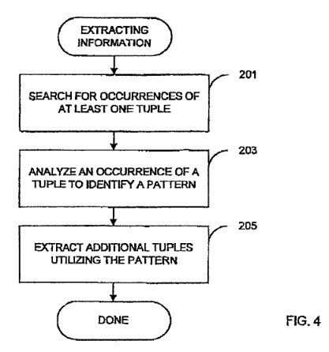
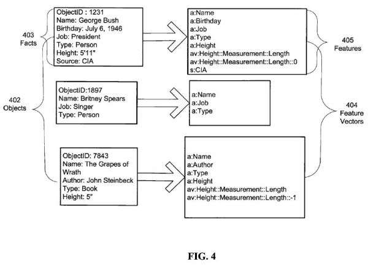

> The World Wide Web is a vast resource for information. At the same time it is extremely distributed.
>
> A particular type of data such as restaurant lists may be scattered across thousands of independent information sources in many different formats. In this paper, we consider the problem of extracting a relation for such a data type from all of these sources automatically.
>
> We present a technique that exploits the duality between sets of patterns and relations to grow the target relation starting from a small sample. To test our technique we use it to extract a relation of (author, title) pairs from the World Wide Web.
>
> Sergey Brin, [Extracting Patterns and Relations from the World Wide Web (pdf), Stanford University, 1999](http://web.archive.org/web/20120314072716/http://ilpubs.stanford.edu:8090/421/1/1999-65.pdf)

_Entities Change – Torpedoes become art and Search Engines become Knowledge Repositories._

One of the early successes of Google’s search is how [PageRank](https://www.seobythesea.com/2011/12/10-most-important-seo-patents-part-1-the-original-pagerank-patent-application/) influenced the ordering of search results in response to queries. Google Founder Lawrence Page is credited with the invention of PageRank, but around the same time, Sergey Brin was digging into another approach for capturing and indexing content on the Web involving entities and knowledge.

The paper quoted at the start of this post contains substantially the same text as a provisional patent Brin filed with the USPTO in the year 2000, but he ended up rewriting it and then filing 4 continuation patents of it up until 2012 when he filed the latest version of [Information extraction from a database](http://patft.uspto.gov/netacgi/nph-Parser?Sect1=PTO2&Sect2=HITOFF&p=1&u=%2Fnetahtml%2FPTO%2Fsearch-adv.htm&r=1&f=G&l=50&d=PALL&S1=08589387&OS=PN/08589387&RS=PN/08589387). The abstract from the versions of the patent reads:

> Techniques for extracting information from a database are provided. A database such as the Web is searched for occurrences of tuples of information. The occurrences of the tuples of information that were found in the database are analyzed to identify a pattern in which the tuples of information were stored. Additional tuples of information can then be extracted from the database utilizing the pattern. This process can be repeated with the additional tuples of information, if desired.

## The Transfiguration of Search @Google

Signs are there that this is the direction that search and SEO are headed in, where the Semantic Web plays a larger and larger role. I’ve been writing for years about topics such as Google’s [acquisition of Meta-Web](https://www.seobythesea.com/2010/07/google-gets-smarter-with-named-entities-acquires-metaweb/) and Freebase, and more recently about how Google might use the Web as a database to identify and disambiguate different entities with the same names, in [Finding Entities: A Tale of Two Michael Jacksons](https://www.seobythesea.com/2014/08/google-finding-entities-tale-two-michael-jacksons/).

Google is going to be changing how they collect and distribute information on the Web in many ways. Think of it as an evolution, though. I’m not saying that SEO is dead, but I am saying that Sergey Brin’s vision of how information from the Web is extracted, in tuples that indicate relationships, might become more commonplace as Google gets better at it.

And Google has been getting better at it,.

Last Monday, I asked the question which name do you prefer, [Semantic Search or Semantic SEO?](https://www.seobythesea.com/2014/08/semantic-seo-semantic-search/), while sharing links to tutorial presentations on Semantic SEO that both Barbara Starr and I had put together as an introduction to the topic after Barbara asked me if I would be interested in joining her on the presentation.

I’m glad I did – it gave me a chance to hear from a lot of other people working on the Semantic Web, including search engineers and people offering services and tools in the field. It gave me a chance to hear Barbara’s thoughts (highly recommended). There were a lot of people from the search engines, and they were saying some interesting things. And there were a few signs of things to come at the 10th anniversary of the Semantic Technology and Business Conference.

**If Google went from being a search engine tomorrow to a knowledge engine, would it surprise you?**

## Entity Type Assignments

We know how difficult it can be for a search engine to identify entities on the Web and recognize different entities that share a name, even in the absence of markup such as schema on pages. Another challenge that faces a search engine or knowledge base is in defining an entity by assigning it an entity “type”.

An entity type assigned to an entity can tell us about the attributes or properties, and the values associated with them, that help us learn more about them. For example, for an actor, you might want to collect information about roles and characters played in Movies and on TV and Stage. You might want to collect additional features, such as other actors involved in a production with them, where it was performed, and what type of medium it was performed in. Who were the people they started with? What awards might they have won?

_When types are defined for entities, those determine what attributes are collected for each_

Entity assignments also indicate other information, such as when an entity type is being a “spouse,” we automatically understand that there is another entity related to it – the person they are a spouse of. If an entity is an author, there are related entities that are books or articles or blog posts or screenplays.

Google was granted a patent in 2011 that describes the assignment of entity types from models about those entities, with facts about them placed in fact repositories, and using these models to assign entity types to objects of unknown entity types in the fact repository.

Information extraction may be used to automatically identify and extract information in the form of facts and can be performed on a variety of sources such as web pages to extract factual data.

The patent is:

[Entity type assignment](http://patft.uspto.gov/netacgi/nph-Parser?Sect1=PTO2&Sect2=HITOFF&p=1&u=/netahtml/PTO/search-adv.htm&r=1&f=G&l=50&d=PALL&S1=07970766&OS=PN/07970766&RS=PN/07970766)
Invented by Farhan Shamsi, Alex Kehlenbeck, David Vespe, and Nemanja Petrovic
Assigned to Google
US Patent 7,970,766
Granted June 28, 2011
Filed: July 23, 2007

Abstract

> A repository contains objects including facts about entities. Objects may be of known or unknown entity type. An entity type assignment engine assigns entity types to objects of unknown entity type. A feature generation module generates a set of features describing the facts included with each object in the repository. An entity type model module generates an entity type model based on the sets of features generated for a subset of objects. An entity type model module generates entity type models, such as a classifier or generative models, based on the sets of features associated with objects of known entity type.
>
> An entity type assignment module generates a value based on the sets of features associated with an object of unknown entity type and the entity type model. This value indicates whether the object of an unknown entity type is of a known entity type. An object update module stores the object to which the known entity type was assigned in the repository in association with the assigned entity type.

While this patent isn’t new, it’s important in its description of how Google collects information about entities it finds on the Web and tries to understand then. The growth of a collection of facts about entities into a knowledge base requires that those objects and facts be defined consistently.

I blogged about this patent because it felt like the time that I did after my “Two Michael Jackson’s post.” I also wanted you to see the words “information extraction” about entities on the Web, as opposed to the “crawling” of Web pages since that’s part of the evolution of SEO.

## Entity Type Identification Problems

Sometimes entity type information might be unavailable on pages. Don’t let this happen to you and your pages.

Sometimes an entity might share a name with another entity, such as when the musician Peter Gabriel named his first four albums “Peter Gabriel.”

If you are going to name your first four collections of music after yourself, people might be a little ambiguous regarding which one they might be writing about when they are.

Listeners might be confused, as well as readers, as well as search engines that may be trying to convert information on web pages into “Knowledge.”

## Some Facts about Entities, Entity Type Assignments and their Fact Repositories

A repository includes facts, and each fact includes a unique identifier for that fact, such as a fact ID. The “object” that a fact has may be given a unique Object ID as well.

A fact about an entity includes at least an attribute and a value. For example, a fact associated with an object representing George Washington may include an attribute of “date of birth” and a value of “February 22, 1732.”

As described above, each fact is associated with an object ID that identifies the object that the fact describes. Thus, each fact that is associated with the same entity (such as George Washington), will have the same object ID.

The number of facts associated with an object may be unlimited – there could be hundreds.

Values associated with Facts, such as a fact about the Economy of China, could contain a lot of information.

In addition to facts about specific objects/or entities, the fact repository may contain facts about the representation of the fact on the Web itself such as:

- Language used to state the fact (English, etc.)
- Importance of the fact
- Source of the fact
- Confidence value for the fact
- so on

This entity type assignment engine attempts to improve the quality of knowledge contained within the fact repository by assigning entity types to objects with unknown entity types.

An entity can have more than one entity type (multiple non-conflicting entity types) when they hold more than one role or did so over different periods. For example, Arnold Schwarzenegger was an Actor Entity Type, a Politician Entity type, and a Weight Lifter entity type, and could have done all of those at the same time, but didn’t usually present himself as a hybrid of all three entity types.

Entity models may be built for entities once, but are usually rebuilt over some time.

Some entity types are binary, as in an entity is of a certain type, or it is not. Fido might be a dog, but the alternative as a binary entity type is a “non-dog.” A multiclass entity is also possible, and a person might be two different entity types at the same time, such as Arnold Schwarzenegger being a business person and an actor simultaneously.

The patent describes these assignments of entity types as either unsupervised or semi-supervised approaches. If the facts used to assign an entity type are weak or conflict in some way, an assignment might not be made.

The patent provides more details and several additional examples.

This patent is a couple of years old, and while it describes an automated way to assign an entity type, there are methods from places such as [Schema.org](https://schema.org/) where site owners could use markup to assign entity types, or places such as freebase.com where a person could assign one.

Or approaches such as the [Open Language Extraction developed by Wavii](https://www.seobythesea.com/2013/05/wavii-google-acquire-future-search/) or other extraction approaches may get involved.
