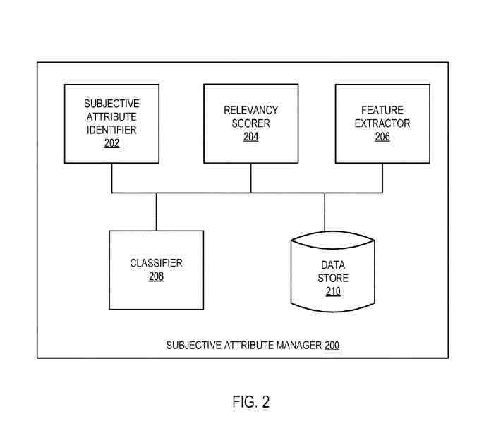

## Identifying UGC Subjective Attributes Of Entities

This recently granted patent is about identifying subjective attributes of entities.

I haven’t seen a patent about subjective attributes of entities or responses to those entities.

A critical aspect of it is that it is user-generated content.

We get told that user-generated content (UGC) is becoming more common on the Web because of the increasing popularity of social networks, blogs, review websites, etc.

We often see user gnnerated content in the form of comments, such as:

- A Comment by a first user about content shared by a second user within a social network
- User comments in response to an article in a columnist’s blog
- A comment from a video clip posted on a content hosting website
- Reviews (such as of products, movies)
- Actions (such as Like!, Dislike!, +1, sharing, bookmarking, playlisting, etc.)
- So forth

Under this patent, a way to identify and predict subjective attributes for entities (such as media clips, images, newspaper articles, blog entries, persons, organizations, commercial businesses, etc.) gets provided.

It starts with:

- Identifying a first set of subjective attributes for a first entity based on a reaction to the first entity (such as comments on a website, a demonstration of approval of the first entity (such as “Like!, etc.)
- Sharing the first entity
- Bookmarking the first entity
- Adding the first entity to a playlist
- Training a classifier (such as a support vector machine, AdaBoost, a neural network, a decision tree on a set of input-output mappings, where the set of input-output mappings comprises an input-output mapping whose input is Providing a feature vector for the first entity, whose output gets based on the first set of subjective attributes
- Providing a feature vector for a second entity to the trained classifier to get a second set of subjective attributes for the second entity

A memory and a processor get provided to identify and predict subjective attributes for entities.

A computer readable storage medium has instructions that cause a computer system to perform operations including:

- Identifying a first set of subjective attributes for a first entity based on a reaction to the first entity
- Obtaining a first feature vector for the first entity
- Training a classifier on a set of input-output mappings, wherein the set of input-output mappings comprises an input-output mapping whose input gets based on the first feature vector and whose output gets based on the first set of subjective attributes
- Obtaining a second feature vector for a second entity
- Providing to the classifier, after the training, the second feature vector to get a second set of subjective attributes for the second entity

This patent on dentifying subjective attributes for entities =is found at:

[Identifying subjective attributes by analysis of curation signals](https://patft.uspto.gov/netacgi/nph-Parser?Sect1=PTO1&Sect2=HITOFF&d=PALL&p=1&u=%2Fnetahtml%2FPTO%2Fsrchnum.htm&r=1&f=G&l=50&s1=11,328,218.PN.&OS=PN/11,328,218&RS=PN/11,328,218)
Inventors: [Hrishikesh Aradhye](https://www.linkedin.com/in/aradhye/) and [Sanketh Shetty](https://www.linkedin.com/in/sankethshetty/)
Assignee: Google LLC
US Patent: 11,328,218
Granted: May 10, 2022
Filed: November 6, 2017

Abstract:

> A system and method for identifying and predicting subjective attributes for entities (such as media clips, movies, television shows, images, newspaper articles, blog entries, persons, organizations, commercial businesses, etc.) get disclosed.
>
> In one aspect, subjective attributes for a first media item get identified based on a reaction to the first media item, and relevancy scores for the personal qualities with about the first media item get determined.
>
> A classifier gets trained using (i) a training input comprising a set of features for the first media item and a target output for the training input, the target output comprising the respective relevancy scores for the subjective attributes of the first media item.

## Identifying And Predicting Subjective Attributes For Entities

Ways for identifying and predicting subjective attributes for entities (such as media clips, images, newspaper articles, blog entries, persons, organizations, commercial businesses, etc.).

Subjective attributes (such as “cute,” “funny,” “awesome,” etc.) get defined, and subjective attributes for a particular entity get identified based on user reaction to the entity, such as:

- Comments on a website
- Like!
- Sharing the first entity with other users
- Boomarking the first entity
- Adding the first entity to a playlist
- Etc

## Relevancy Scores For The Subjective Attributes Get Determined About The Entity

If the subjective attribute “cute” appears in a significant proportion of comments for a video clip, then “cute” may get assigned a high relevancy score.

**The entity is then associated with the identified subjective attributes and relevancy scores (such as via tags applied to the entity, via entries in a table of a relational database, etc.).**

The above procedure is performed for each entity in a given set of entities (such as video clips in a video clip repository, etc.), and an inverse mapping from subjective attributes to entities in the group is generated based on personal qualities and relevancy scores.

The inverse mapping can then get used to identify all entities in the set that match a given subjective attribute (such as all entities that have gotten associated with the subjective attribute “funny”, etc.), thereby enabling:

- Rapid retrieval of relevant entities for processing keyword searches
- Populating playlists
- Delivering advertisements
- Generating training sets for the classifier
- So forth

A classifier (such as a support vector machine [SVM], AdaBoost, a neural network, a decision tree, etc.) gets trained by providing a set of training examples, where the input for a training example comprises a feature vector obtained from a particular entity (such as a feature vector for a video clip.

It may contain numerical values about:

- Color
- Texture
- Intensity
- Metadata tags associated with the video clip
- Etc

The output has relevancy scores for each subjective attribute in the vocabulary for the particular entity.

The trained classifier can then predict subjective attributes for entities not in the training set (such as a newly-uploaded video clip, a news article that has not yet received any comments, etc.).

This patent can classify entities according to subjective attributes such as “funny,” “cute,” etc. based on user reaction to the entities.

This patent can improve the quality of entity descriptions, such as tags for a video clip, improving the quality of searches and the targeting of advertisements.

## A System Architecture To Identify Subjective Attributes

The system architecture includes a:

- Server machine
- Entity store
- Client machines are connected to a network

The network may be public (such as the Internet), a private network (such as a local area network (LAN) or vast area network (WAN)), or a combination thereof.

The client machines may be wireless terminals (smartphones, etc.), personal computers (PC), laptops, tablet computers, or any other computing or communication devices.

The client machines may run an operating system (OS) that manages the hardware and software of the client machines.

A browser (not shown) may run on the client machines (such as on the OS of the client machines).

The browser may be a web browser that can access web pages and content served by a web server.

The client machines may also upload:

- Web pages
- Media clips
- Blog entries
- links to articles
- So forth

The server machine includes a web server and a subjective attribute manager. The web server and emotional attribute manager may run on different devices.

The entity store is persistent storage that is capable of storing entities such as media clips (such as video clips, audio clips, clips containing both video and audio, images, etc.) and other types of content items (such as webpages, text-based documents, restaurant reviews, movie reviews, etc.), as well as data structures to tag, organize, and index the entities.

The entity store may be hosted by storage devices, such as main memory, magnetic or optical storage-based disks, tapes or hard drives, NAS, SAN, etc.

The entity store might get hosted by a network-attached file server. In contrast, in other implementations, the entity store may get hosted by some other type of persistent storage such as that of the server machine or different machines coupled to the server machine via the network.

The entities stored in the entity store may include user-generated content that gets uploaded by client machines and may include content provided by service providers such as:

- News organizations
- Publishers
- Libraries
- So on

The server may serve web pages and content from the entity stores to clients.

The subjective attribute manager:

- Identifies subjective attributes for entities based on user reaction (such as comments, Like!, sharing, bookmarking, playlisting, etc.)
- Determines relevancy scores for subjective attributes about entities
- Associates subjective attributes and relevancy scores with entities
- Extracts features like image features such as color, texture, and intensity; audio features like amplitude, spectral coefficient ratios; textual features like word frequencies, average sentence length, formatting parameters; metadata associated with the entity; etc.) from entities to generate feature vectors
- Trains a classifier based on the feature vectors and the subjective attributes’ relevancy scores
- Uses the trained classifier to predict subjective attributes for new entities based on feature vectors of the new entities

## A Subjective Attribute Manager

The subjective attribute manager may be the same as the subjective attribute manager and may include a:

- Subjective attribute identifier
- Relevancy scorer
- Feature extractor
- Classifier
- Data store

The components can get combined or separated into further details.

The data store may be the same as the entity store or a different data store (such as a temporary buffer or a permanent data store) to hold a personal attribute vocabulary, entities that are to get processed, feature vectors associated with entities, personal attributes and relevancy scores related to entities, or some combination of these data.

Datastore may be hosted by storage devices, such as main memory, magnetic or optical storage-based disks, tapes or hard drives, etc.

The subjective attribute manager notifies users of the types of information stored in the data store and entity store and allows users to choose not to have such information collected and shared with the subjective attribute manager.

## The Subjective Attribute Identifier

The personal attribute identifier identifies subjective attributes for entities based on user reaction to the entities.

The personal attribute identifier may identify subjective attributes via text processing of users’ comments to an entity posted by a user on a social networking website.

Subjective attribute identifier may identify subjective attributes for entities based on other types of user reactions to entities, such as:

- ‘Like!’ or ‘Dislike!’
- Sharing the entity
- Bookmarking the entity
- Adding the entity to a playlist
- So forth

The personal attribute identifier may apply thresholds to determine which attributes are associated with an entity (such as a subjective attribute should appear in at least N comments, etc.).

The relevancy scorer determines relevancy scores for subjective attributes about entities.

For example, when subjective attribute identifier has identified the subjective attributes “cute”, “funny”, and “awesome” based on comments to a media clip posted on a social networking website, relevancy scorer may determine relevancy scores for each of these three subjective attributes based on:

- The frequency with which these subjective attributes appear in comments
- The particular users that provided the subjective attributes
- So forth

For example, if there are 40 comments and “cute” appears in 20 words and “awesome” appears in 8 comments, then “cute” may get assigned a relevancy score that is higher than “awesome.”

The relevancy scores may be assigned based on the proportion of comments that a subjective attribute appears in (such as a score of 0.5 for “cute” and a score of 0.2 for “awesome,” etc.).

The relevancy scorer may keep only the k most relevant subjective attributes and discard other personal attributes.

For example, suppose the personal attribute identifier identifies seven emotional attributes that appear in user comments at least three times. In that case, the relevancy scorer may, for example, retain only the five subjective attributes with the highest relevancy scores and discard the other two emotional attributes (such as by setting their relevancy scores to zero, etc.).

A relevancy score is a natural number between 0.0 and 1.0 inclusive.

The feature extractor obtains a feature vector for an entity using techniques such as:

- Principal components analysis
- Semidefinite embeddings
- Isomaps
- Partial least squares
- So forth

The computations associated with extracting features of an entity get performed by the feature extractor itself.

In some other aspects these computations get performed by another entity, such as an Executable library of:

- Image processing routines hosted by server machine [not depicted in the Figures]
- Audio processing routines
- Text processing routines
- Etc

The results get provided to the feature extractor.

The classifier is a learning machine (such as support vector machines [SVMs], AdaBoost, neural networks, decision trees, etc.) that accepts as input a feature vector associated with an entity and outputs relevancy scores (such as an actual number between 0 and 1 inclusive, etc.) for each subjective attribute of the personal attribute vocabulary.

The classifier consists of a single classifier.

The classifier may include multiple classifiers (such as a classifier for each subjective attribute in the personal attribute vocabulary, etc.).

A set of positive examples and negative criteria are assembled for each subjective attribute in the personal attribute vocabulary.

The set of positive examples for a subjective attribute may include feature vectors for entities associated with that particular personal attribute.

The set of negative examples for a subjective attribute may include feature vectors for entities that have not gotten associated with that particular personal attribute.

When the set of positive examples and the set of negative criteria are unequal in size, the more extensive set may get sampled to match the size of the smaller group.

After training, the classifier may predict subjective attributes for other entities not in the training set by providing feature vectors for these entities as input to the classifier.

A set of subjective attributes may get obtained from the classifier’s output by including all emotional attributes with non-zero relevancy scores. A group of subjective points may be obtained by applying the most minor threshold to the numerical scores (by considering all personal attributes that have a score of at least, say, 0.2 as being a member of the set).

## Identifying Subjective Attributes Of Entities

The method is performed by processing logic that may comprise hardware (circuitry, dedicated logic, etc.), software (such as gets run on a general-purpose computer system or a dedicated machine), or both.

The method gets performed by the server machine, while some other implementations may get performed by another device.

Various components of subjective attribute managers may run on separate machines (such as personal attribute identifier and relevancy scorer may run on one device while feature extractor and classifier run on another device, etc.).

For simplicity of explanation, the method gets depicted and described as a series of acts.

But acts can occur in various orders and and with other acts not presented and described herein.

Furthermore, not all illustrated acts may get required to install the methods by the disclosed subject matter.

In addition, those skilled in the art will understand and appreciate that the method could be represented as a series of interrelated states via a state diagram or events.

Additionally, it should get appreciated that the methods disclosed in this specification are capable of getting stored on an article of manufacture to ease transporting and transferring such methodologies to computing devices.

The term article of manufacture, as used herein, gets intended to encompass a computer program accessible from any computer-readable device or storage media.

A vocabulary of subjective attributes gets generated.

In some aspects, the subjective attribute vocabulary may get defined. In contrast, in some other factors, the personal attribute vocabulary may get generated in an automated fashion by collecting terms and phrases that get used in users’ reactions to entities. In contrast, in yet other aspects, the vocabulary may get generated by a combination of manual and automated techniques.

The vocabulary gets seeded with a small number of subjective attributes expected to apply to entities. The vocabulary gets expanded over time as more terms or phrases that appear in user reactions get identified via automated processing of the responses.

The subjective attribute vocabulary may be organized hierarchically, possibly based on “meta-attributes” associated with the personal attributes (such as the personal attribute “funny” may have a meta-attribute “positive,” while the subjective point “disgusting” may have a meta-attribute “negative,” etc.).

A set S of entities (such as all the entities in the entity store, a subset of entities in the entity store, etc.) is pre-processed.

Under one aspect, pre-processing of the entities comprises identifying user reactions to the entities and then training a classifier based on the responses.

## When An Entity Is An Actual Physical Entity

It should get noted that when an entity is an actual physical entity (such as a person, a restaurant, etc.), the pre-processing of the entity gets performed via a “cyber proxy” associated with the physical entity (such as a fan page for an actor on a social networking website, a restaurant review on a website, etc.); but, the subjective attributes get considered to get associated with the entity itself (such as the actor or restaurant, not the actor’s fan page or the restaurant review).

An example of a method for performing get described in detail.

Atn entity E that is not in set S is received (such as a newly-uploaded video clip, a news article that has not yet received any comments, an entity in entity store that was not included in the training set, etc.).

Subject attributes and relevancy scores for entity E get obtained.

An implementation of a first example method is described in detail below, and the performance of a second example method is described.

The subjective attributes and relevancy scores obtained are associated with entity E (such as by applying corresponding tags to the entity, adding a record in a relational database table, etc.).

Execution continues back.

It should get noted that the classifier may be re-trained (such as after every 100 iterations of the loop, every N days, etc.) by a re-training process that may execute concurrently.

## Pre-Processing A Set Of Entities

The method is performed by processing logic that may comprise hardware (circuitry, dedicated logic, etc.), software (such as gets run on a general-purpose computer system or a dedicated machine), or both.

The method gets performed, while in some other implementations may get performed by another machine.

The training set gets initialized to the empty set. An entity E gets selected and removed from the set S of entities.

Subjective attributes for entity E are identified based on user reactions to entity E (such as user comments, Like!, bookmarking, sharing, adding to a playlist, etc.).

The identification of subjective attributes includes performing processing of user comments, such as by:

- Matching words in user comments against subjective attributes in the vocabulary
- Combining word matching and other natural language processing techniques such as syntactic and semantic analysis
- Etc

## Entities that Occur Near Locations

User reactions may get aggregated for entities that occur in many locations, such as:

- Entities that appear in many users’ playlists
- Entities that have gotten shared and appear in a plurality of users’ “newsfeeds” on a social networking website
- Etc

The different locations may get weighted in their contribution to relevancy scores based on a variety of factors, such as a:

The particular user associated with the location (such as a specific user may be an authority on classical music and thus comments about an entity in their newsfeed may get weighted more than comments in another newsfeed, etc.), non-textual user reactions (such as “Like!”, “Dislike!”, “+1”, etc.).

In addition, the number of locations where the entity appears may also be used in determining subjective attributes and relevancy scores (such as relevancy scores for a video clip may be increased when the video clip is in hundreds of user playlists, etc.).

The block gets performed by subjective attribute identifier.

Relevancy scores for the subjective attributes get determined by entity E.

A relevancy score is determined for a particular subjective attribute based on the frequency with which the personal attribute appears in user comments, the specific users that provided the subjective details in their words (such as some users may be known from experience to be more accurate in their comments than other users, etc.).

For example, if there are 40 comments and “cute” appears in 20 words and “awesome” appears in 8 comments, then “cute” may get assigned a relevancy score that is higher than “awesome.”

The relevancy scores may be assigned based on the proportion of comments in which a subjective attribute appears (such as a score of 0.5 for “cute” and a score of 0.2 for “awesome,” etc.).

Under one aspect, the relevancy scores get normalized to fall in intervals [0, 1].

By some aspects, the subjective attributes identified may be discarded based on their relevancy scores (such as retaining the k emotional attributes with the highest relevancy scores, discarding any personal attribute whose relevancy score is below a threshold, etc.).

It should be noted that a subjective attribute may be discarded by setting its relevancy score to zero in some aspects.

## Subjective Attributes And Relevancy Scores Are Associated With The Entities

The subjective attributes and relevancy scores are associated with the entities (such as via tagging, entries in a table in a relational database, etc.).

A feature vector for entity E gets obtained.

In one aspect, the feature vector for a video clip or still image may contain numerical values about color, texture, intensity, etc., while the feature vector for an audio clip (or a video clip with sound) may include numerical values about amplitude, spectral coefficients, etc., while the feature vector for a text document may include:

- Numerical values about word frequencies
- Average sentence length
- Formatting parameters
- So forth

This may get performed by the feature extractor.

The feature vector and the relevancy scores obtained get added to the training set.

The bock checks whether the set S of entities is empty; if S is non-empty, execution continues, otherwise execution proceeds.

The classifier gets trained on all the examples of the training set, such that the feature vector of a training example gets provided as input to the classifier, and the subjective attribute relevancy scores get provided as output.

## Obtaining Subjective Attributes And Relevancy Scores For An Entity

A feature vector for entity E gets generated.

As described above, the feature vector for a video clip or still image may contain numerical values about color, texture, intensity, etc.. In contrast, the feature vector for an audio clip (or a video clip with sound) may include numerical values about amplitude, spectral coefficients, etc.. In contrast, the feature vector for a text document may include numerical values about word frequencies, average sentence length, formatting parameters, and so forth.

The trained classifier provides the feature vector to get predicted subjective attributes and relevancy scores for entity E.

The predicted subjective attributes and relevancy scores get associated with entity E (such as via tags applied to entity E, via entries in a table of a relational database, etc.).

## A Second Method For Obtaining Subjective Attributes And Relevancy Scores For An Entity

The method gets performed by processing logic that may comprise hardware (circuitry, dedicated logic, etc.), software, or a combination of both.

The method gets performed by the server machine, while some others may get performed by another device.

A feature vector for entity E gets generated. The trained classifier provides the feature vector to get predicted subjective attributes and relevancy scores for entity E.

The predicted subjective attributes obtained get suggested to a user (such as the user who uploaded the entity. A refined set of personal attributes is obtained from the user, such as via a web page in which the user selects from among the suggested attributes and possibly adds new attributes, etc.).

## A Default Relevancy Score For Entities

A default relevancy score gets assigned to any new subjective attributes that got added by the user.

The default relevancy score maybe 1.0 on a scale from 0.0 to 1.0, the default relevancy score may be based on the particular user (such as a score of 1.0 when the user is known from past history to be very good at suggesting attributes, a score of 0.8 when the user is known to be somewhat good at suggesting attributes, etc.).

The Block branches get based on whether the user removed any of the suggested subjective attributes (such as by not selecting the attribute).

Entity E gets stored as a negative example of the removed attribute(s) for future re-training of the classifier. The refined set of subjective attributes and corresponding relevancy scores are associated with entity E (such as via tags applied to entity E, via entries in a table of a relational database, etc.).
