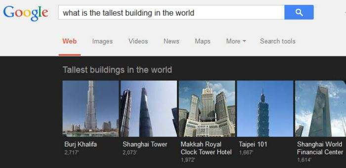
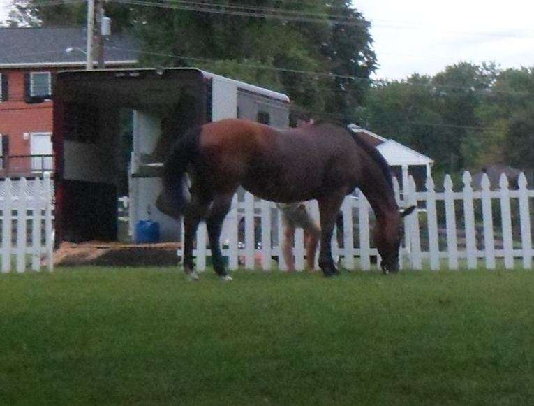
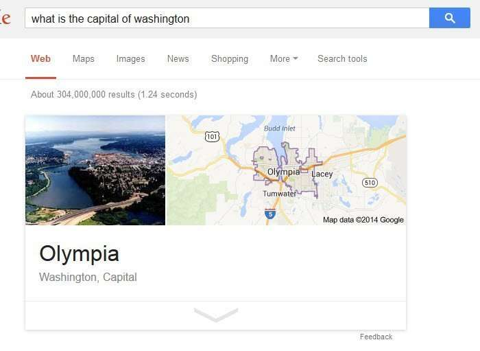
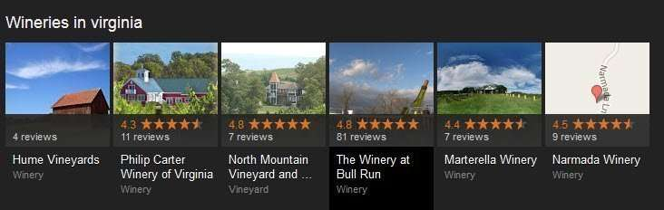

Just where do rich content images; those images in question answers, carousels, and knowledge panels at Google come from?

When Google introduced us to the knowledge graph, it also introduced us to pictures and the possibility of other kinds of rich content images in those knowledge panels, and pictorial lists displayed in carousels at the top of pages in response to a query, such as “What is the tallest building in the World?”

A Google patent granted a couple of weeks ago, describes how Google processes search system queries, and might display knowledge graph answers to questions that include images. Here’s where they introduced carousels, in their page on the [Knowledge Graph](https://www.google.com/search/about/):

You may have also noticed that image search results often have some categorized results now, like this set of results from the top of a search for “horse farm”, broken into “expensive,” “beautiful,” and “luxury.”

Google seems to have gotten better at understanding images and what they are about. One of the inventors listed on the patent describes a lot more information is being collected and understood about pictures in the following document:

[Learning Semantic Representations Of Objects And Their Parts](http://www.iro.umontreal.ca/~lisa/pointeurs/2013_semantic_image_mlj.pdf) (pdf)

The abstract from that paper in part, tells us:

> We design a model architecture that can be trained under a proxy supervision obtained by combining standard image annotation (from [ImageNet](http://www.image-net.org/)) with semantic part-based within-label relations (from [WordNet](https://wordnet.princeton.edu/)).
>
> The model itself is designed to model both object image to object label similarities, and object label to object part label similarities in a single joint system. Experiments conducted on our combined data and a precisely annotated evaluation set demonstrate the usefulness of our approach.

We don’t know if this experiment or something else has to lead to the improvement that we see in rich content images chosen for carousels or the knowledge panel or how images are categorized in some images searches.

## SEO Images Optimization

When we optimize images for SEO so that they might be found for queries in Google’s image search and to help pages themselves rank well better for queries, there are several practices that we followed. We:

1) Try to find meaningful images that are related to the words we are optimizing a page for, in the belief that a picture should say a 1,000 words (if not even more).

2) Choose a name for the picture file that both describes it well and includes those keywords, separated by hyphens within the file name, such as “horse-farm-pictures-in-virginia.jpg

3) Include alt attributes for pictures that effectively describe what the image contains to people who either cannot see the picture for one reason or another and might have them turned off or might be using a screen reader. *Example*: alt=”A horse farm in Warrenton, Virginia”

4) Attempt to use pictures that aren’t too small (a search engine might mistake them for thumbnails) or too large (to keep people from having to wait for it to load and to download.

5) Try to make the words on the page that surround the image put the picture into context, with a page title element, and page headings, and text that surrounds it corresponding with the picture well. Those associated words likely impact what a search engine sees the picture as being. A caption for a picture, contained within HTML like a “div” along with the picture is a good idea, too.

Many people who display pictures on a page don’t go through that much effort. If Google relied upon the text it found accompanying images on the web to get an idea of what they are about, it might not do so well.

The kind of categorizing described in that paper more likely describes the effort to label and organize pictures we see today than what we had in the past.

## Answers; Not Informational Resources

Users of search systems are often searching for an answer to a specific question, rather than a listing of resources.

The patent is:

[Rich content for query answers](http://patft.uspto.gov/netacgi/nph-Parser?Sect1=PTO2&Sect2=HITOFF&p=1&u=%2Fnetahtml%2FPTO%2Fsearch-adv.htm&r=1&f=G&l=50&d=PALL&S1=08819006&OS=PN/08819006&RS=PN/08819006)
Invented by Gal Chechik, Eyal Segalis, Yaniv Leviathan, and Yoav Tzur
Assigned to Google
US Patent 8,819,006
Granted August 26, 2014
Filed: December 31, 2013

Abstract

> Methods and systems for providing rich content with an answer to a question query. A method includes;
>
> - Receiving a query determined to be a question query and a corresponding answer generated in response to the question query
> - Generating a contextual query that includes an element relating to the question query and an element relating to the answer
> - Submitting the contextual query to a rich content search process and receiving data specifying a first set of rich content items responsive to the contextual query
> - Determining first rich content item in the first set of rich content items that meet a context condition that is indicative of a rich content item providing contextual information of both elements of the question query and the answer query; and
> - Preferentially selecting from the first content items relative to the second rich content items to be provided as one or more answer rich content items.

## How Question Answering with Rich Content Images Works

The patent describes how pictures are returned for question answering, but it tells us that this approach could also be used for other rich content, such as videos or audio.

The first step is for Google to look at the query, and make certain that it is a question-answering query, of the type that is looking for a specific answer, such as “what is the capital of Washington?”

The second step is to get an answer, in this case, “Olympia”.

Google will take the question and the answer, and try to create a “contextual query” out of them. It can do this in many ways, as described in the patent, but one way to concatenate (merge) the question and answer, like: “capital of Washington Olympia”.

This algorithm then takes the original question, the original answer, and the contextual query (the two joined together in this instance), and runs all three on an image search. It compares the images returned for all three and chooses the most relevant, and possibly the most important. To do that in part, it could look at the PageRanks of the pages the pictures appear upon.

It then displays the image it might show. For the “capital of Washington” query, there’s a picture and a map. They are likely from Google’s collection of images, and Google Maps. Searches for the capitals of other states show a similar pattern combining an image with a map.

## Take Aways

Google seems to have its images much more organized now than they have in past years. And they seem to have a lot of confidence that pictures they might show in knowledge panels and one boxes are going to be correct.

I have seen some carousel results where instead of showing images of some places included, Google has been showing a map of its location instead. Like this one on a search for wineries in Virginia, where the last one shows a map instead of a picture.

I likely won’t change the way I try to optimize images for SEO, as described above.

Now you have an idea of how Google might choose rich content images for carousels and knowledge panels and oneboxes in response to question answering queries.
