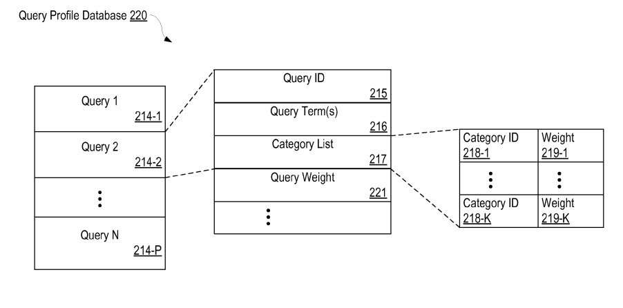

## Better Document Classification

Last week, I wrote about a patent granted to Google which described how the search engine [may use categories as a search ranking factor](https://www.seobythesea.com/2010/10/how-google-may-use-categories-as-a-search-ranking-factor/) to decide whether or not to include some pages in search results for specific queries. The patent was originally filed back in 2004, and focused primarily upon document classification based upon things such as the contents of web pages and anchor text in links pointing to pages.

A few days ago, a new patent application was published by Google which focuses upon document classification using a wider range of information, including user behavior data. Instead of a simple matching of weighted classifications between web pages and queries, the patent filing describes a way of creating profiles for pages which include classification information and spreading that document classification information to unclassified pages through query profiles for queries which both types of pages rank for in search results.

This kind of user-data based profile information could be used along with more conventional ways of ranking pages to improve the quality of search results and to provide more personalized results to searchers. The patent application is:

[Generating Improved Document Classification Data Using Historical Search Results](http://appft.uspto.gov/netacgi/nph-Parser?Sect1=PTO2&Sect2=HITOFF&u=%2Fnetahtml%2FPTO%2Fsearch-adv.html&r=1&p=1&f=G&l=50&d=PG01&S1=20100262615.PGNR.&OS=dn/20100262615&RS=DN/20100262615)
Invented by Bilgehan Uygar Oztekin and Pei-Wen Andy Chiu
US Patent Application 20100262615
Published October 14, 2010
Filed: April 8, 2009

When a search engine receives a query from a searcher, it may collect a fair amount of information about that query term or phrase. That can include:

- Words or Phrases used in the query
- The search results shown previously for the query
- Impression data- One or more information retrieval (IR) scores of the search results
  - Position data of the search results (indicating the order of the displayed search results)
  - Click data of the search results (user selections of the search results)
- User navigation statistical data for the search results (the ratio between the user selections of the URL and the user selections of all the URLs in the search results for the same query during a particular time period, such as the week or month preceding submission of the query)
- Location information (e.g., city, state, country or region) for the searcher
- The language of the query

This information could be collected in a database for all searchers, or it could be partitioned for specific groups of users of the search engine, such as all searchers submitting queries:

- In a particular language (e.g., English, Japanese, Chinese, French, German, etc.)
- From a particular country or other jurisdiction
- From a certain range of IP addresses, or
- From some combination of the above

**User Profiles**

The search engine also collects information about the people submitting those queries, and stores the information in a “user profile database.”

Each user profile may include multiple sub-profiles which could be broken down into different interests. A user profile can cover a group of users, such as people who all access the search engine from a particular computer, or from a particular web site or web page. The user profile database may use the search history of use to determine that user’s search interests.

A user profile record can include things such as favorite topics, and preferred ordering of search results.

**Query Profiles**

A query profile, created from the collected information may include such information as:

- A particular query
- the set of corresponding query terms in the query, and
- a category list for classifying the query

Categories assigned to web pages are similar to the categories that I described in my post on the earlier patent from Google. For instance, a category might be a news item, it might involve sports or travel or finance. A page might be given a weight involving how much it actually fits into those categories. Categories are also assigned to queries, and they are also given a particular weight for those categories.

For example, the search term “golf” could have a high weight for the categories “sports” and “sporting goods,” and very low weight for the category of “information technology.”

**Document Classification Profiles**

Document profiles might be created for web pages or web sites, or other objects on the web such as videos or news items or blog posts.

Information collected about documents can include their URLs, attributes associated with the pages such as URL text, anchor text pointing to the page, content on the page, page rank, and others. A category list for classifying the document can also be included in the profile, which includes the category itself, and the category weight for the page.

**Spreading Document Classification Data to Unclassified pages**

When Google classifies a web page, it is actually creating a category list for that page. The category list may include more than one category and includes a weight for each category listed.

There are many pages within Google’s index that either haven’t been classified or may have been misclassified. One of the focuses of this patent application is upon “spreading” the classification data for classified pages to those unclassified pages and to create more accurate classification data for pages.

Spreading document classification data usually involves two steps.

The first step is to spread document classification data from classified web pages to queries that are related to both classified and unclassified web pages.

The second step is to then take the classification data from those queries and spread it to unclassified pages.

That is why creating a query profile is an important part of this process.

Pages that originally have classifications have received them possibly from looking at initial estimates of web pages’ relevance to different subjects or topics or concept clusters. These estimates, or “sparse vectors” as they are referred to in the patent filing, can involve things such as an analysis of a web page’s content, key terms, and/or links.

**Document Classification Example**

A page about the Cincinnati Reds baseball team has been previously classified by Google after Google looked at the content of the page, key terms appearing on the page, and the links that point to it.

A document profile for the page shows how often it appears in different search results for specific queries, which position it tends to appear at for each of those queries, how often it is clicked upon, what its PageRank might be, which countries searchers who visit the page might be from, and what their preferred language might be, as well as other information.

Imagine that an unclassified page about the Cincinnati Reds also appears in a number of the same search results for the same queries as the classified page.

Document classification information from the classified page about the Cincinnati Reds may be spread to the query profiles created those for those shared queries (as well as for other queries the page may rank for). The classification information in those query profiles from the original classified page may then spread to the unclassified page.

The weight for those classifications for the unclassified page, possibly such terms as “baseball,” “major league team,” and “Cincinnati reds,” may be based upon how relevant the unclassified page might be seen to be for the queries used to find it, including search position data and click data.

**Categories and Personalization**

Information kept about a searcher’s web history, including browsing and searching, can be used to identify categories that a searcher might be interested in. The profile document classification information about queries and documents could be used together with that searcher’s profile to boost some search results.

**Conclusion**

While I’ve shared some specific details about the kinds of information that might be used to create document and query profiles, the patent goes into considerably more depth about how this profile and classification process may work. I write “may,” because like most patent filings, it’s possible that the search engine might use somewhat different approaches than what they’ve published in a patent application.

What’s important about this patent filing is that it describes how actual user-based data might be used to help make decisions about how pages may be classified by the search engine. The older patent on the classification of pages from Google, that I mentioned at the start of this post, appears to have evolved to consider how people search and select pages, and how aggregated information about searcher behavior can be used to classify those pages to improve processes like personalized search.
